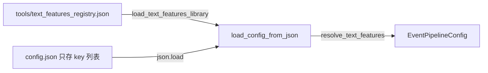

# 数据管线使用指南

## 一、数据流总览

项目的数据从两个来源汇入 Godot 运行时：**云端 Google Sheets** 和 **本地 Python 生成管线**。两者统一经过 `DATA_MANIFEST`（定义在 [`core/csv_cloud_loader.gd`](../core/csv_cloud_loader.gd)）调度，最终产出 `.tres` 资源文件和 Registry 注册表。

```
云端 Google Sheets  ──┐
                      ├── DATA_MANIFEST 调度 ──→ DSLParser ──→ .tres ──→ Registry
Python 生成管线  ─────┘
```

## 二、云端数据同步

### 数据来源

项目使用 Google Sheets 作为云端数据源。`DATA_MANIFEST` 中每个云端条目包含三个核心字段：

- `url`：Google Sheets 发布的 CSV 导出链接
- `save_path`：CSV 下载到本地的保存路径
- `data_type`：数据类型（trait / flag / random_event / state_transistor）

### 同步方式

| 方式 | 触发条件 | 行为 |
|------|---------|------|
| Godot 编辑器按钮 | 点击 `sync_all_data` 属性 | 遍历 `DATA_MANIFEST` 全部条目，云端拉取或本地读取 |
| CLI 命令行 | `godot --headless script.gd --sync` | 同上，适合 CI 环境 |
| 本地优先模式 | 勾选 `prefer_local_files` | 优先读取本地 CSV，不存在时降级到云端 |

同步流程：
1. 遍历 `DATA_MANIFEST` 中的条目
2. 对于云端条目，通过 `curl` 请求 Google Sheets CSV 链接
3. 保存原始 CSV 到 `save_path`
4. `_process_csv_data()` 接管：解析 CSV → 调用 `DSLParser.parse_csv_data()` → 创建 Godot Resource 对象 → 注入内存数据库
5. `save_resources_to_tres()` 将资源保存为 `.tres` 文件到 CSV 所在目录
6. `_regenerate_registries()` 刷新全局资源注册表

## 三、本地生成事件管线

### Python 生成脚本

[`tools/generate_orthogonal_events.py`](../tools/generate_orthogonal_events.py) 是正交事件生成管线的主脚本。它读取配置（内置默认或 JSON 文件），对维度值做笛卡尔积展开，逐个调用 LLM API 生成事件文本，最终输出 CSV。

基本用法：

```bash
# 使用内置默认配置（拜谒蜜月期）
python3 tools/generate_orthogonal_events.py

# 使用自定义 JSON 配置
python3 tools/generate_orthogonal_events.py --config tools/my_config.json

# 只看 Prompt 不调 API（调试 System/User Prompt 结构）
python3 tools/generate_orthogonal_events.py --dry-run

# 试运行：实际调 1 次 API，打印全部中间产物，不保存 CSV（验证生成质量）
python3 tools/generate_orthogonal_events.py --trial
```

输出文件：`data/generated_events/<config.id>_events.csv`

### 配置文件结构

配置文件（`.json` 或 Python 内置）定义以下核心组件：

- `background_context` / `ai_persona`：世界观背景和 AI 角色设定
- `prompt_features`：风格要求列表，注入 System Prompt
- `fact_features`：事实约束列表，AI 必须严格遵循，不得编造
- `option_features`：选项定义，让 AI 生成选项文本
- `dimensions`：正交维度定义，每个维度包含多个值（含 DSL operator 和 scale）
- `universal_tags` / `universal_requirement` / `universal_result`：通用触发标签、条件和结果
- `universal_option_requirement`：**选项级** requirement DSL，支持 `{failed_hint}` 模板变量（由插件注入），例如 `poem_has(type=GAN_YE; min_level=1; failed_hint="{failed_hint}")`
- `plugins`：启用的插件 ID 列表，通过 3 个 Hook 点注入行为（见下文）

#### TextFeature Registry（文本特征中央库）

`prompt_features` / `fact_features` / `option_features` 不再直接在 JSON 配置中内联定义完整对象，而是引用中央特征库 [`tools/text_features_registry.json`](../tools/text_features_registry.json) 中的 key：

```json
// ❌ 旧方式：每条配置内联完整定义
"prompt_features": [
  {"id": "stateless_narrative", "text": "使用无状态叙事..."}
]

// ✅ 新方式：配置只存 key，加载时从 Registry 解析
"prompt_features": ["stateless_narrative"]
```

中央特征库结构：

```json
{
  "prompt_features": [
    {"id": "stateless_narrative", "text": "使用无状态叙事，不要引用玩家过去的具体经历..."},
    {"id": "tone_cautious", "text": "不要过于戏剧化，保持冷静克制的叙事语气..."}
  ],
  "fact_features": [
    {"id": "bai_ye_venue", "text": "去拜谒的地方可以是王府、右相府或六部衙门..."}
  ],
  "option_features": [
    {"id": "option_accept", "text": "用20字以内描述接受对方要求的方案"}
  ]
}
```

**优势：**
- 消除跨配置文件的重复定义（如 `stateless_narrative` 被多个配置共用）
- 添加新 feature 只需在 registry 中注册一次，任意配置通过 key 引用
- 向后兼容：`list[dict]` 内联写法的旧配置仍可正常加载

**添加新 feature 的步骤：**
1. 在 [`tools/text_features_registry.json`](../tools/text_features_registry.json) 对应数组中添加 `{"id": "...", "text": "..."}`
2. 在目标配置的对应字段中添加 key 字符串

**Python API 参考（`tools/config.py`）：**

| 函数/类 | 说明 |
|---------|------|
| `TextFeatureLibrary` | Registry 的 Pydantic 模型，含 `resolve_prompt(key)` / `resolve_fact(key)` / `resolve_option(key)` 方法 |
| `load_text_features_library(path?)` | 加载 registry JSON，返回 `TextFeatureLibrary` 实例 |
| `resolve_text_features(config_data, library?)` | 将 config dict 中的 key 列表解析为完整对象（原地修改） |

### Plugin Hook 系统

插件系统允许在不修改 generate_orthogonal_events.py 核心逻辑的情况下，向管线注入自定义行为。

**3 个 Hook 点：**

| Hook | 方法 | 时机 | 作用 |
|------|------|------|------|
| 1 | `get_prompt_fragment(combos, cfg)` | 构建 User Prompt 时 | 注入额外的指令文本 |
| 2 | `get_extra_output_fields()` | 解析 AI 响应时 | 声明 AI 输出中的额外字段名 |
| 3 | `enrich_context(ctx: PluginContext)` | 写入 CSV 前 | 提取/处理数据，返回 `dict[str,str]` 注入 context_extras |

**配置方式：**
```json
{
  "plugins": ["ganye_failed_hint"],
  "universal_option_requirement": "poem_has(type=GAN_YE; min_level=1; failed_hint=\"{failed_hint}\")"
}
```

**模板替换机制：**
- `universal_option_requirement` 中的 `{failed_hint}` 占位符在运行时被 Hook 3 返回的 `context_extras["failed_hint"]` 替换
- 替换发生在写入 CSV 前，最终 option 行的 requirements 列包含完整的 DSL（如 `poem_has(type=GAN_YE; min_level=1; failed_hint="去写首干谒诗再来")`）

**内置插件：**

| 插件 ID | 文件 | 用途 |
|---------|------|------|
| `failed_hint` | [`tools/plugins/failed_hint_plugin.py`](../tools/plugins/failed_hint_plugin.py) | 通用的失败条件提示（用于 0-70 蜜月期） |
| `ganye_failed_hint` | [`tools/plugins/ganye_failed_hint_plugin.py`](../tools/plugins/ganye_failed_hint_plugin.py) | 干谒诗专用失败条件提示（用于 70-100 真实面目期） |

**添加新插件：**
1. 在 [`tools/plugins/`](../tools/plugins/) 中创建新文件，继承 `EventPromptPlugin`
2. 实现所需 Hook 方法
3. 在文件末尾调用 `register_plugin(YourPlugin())`
4. 在 JSON 配置的 `plugins` 列表中引用插件 ID

### DSL Operator 缩放范围

`scale_dsl_operator()` 对 `val` 参数做 Scale 乘算。支持的 operator 集合：

| 类型 | 可缩放 | 说明 |
|------|--------|------|
| `prop_add`, `prop_sub`, `prop_set` | ✅ | Property 操作（数值属性） |
| `emo_add`, `emo_sub` | ✅ | 情绪操作（如 `emo_add(name=anger; val=10)`） |
| `emo_set` | ❌ | 情绪设定（不允许缩放） |
| `trait_add`, `trait_remove` | ❌ | Trait 操作 |
| `flag_bool_set`, `flag_str_set` 等 | ❌ | Flag 操作 |

### 数据导入 Godot

`csv_cloud_loader.gd` 提供了两个入口将生成的 CSV 导入 Godot：

| 方式 | 触发 | 行为 |
|------|------|------|
| `import_generated_events` 按钮 | 编辑器点击 | 遍历 `DATA_MANIFEST` 中所有 `is_generated=true` 的条目，逐个解析 |
| `sync_all_data` 按钮或 CLI `--sync` | 编辑器点击或命令行 | 覆盖全部条目（云端 + 本地生成），根据 `is_generated` 区分处理策略 |

处理流程与云端数据完全一致：CSV → DSLParser → `.tres` → Registry。

## 四、现有配置文件

| 配置文件 | 阶段 | 用途 |
|---------|------|------|
| [`tools/bai_ye_honeymoon_config.json`](../tools/bai_ye_honeymoon_config.json) | 拜谒蜜月期 (0-70) | 内置默认配置 |
| [`tools/event_base_config_bai_ye_real_appearance.json`](../tools/event_base_config_bai_ye_real_appearance.json) | 拜谒真实面目 (70-100) | 70-100 阶段的权力阻击事件，含干谒诗 requirement |

## 五、新增生成配置的完整步骤

1. 创建 JSON 配置文件，例如 `tools/foo_config.json`
2. 运行 `python3 tools/generate_orthogonal_events.py --config tools/foo_config.json`
3. 验证输出 `data/generated_events/foo_events.csv`
4. 在 [`DATA_MANIFEST`](../core/csv_cloud_loader.gd) 中添加条目：
   ```gdscript
   {
       "name": "某事件（本地生成）",
       "save_path": "res://data/generated_events/foo_events.csv",
       "data_type": "random_event",
       "is_generated": true,
   }
   ```
5. 在 Godot 编辑器中点击 `import_generated_events` 或 `sync_all_data` 即可导入

## 六、注意事项

#### 配置加载流程（含 Registry 解析）



- **排序依赖**：`DATA_MANIFEST` 中 trait 和 flag 必须排在 random_event 之前，否则 template URN 解析会失败
- **CSV 格式**：生成 CSV 的列名必须与 `DSLParser.parse_random_event()` 中的 `row.get()` key 完全一致
- **本地优先模式的边界**：生成事件 CSV 本身就在本地，不受 `prefer_local_files` 影响
- **兜底检测**：`import_generated_events` 执行时会扫描 `data/generated_events/` 目录，报告未被 `DATA_MANIFEST` 收录的 CSV 文件
