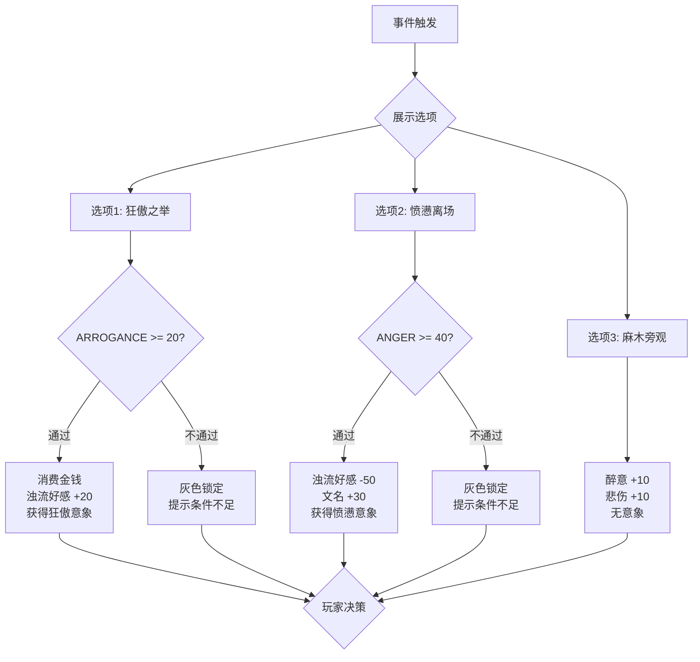

# 情绪守卫的多分支选项设计模式

## 概述

本文档记录了一种核心的事件叙事设计模式：**通过 Requirement 守卫提供多分支情绪选项，让玩家自主选择获得的意象类型和后果**。

该模式将意象获取从"数值播片"（事件触发 → 自动获得意象）升级为"玩家代理权"（Player Agency），让玩家在关键时刻做出符合角色性格的选择，从而获得对应的情绪意象。

---

## 1. 标准模式 vs 分支模式

### 1.1 标准模式（单行道）

```
事件触发
    ↓
Requirement 守卫（检查属性/情绪）
    ↓
获得固定意象
```

- **优点**：简单、配置量小
- **缺点**：玩家没有选择权，意象获取是自动的
- **适用场景**：日常小事件、非关键剧情

### 1.2 分支模式（多叉路）

```
事件触发
    ↓
展示多个 Option，每个由不同的 Requirement 守卫
    ↓
玩家自主选择
    ↓
根据选择获得对应意象（及后果）
```

- **优点**：玩家代理权强、叙事深度高、可重玩性强
- **缺点**：配置量大（每个分支需要独立的文案和后果）、只适合关键节点
- **适用场景**：宴会高潮、历史大事件爆发、高价值艺术观赏

---

## 2. 核心架构

### 2.1 数据流

```
Event (CSV 行)
    ├── Option_1 (Text + Requirement + Operators)
    │       ├── Text: "拔剑起舞，与权贵同乐！"
    │       ├── Req:   ARROGANCE > 20, MONEY > 500
    │       └── Op:    MONEY-500, zhuoliu_favor+20, imaginary_add(arrogance)
    │
    ├── Option_2 (Text + Requirement + Operators)
    │       ├── Text: "朱门酒肉臭！拂袖而去。"
    │       ├── Req:   ANGER > 40
    │       └── Op:    zhuoliu_favor-50, LITERARY_FAME+30, imaginary_add(anger)
    │
    └── Option_3 (兜底 - 无条件)
            ├── Text: "默默喝完杯中酒，只觉得吵闹。"
            ├── Req:   (无)
            └── Op:    DRUNK+10, SORROW+10
```

### 2.2 架构契约

该模式**不需要修改任何 GDScript 底层代码**，完全在 CSV 配置层闭环：

| 组件 | 职责 | 是否需改代码 |
|------|------|:---:|
| `EventOption.requirements` | 守卫选项可见性 | ❌ |
| `ChoiceResult.operators` | 执行分支后果（含 ImaginaryOperator） | ❌ |
| `ImaginaryManager` | 处理意象添加 | ❌ |
| CSV 配置 | 定义分支文案、守卫条件、后果 | ✅ 只需改这里 |

---

## 3. 配置示例

### 3.1 事件：平康坊观胡旋舞

```csv
event_id,desc,option_1_text,option_1_req,option_1_op,option_2_text,option_2_req,option_2_op,option_3_text,option_3_req,option_3_op
event_art_huxuan,胡姬在鼓点中疯狂旋转，权贵们大声喝彩，酒池肉林，纸醉金迷。,拔剑起舞，与权贵同乐！,prop_gt(ARROGANCE,20) prop_gt(MONEY,500),prop_add(MONEY,-500) flag_add(zhuoliu_favor,20) imaginary_add_random(tags=emotion:arrogance),朱门酒肉臭！你忍无可忍，拂袖而去。,prop_gt(ANGER,40),flag_add(zhuoliu_favor,-50) prop_add(LITERARY_FAME,30) imaginary_add_random(tags=emotion:anger),你默默喝完杯中酒，只觉得吵闹。,,prop_add(DRUNK,10) emotion_add(SORROW,10)
```

### 3.2 各分支详解

| 分支 | 情绪底色 | 守卫条件 | 后果 | 意象产出 |
|------|---------|---------|------|---------|
| 【狂傲】拔剑起舞 | `ARROGANCE` | 狂妄≥20, 钱≥500 | 花钱、浊流好感↑ | 狂傲类意象 |
| 【愤懑】拂袖而去 | `ANGER` | 愤怒≥40 | 浊流好感↓↓, 文名↑ | 愤懑类意象 |
| 【麻木】默默喝酒 | 中性 | 无条件（兜底） | 醉意↑, 悲伤↑ | 无意象 |

---

## 4. 设计原则

### 4.1 选择的重量

- 选项**绝不能是无条件的免费自助餐**
- 用 `requirements` 守卫选项 = 倒逼玩家平时进行情绪管理
- 没有积累 `ANGER` 的玩家，在关键时刻连"拍桌而起"这个选项都看不到
- 玩家看到灰色锁死的选项，本身就是一种叙事表达："你还不够资格愤怒"

### 4.2 兜底机制

- 必须至少有一个**无条件兜底选项**，防止所有选项都被守卫锁死导致无法选择
- 兜底选项的后果应该平淡或负面，奖励最少
- 兜底本身就是对"平庸"的惩罚

### 4.3 意象产出的匹配

- 每种情绪分支应该产出对应情绪标签（`tag`）的意象
- `imaginary_add_random(tags=emotion:arrogance)` 从狂傲标签池随机抽取
- 不要手动指定具体意象 UUID，保持系统的随机涌现性

---

## 5. 赛博导师的防爆警告 ⚠️

### 5.1 使用阈值

| 场景 | 是否使用分支模式 | 理由 |
|------|:---:|------|
| 核心剧情高潮 | ✅ | 值得投入配置量 |
| 高价值艺术观赏 | ✅ | 意象产出+叙事深度 |
| 历史大事件爆发 | ✅ | 代理权提升沉浸感 |
| 日常街边吃碗面 | ❌ | 文案工作量爆炸 |

### 5.2 反模式

- ❌ 给每个芝麻绿豆大的小事件写 3 个情绪分支
- ❌ 分支选项超过 4 个（认知负荷过高）
- ❌ 兜底选项也有苛刻的守卫条件（导致死锁）
- ❌ 不同分支产出同一种意象（分支失去意义）

### 5.3 配置量估算

每个带分支的事件需要：
- 3 组独立的选项文案
- 3 组独立的守卫条件（含兜底的空白条件）
- 3 组独立的后果操作符
- 确保各分支意象产出不重叠

→ 建议全游戏不超过 **10-15 个** 此类事件。

---

## 6. 与现有系统的关系

| 现有系统 | 关系 |
|---------|------|
| [`EventOption`](model/event/event_option.gd) | 本模式的直接载体，Option 即分支 |
| [`requirements`](model/event/base_option.gd) | 守卫选项的**铁幕** |
| [`ChoiceResult.operators`](model/choice_result.gd) | 执行分支后果 |
| [`ImaginaryManager`](core/imaginary_manager.gd) | 接收意象添加请求 |
| [`emotion_imaginary_system.md`](../imaginary/emotion_imaginary_system.md) | 情绪-意象连接机制 |
| [`event_option_system.md`](event_option_system.md) | Option 系统的完整文档 |

---

## 7. Mermaid 流程图

