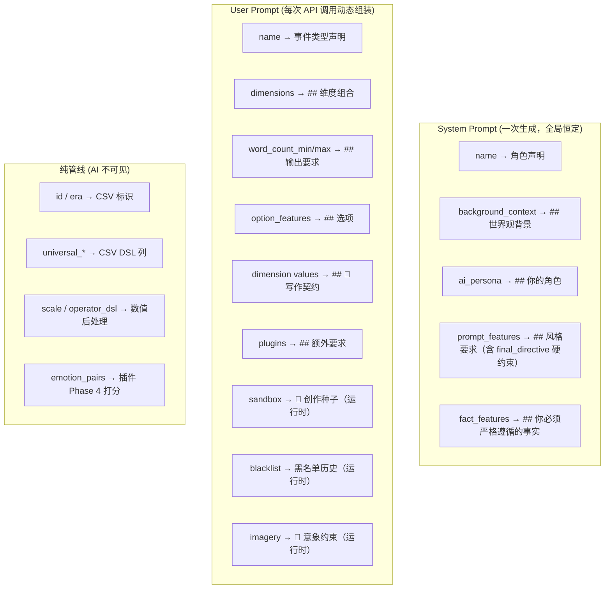
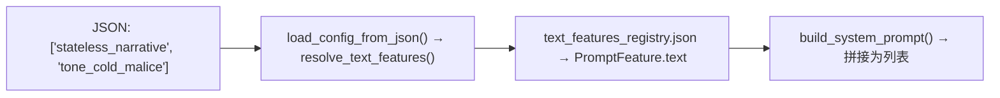

# 正交事件生成器 — 配置文件字段完全指南

> **适用管线**: [`tools/generate_orthogonal_events.py`](../../tools/generate_orthogonal_events.py) → [`tools/event_generator/`](../../tools/event_generator/)
> **数据模型**: [`tools/config.py`](../../tools/config.py) → `EventPipelineConfig`
> **特征库**: [`tools/text_features_registry.json`](../../tools/text_features_registry.json)

---

## 概述

正交事件生成器的 JSON 配置文件定义了**一个事件库的完整生成参数**。配置文件中的字段按消费目标分为三类：

| 分类 | 标记 | 含义 |
|------|------|------|
| 🟢 **System Prompt 域** | `[SYS]` | 渲染到 System Prompt，设定 AI 角色与全局规则 |
| 🔵 **User Prompt 域** | `[USR]` | 渲染到 User Prompt，传递给每次 API 调用 |
| ⚫ **纯管线域** | `[PIPE]` | 仅管线内部消费，AI 不可见 |

---

## Prompt 渲染架构



---

# 🟢 System Prompt 域

这些字段在 `build_system_prompt()` ([`prompts.py:35`](../../tools/event_generator/prompts.py:35)) 中组装，**整个生成周期只构建一次**，作为所有 API 调用的共享 System Prompt。

## `name` [SYS]

- **类型**: `str`
- **渲染位置**: System Prompt 开头 + User Prompt 开头
- **渲染格式**: `你是{name}叙事设计师。你只负责生成事件文本，不要输出任何额外内容。`
- **示例**: `"多态事件库 - 八大屈辱维度 × 六大网关"`

---

## `background_context` [SYS]

- **类型**: `str`
- **渲染位置**: System Prompt，`## 世界观背景` 区块
- **渲染格式**: 原文照搬，前后自动换行
- **用途**: 告诉 AI 故事发生的时代、地点、玩家的社会位置和所处的生命阶段
- **示例**:

```text
天宝十三载（754年），杜甫四十三岁，困居长安已近十年。
投诗干谒、献赋上书、奔走权门——该试的都试过了，该碰的壁也碰完了。
...
```

- **⚠️ 约束**: 这是 AI 的"世界观基线"。任何与 `background_context` 矛盾的叙事都会被 AI 视为"偏离设定"。**不要在这里写风格指令**——风格指令放 `prompt_features`。

---

## `ai_persona` [SYS]

- **类型**: `str`
- **渲染位置**: System Prompt，`## 你的角色` 区块
- **渲染格式**: 原文照搬
- **用途**: 定义 AI 的叙事人格——文风、视角、情感基调
- **示例**:

```text
你是一位以冷峻写实的笔触书写唐代底层文人困境的叙事作家。
你的文字像杜诗本身的风格一样——沉郁顿挫，克制冷峻。
你不写心理活动，只写可见的动作、环境、对话和沉默。
```

- **⚠️ 与 `prompt_features` 的区别**: `ai_persona` 定义"你是谁"，`prompt_features` 定义"你该怎么写"。前者是身份，后者是规则。

---

## `prompt_features` [SYS]

- **类型**: `list[str]` — 字符串列表，每个字符串是 `text_features_registry.json` 中 `prompt_features[].id` 的 key 引用
- **渲染位置**: System Prompt，`## 风格要求` 区块
- **渲染格式**: 每条一行，`- {resolved_text}`
- **解析流程**:



- **实际示例**（JSON 中写 `"tone_cold_malice"`，registry 解析后 AI 看到）:

```text
语气冷酷但克制，突出权力碾压感。不要直白的辱骂，
用细节呈现精致的恶意——一个意味深长的停顿、一次故意的冷落、
一句带着微笑的贬低。
```

- **可用的 prompt feature ID**（截至当前 registry）:

| ID | 功能 |
|----|------|
| `stateless_narrative` | 无状态叙事，不引用玩家历史 |
| `tone_cold_malice` | 冷酷克制，权力碾压感 |
| `forbid_god_view_psychology` | 禁止上帝视角心理剖析 |
| `forbid_inner_monologue` | 禁止主角内心独白 |
| `forbid_comedy_exaggeration` | 禁止喜剧化/浮夸 |
| `ambiguous_narrative` | 模糊叙事/薛定谔的交易物 |
| `anti_repetition` | 反重复意象/动作 |
| `anonymous_officials` | 禁用真实历史人物姓名 |
| `power_metaphor_lens` | 权力隐喻滤镜 |
| `tone_cautious` | 冷静克制，突出虚伪客套 |
| `scene_focus` | 环境氛围描写 |
| `NPC_ask_poem` | NPC 索要诗词模板 |
| `plain_action` | 选项中性物理动作 |

- **约束级别总览**:

| 约束级别 | 机制 | 适用内容 |
|---------|------|---------|
| `final_directive` (prompt_feature) | Registry 解析 → System Prompt 末尾 | 跨维度的、不可协商的硬规则 |
| `narrative_constraint`（维度/选项级） | 结构化区块（`📜 写作契约`） | 特定维度/场景/选项的写作规则 |
| 其他 `prompt_features` | 风格列表（`## 风格要求`） | 软性的风格指南 |

---

## `fact_features` [SYS]

- **类型**: `list[str]` — 字符串列表，同样通过 `text_features_registry.json` 解析
- **渲染位置**: System Prompt，`## 你必须严格遵循的事实` 区块
- **渲染格式**: 每条一行，`- {resolved_text}`，末尾追加 `以上是你要严格遵循的事实陈述，除此之外不要自己编造任何设定。`
- **与 `prompt_features` 的区别**: `fact_features` 是**硬事实**（AI 不能违背），`prompt_features` 是**软风格**（AI 应当遵守）。注意：`prompt_features` 中存在 `final_directive` 例外——它是一个硬约束条目，但通过 registry 注入的渲染位置（Prompt 末尾 + Recency Bias）使其实际效力接近硬事实。

---

# 🔵 User Prompt 域

这些字段在 `build_user_prompt()` ([`prompts.py:69`](../../tools/event_generator/prompts.py:69)) 中组装，**每次 API 调用都重新构建**（因为维度组合不同、黑名单不同等）。

## `name` [USR]

- **类型**: `str`
- **渲染位置**: User Prompt 开头
- **渲染格式**: `请为以下维度组合生成一个{name}事件：`

---

## `dimensions` [USR] — 维度组合描述

- **类型**: `list[PipelineDimension]`
- **渲染位置**: User Prompt，`## 维度组合` 区块
- **渲染格式**: 每个维度一行 `{序号}. {维度名}: {值名}（{值描述}）`

示例渲染结果：

```text
1. 屈辱维度 — 羞辱的形态: 才华物化 — 诗在权贵眼中只是交易筹码（杜甫的诗被当作等价物——换一顿饭、一件旧衣、一个引荐机会...）
2. 场景网关 — 事件发生的空间与社交语境: 坊市 — 长安东西市的日常交易与偶遇（长安东西两市及坊间街巷...）
```

- **AI 可见的字段**: `dimension.name`、`value.name`、`value.description`
- **AI 不可见的字段**: `scale`、`operator_dsl`、`tags`、`linked_value_ids`（这些都是管线后处理用）

---

## `word_count_min` / `word_count_max` [USR]

- **类型**: `int`
- **渲染位置**: User Prompt，`## 输出要求` 区块
- **渲染格式**: `description：{min}-{max}字的事件描述`
- **动态调整**: 如果验证失败（过短/过长），管线会自动收缩边界并重试，User Prompt 中的字数范围会随之改变

---

## `option_features` [USR] — 选项定义

- **类型**: `list[OptionFeature]`
- **渲染位置**: User Prompt，`## 选项` 区块（仅非 `fixed` 选项）
- **渲染规则**:
  - `fixed: true` → **不呈现给 AI**，直接用 `text` 字段作为固定文本写入 CSV
  - `fixed: false` → 将 `prompt` 字段（或 `text` 兜底）作为 AI 指令注入

- **AI 看到的格式**:

```text
## 选项
为以下每个选项生成描述文本（每个不超过20字）：
- opt_kuangke: 用30字以内写一个简短的动作描述——玩家以高旷达状态回应当前羞辱...
- opt_fengying: 用30字以内写一个简短的动作描述——玩家以中旷达状态回应当前羞辱...
- opt_zuanying: 用30字以内写一个简短的动作描述——玩家以低旷达状态回应当前羞辱...

输出格式如下，不要多余的内容：
title: <你的标题>
description: <你的描述>
options:
 opt_kuangke: <opt_kuangke文本>
 opt_fengying: <opt_fengying文本>
 opt_zuanying: <opt_zuanying文本>
```

- **AI 不可见的选项字段**（纯管线）:
  - `result` — 选项结果 DSL（如 `prop_add(name=kuangda; val=2)|prop_sub(name=fatigue; val=3)`）
  - `requirement` — 选项需求 DSL
  - `accept_influence` — 影响过滤白名单
  - `pair_role` — 情绪对分支角色（`branch_A` / `branch_B` / `fallback`），由 `emotion_pair_imagery` 插件消费
  - `plugins` — 插件配置挂载点

## `dimensions[].values[].narrative_constraint` [USR] — 写作契约

- **渲染位置**: User Prompt，`## 📜 写作契约 (Narrative Constraint)` 区块
- **渲染来源**: 维度值级 + 选项级的 `narrative_constraint`
- **渲染格式**: 固定三层结构

```text
## 📜 写作契约 (Narrative Constraint)

### 维度 "{值名}"
- 📣 索取层 (NPC Demand): {demand_context}
- 🎭 执行层 (Player Action): {action_style}
- 💀 揭晓层 (System Resolution): {resolution_style}

  ⛔ 反面教材（禁止出现以下写法）:
    ❌ [{field}] "{bad}"
      原因: {reason}
```

- **字段详解**:

| 字段 | 含义 | 渲染标记 |
|------|------|---------|
| `demand_context` | Layer 1: NPC 如何提出需求 | `📣 索取层` |
| `action_style` | Layer 2: 玩家动作描写规则 | `🎭 执行层` |
| `resolution_style` | Layer 3: NPC 揭晓反应规则 | `💀 揭晓层` |
| `negative_examples` | 反面教材列表 | `⛔ 反面教材` |

- **⚠️ 重要**: 渲染时遍历 `combos` 中**所有维度值**的 `narrative_constraint`（不限于特定维度），同时也遍历 `option_features` 中每个选项的 `narrative_constraint`
- **key 解析**: `demand_context` / `action_style` / `resolution_style` 的值首先尝试作为 `text_features_registry.json` 的 key 解析，解析失败则保持原值（向后兼容 inline text）
- **⚠️ `NarrativeConstraint.type` 已废弃**: 当前数据模型中残留的 `type` 字段**不参与任何约束逻辑**，仅为管线 debug 标记。新配置不应填写此字段

---

## Plugin 注入 [USR] — `plugins`

- **类型**: `list[str]` — 插件 ID 列表
- **渲染位置**: User Prompt，`## 额外要求（{plugin_id}）` 区块
- **机制**: 每个启用的插件的 `get_prompt_fragment(combos, cfg)` 返回值被追加为独立区块
- **当前可用插件**:
  - `emotion_pair_imagery` — 情绪对意象打分插件（Hook 4），**不产生 Prompt 片段**（`get_prompt_fragment()` 返回空字符串），只在 options result DSL 中注入 `imagery_add(name=...)`
  - 未来插件可通过重写 `get_prompt_fragment()` 注入自定义 Prompt 指令

---

## 运行时注入 [USR]

以下内容不来自配置文件，而是在运行时由管线动态生成并注入 User Prompt：

| 注入源 | 区块标记 | 说明 |
|--------|---------|------|
| `SandboxManager` | `🎲 创作种子` | 预生成的随机创作关键词，引导 AI 围绕特定场景创作 |
| `SlidingBlacklist` | 黑名单历史 | 已用过的维度值摘要，防止 AI 重复套路 |
| 意象选择结果 | `## 🎯 意象约束` | 按情绪亲缘度打分后选中的最佳意象，注入叙事约束 |

---

# ⚫ 纯管线域

以下字段**完全不呈现给 AI**，仅用于管线后处理、CSV 生成、或插件逻辑。

## 标识与路由

| 字段 | 类型 | 用途 |
|------|------|------|
| `id` | `str` | 事件库唯一 ID，用于 output_dir 中的文件命名 |
| `era` | `str` | 注入 CSV context 列 `era=<value>`，Godot 端路由用 |

---

## CSV DSL 列

| 字段 | 类型 | 消费位置 | 格式示例 |
|------|------|---------|---------|
| `universal_tags` | `list[str]` | CSV `trigger_tags` 列 | `["bai_ye"]` |
| `universal_requirement` | `str` | CSV `requirements` 列 | `prop_gt(name=ambition,val=50),prop_lt(name=ambition,val=100)` |
| `universal_result` | `str` | 每个 option 行的 `results` 列（Layer 0，与维度花销合并） | `prop_add(name=exhaustion; val=1)\|prop_add(name=fatigue; val=5)` |
| `universal_option_requirement` | `str` | CSV option 行的 `requirements` 列 | `poem_has(type=GAN_YE; min_level=1; failed_hint="{failed_hint}")` |

---

## 维度值 — 管线计算字段

每个 `dimensions[].values[]` 中的以下字段 AI 不可见，仅用于管线数值计算：

| 字段 | 用途 |
|------|------|
| `scale` | 缩放乘数，合并时的权重因子（如 `1.05` 表示 5% 额外加成） |
| `operator_dsl` | 该维度值的属性操作（如 `prop_sub(name=money; val=3)`），最终与 `universal_result` 合并 |
| `tags` | 标签列表，部分标签被管线用于意象提取（如 `ENV_NATURE_NIGHTMOON:cold_moon`）、情绪对绑定（`emotion_pair:pair_rebellion`）、黑名单追踪等 |
| `linked_value_ids` | 值级引用，用于从外部维度数据库自动注入关联维度 |

---

## 选项 — 管线计算字段

`option_features[]` 中以下字段 AI 不可见：

| 字段 | 用途 |
|------|------|
| `result` | 选项结果 DSL，与维度花销合并后写入 CSV |
| `requirement` | 选项需求 DSL |
| `fixed` | `true` → 直接用 `text` 写入 CSV，不调用 AI 生成 |
| `accept_influence` | 影响过滤白名单，控制哪些维度的 `scale` 生效 |
| `pair_role` | `"branch_A"` / `"fallback"` / `"branch_B"`，由 `emotion_pair_imagery` 插件消费以确定情绪 |
| `plugins` | 插件配置挂载点（如 `{"emotion_pair_imagery": {"branch_role": "branch_A"}}`） |

---

## `emotion_pairs` [PIPE]

- **类型**: `dict[str, EmotionPairConfig]`
- **消费方**: `emotion_pair_imagery` 插件（Phase 4: `get_option_result_extras()`）
- **AI 可见性**: **完全不呈现给 AI**。情绪名仅用于插件内部的意象亲缘度打分计算
- **作用链**: `dimension tags` → `emotion_pair_id` → `option.pair_role` → `emotion_pairs[id].{role}.emotion` → 意象打分 → `imagery_add(name=...)` DSL

---

## 控制参数

| 字段 | 类型 | 默认值 | 用途 |
|------|------|--------|------|
| `api_model` | `str` | `"deepseek-chat"` | API 模型名 |
| `output_dir` | `str` | `"data/generated_events/"` | 输出目录 |
| `max_retries` | `int` | `3` | 单次 API 调用失败/验证失败的最大重试次数 |
| `apply_dimension_imagery` | `bool` | `false` | 意象正交打分总开关 |

---

# 🔧 历史残留字段迁移指南

以下字段曾在 `event_base_config_duotai_humiliation.json` 的历史版本中存在，但管线代码不消费它们。这不是 bug，而是它们的内容**应该通过其他机制表达**：

## `anti_repetition_directive` → 应迁移至 `narrative_constraint`

- **当前状态**: JSON 根层级曾存在（109 chars），但 `EventPipelineConfig` 模型无此字段，Pydantic 静默丢弃
- **正确做法**: 反重复约束应该通过**维度值级的 `narrative_constraint`** 的 `negative_examples` + `action_style` 字段来表达，或通过 `prompt_features` 中的 `anti_repetition` 键注入风格指令。运行时 `SlidingBlacklist` 则提供机制层的去重保证
- **⚠️ 如果确实需要一个"跨所有维度"的反重复全局指令**，应将其内容写入某个维度值的 `narrative_constraint.demand_context`，或作为 `prompt_features` 中的新条目注册到 `text_features_registry.json`

## 顶层 `narrative_constraint` → 应下沉至维度值级

- **当前状态**: JSON 根层级曾存在 `"narrative_constraint": { "type": "polymorphic_humiliation_event", ... }`，`EventPipelineConfig` 模型无此顶层字段
- **正确做法**: `narrative_constraint` 只存在于维度值级和选项级——这是设计意图。如果顶层的约束内容应全局生效，将其内容**复制到每个维度值的 `narrative_constraint`** 中，或提取为 `prompt_features` 条目
- **`NarrativeConstraint.type` 字段**: 仅为元数据标记，不参与任何约束渲染。新配置中应省略此字段

---

# 字段速查表

| 字段 | 域 | 类型 | AI 可见 | 渲染位置 |
|------|-----|------|---------|---------|
| `id` | PIPE | `str` | ❌ | — |
| `name` | SYS+USR | `str` | ✅ | System Prompt 角色声明 + User Prompt 事件类型 |
| `era` | PIPE | `str` | ❌ | — |
| `background_context` | SYS | `str` | ✅ | `## 世界观背景` |
| `ai_persona` | SYS | `str` | ✅ | `## 你的角色` |
| `prompt_features` | SYS | `list[str]` | ✅ (经过 registry 解析) | `## 风格要求`（含 `final_directive` → `## ⚠️ 绝对指令` 末尾） |
| `fact_features` | SYS | `list[str]` | ✅ (经过 registry 解析) | `## 你必须严格遵循的事实` |
| `dimensions` | USR+PIPE | `list` | 部分 | `## 维度组合` (name+desc); scale/dsl/tags 不可见 |
| `dimensions[].values[].narrative_constraint` | USR | `object` | ✅ | `## 📜 写作契约` |
| `option_features` | USR+PIPE | `list` | 部分 (非fixed) | `## 选项`; result/req/accept_influence 不可见 |
| `option_features[].narrative_constraint` | USR | `object` | ✅ | `## 📜 写作契约` (选项级) |
| `word_count_min` | USR | `int` | ✅ | `## 输出要求` |
| `word_count_max` | USR | `int` | ✅ | `## 输出要求` |
| `plugins` | PIPE | `list[str]` | 间接 (插件自决) | 通过 `get_prompt_fragment()` 注入 |
| `emotion_pairs` | PIPE | `dict` | ❌ | — |
| `universal_tags` | PIPE | `list[str]` | ❌ | — |
| `universal_requirement` | PIPE | `str` | ❌ | — |
| `universal_result` | PIPE | `str` | ❌ | — |
| `universal_option_requirement` | PIPE | `str` | ❌ | — |
| `apply_dimension_imagery` | PIPE | `bool` | ❌ | — |
| `api_model` | PIPE | `str` | ❌ | — |
| `output_dir` | PIPE | `str` | ❌ | — |
| `max_retries` | PIPE | `int` | ❌ | — |

---

# 相关文档

- [Prompt Engineering 原则：样例过拟合与对抗策略](./prompt_engineering_principles.md)
- [事件选项系统文档](./event_option_system.md)
- [Tag 字典与五维宪法](./tag_dictioinary.md)
- [Provider 设计与动态选项生成](./provider_design.md)
- [Config 数据模型源码](../../tools/config.py)
- [Prompt 组装源码](../../tools/event_generator/prompts.py)
