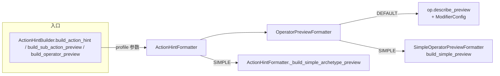
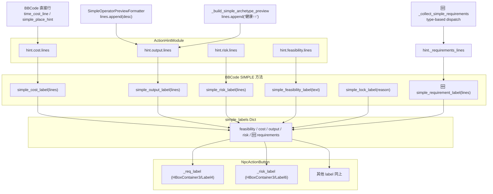

# Hint Profile — 行动提示双模式系统

## 设计意图

为行动按钮的 hover popup 提供两套提示 profile：

- **DEFAULT**（默认）：详版，完整调用 `op.describe_preview()`，含属性名+数值+箭头+知觉文本+ModifierConfig 注解
- **SIMPLE**（简版）：仅显示属性名+箭头（S/M/L→1/2/3个），无数值、无知觉文本、无来源注解、无重复行动惩罚注释，精简 UI 信息密度

## 架构



### 新增文件

| 文件 | 作用 |
|------|------|
| `core/hints/hint_profile.gd` | `HintProfile.Profile` 枚举（DEFAULT / SIMPLE） |
| `core/hints/simple_operator_preview_formatter.gd` | 为每类 operator 提供简单版本描述 |

### 修改文件

| 文件 | 变更 |
|------|------|
| `core/hints/operator_preview_formatter.gd` | `build_preview()` / `build_choice_result_preview()` 增加 `profile` 参数，SIMPLE 委托 SimpleOperatorPreviewFormatter |
| `core/hints/action_hint_formatter.gd` | `build_action_hint()` / `build_sub_action_preview()` 增加 `profile` 参数；extract `_assemble_feasibility_module` / `_assemble_cost_module` / `_assemble_output_module` / `_assemble_risk_module`；增加 `_build_simple_archetype_preview()` |
| `core/action_hint_builder.gd` | 所有公开 API 增加 `profile` 参数（默认 `DEFAULT`），透传给下辖 Formatter |

### 消费方改动

零破坏性变更。所有现有调用点不传 `profile` 时默认走 `DEFAULT`，行为与原来完全一致。

## Simple Profile 映射表

### Operator 映射

| Operator | Default 输出 | Simple 输出 | 规则 |
|----------|-------------|------------|------|
| `PropertyOperator` | `健康 ↑↑↑：+50（大幅提升）` | `健康↑↑↑` | 属性名 + 箭头（S/M/L→1/2/3个），无数值，无知觉文本，无来源 |
| `TimeOperator` | `时间消耗 5 天` | `⏱5天` | 缩略格式 |
| `TraitOperator` (add) | `获得「崴脚」` | `获 崴脚` | 「获」+ trait 名 |
| `TraitOperator` (remove) | `失去「中毒」` | `失 中毒` | 「失」+ trait 名 |
| `PoemRewardOperator` (money) | `选择一首诗词换取金钱（平庸→中等…）` | `卖诗` | mode→短标签 |
| `PoemRewardOperator` (fame) | — | `以诗换名` | mode→短标签 |
| `PoemRewardOperator` (baiye) | — | `携诗拜谒` | mode→短标签 |
| 异地行动提示 | `📍 自动消耗1天前往%s` | `赴%s` | 新增 `simple_place_hint()` in bbcode.gd，action_hint_formatter 按 profile 分流 |
| 其他 Operator (60+) | 不出现 | 不出现 | simple 不做显示 |

### 🆕 SIMPLE Requirements 映射

Requirements 格式由 `ActionHintFormatter._collect_simple_requirements()` 内 type-based dispatch 生成，不使用 `describe_requirement()`（那是 DEFAULT 的 i18n 长文本）。

| Requirement 类 | SIMPLE 格式 | i18n key | 示例 |
|---|---|---|---|
| `PropertyRequirement` | `需 {value} {感知词}` | `CODE_SIMPLE_ACTION_REQUIREMENT_PROPERTY_FMT` | `需 50 健` |
| `PropRangeRequirement` | `需 {min_value} {感知词}` | 同上 | `需 50 健` |
| `TraitRequirement` (HAS) | `需 {trait 中文名}` | `CODE_SIMPLE_ACTION_REQUIREMENT_TRAIT_NEED_FMT` | `需 貂皮大衣` |
| `TraitRequirement` (NOT_HAS) | `无 {trait 中文名}` | `CODE_SIMPLE_ACTION_REQUIREMENT_TRAIT_NONE_FMT` | `无 中毒` |
| `EmotionRequirement` | `需 {情绪名} {value}` | `CODE_SIMPLE_ACTION_REQUIREMENT_EMOTION_FMT` | `需 悲伤 50` |
| `PoemRequirement` | `需 诗词` | `CODE_POEM_REQUIREMENT_SIMPLE_DESC` | `需 诗词` |
| `XunDayLimitRequirement` | `仅前{N} 天` | `CODE_SIMPLE_ACTION_REQUIREMENT_XUN_DAY_FMT` | `仅前5 天` |
| `ActionMatchRequirement` | `需执行{action_id}` | `CODE_SIMPLE_ACTION_REQUIREMENT_ACTION_MATCH_FMT` | `需执行denggao` |
| `ComplexRequirements` | 递归展开子项 | — | 同上规则 |
| `FlagRequirement` | 不展示 | — | — |
| `NarrativeLockRequirement` | 不展示 | — | — |

> 格式约定：`\"··· {}\"`（空格分隔），无 `•` 前缀，与 SIMPLE 风格一致。

## SIMPLE profile 标签生成（Simple Labels）

SIMPLE profile 的标签文本（显示在 `NpcActionButton` 的五行/四行标签上）不再使用 `•` 和 `、`，改为**空格分割**。

### 数据流



### BBCode 方法（`ui/utils/bbcode.gd`）

| 方法 | 输入 | 输出示例 |
|------|------|---------|
| `simple_feasibility_label(text)` | 裸标签（如 `"渺茫"`） | `可行：渺茫` |
| `simple_cost_label(lines)` | `["⏱3天", "赴洛阳"]` | `耗：⏱3天 赴洛阳` |
| `simple_output_label(lines)` | `["健康↑", "金钱↑↑"]` | `产：健康↑ 金钱↑↑` |
| `simple_risk_label(lines)` | `["后果难料…"]` | `险：后果难料…` |
| `simple_requirement_label(lines)` 🆕 | `["需 50 健", "需 貂皮大衣"]` | `求：需 50 健 需 貂皮大衣` |
| `simple_lock_label(reason)` | `"条件不足"` | `锁定：条件不足`（红色） |

### NpcActionButton 层级（.tscn）

```
VBoxContainer
├── Label (title)
├── HBoxContainer
│   ├── Label2 (desc)
│   ├── VSeparator
│   └── Label3 (feas)
├── HBoxContainer2
│   ├── Label4 (cost)
│   ├── VSeparator
│   └── Label5 (output)
└── HBoxContainer3                        ← 🆕 requirements + risk 行
    ├── Label4 (求: ...)                  ← 🆕 _req_label
    ├── VSeparator
    └── Label6 (risk)                     ← 从旧位置 VBoxContainer/Label6 挪入
```

### 关键约定

1. **无 `•` 前缀** — `SimpleOperatorPreviewFormatter.build_simple_preview()` 和 `_build_simple_archetype_preview()` 不再输出 `"• " + desc`，只输出裸 desc
2. **空格分割** — 多行通过 `" ".join()` 拼接，而不是 `"、".join()`
3. **BBCode 集中管理** — 所有标签的前缀（`可行：`/`耗：`/`产：`/`求：`/`险：`/`锁定：`）收敛在 `bbcode.gd`，不散落在 formatter
4. **锁定态** — 自动展示红色 `"锁定：条件不足"`，不读取模块 lines
5. **Requirements 空数组处理** — `simple_requirement_label([])` 返回 `""`，UI 层 `_req_label.visible = false` 隐藏

## Archetype 定性预览（_build_archetype_qualitative_preview）

- DEFAULT: `• 健康 将会增加` / `• 健康 将会消耗（重复行动，效果减少20%）`
- SIMPLE: `健康↑` / `健康↓（重复）`（无 `•` 前缀）

## 使用示例

```gdscript
# 默认详版（向后兼容）
var hint = ActionHintBuilder.build_action_hint(action, is_locked)

# 显式指定 SIMPLE
var simple_hint = ActionHintBuilder.build_action_hint(action, is_locked, HintProfile.Profile.SIMPLE)

# 子行动 preview
var preview = ActionHintBuilder.build_sub_action_preview(sub, success_ops, fail_ops, parent_day, HintProfile.Profile.SIMPLE)

# operator preview
var lines = ActionHintBuilder.build_operator_preview(ops, HintProfile.Profile.SIMPLE)
```

## 相关文件

- `core/hints/hint_profile.gd` — 枚举定义
- `core/hints/simple_operator_preview_formatter.gd` — 简化描述实现（无 `•` 前缀）
- `core/hints/operator_preview_formatter.gd` — profile 分流路由
- `core/hints/action_hint_formatter.gd` — 组装函数 + profile 透传；`_build_simple_labels`；🆕 `_collect_simple_requirements` type-based dispatch
- `core/model/action_hint.gd` — 结构化输出；🆕 `_requirements_lines` 字段
- `ui/utils/bbcode.gd` — SIMPLE 标签格式化的唯一真相源；🆕 `simple_requirement_label()`
- `core/action_hint_builder.gd` — 外部接口代理层
- `ui/npc_action_button.gd` — 消费方；🆕 `_req_label` + HBoxContainer3 层级适配
- `core/requirements/poem_requirement.gd` — 🆕 `describe_requirement()` override
- `tests/test_action_hint_builder.gd` — 测试（含 SIMPLE profile 用例）
