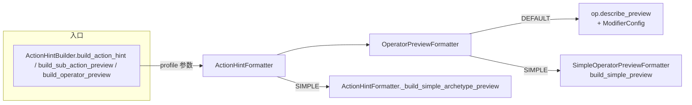

# Hint Profile — 行动提示双模式系统

## 设计意图

为行动按钮的 hover popup 提供两套提示 profile：

- **DEFAULT**（默认）：详版，完整调用 `op.describe_preview()`，含属性名+数值+箭头+知觉文本+ModifierConfig 注解
- **SIMPLE**（简版）：仅显示属性名+箭头（S/M/L→1/2/3个），无数值、无知觉文本、无来源注解、无重复行动惩罚注释，精简 UI 信息密度

## 架构



### 新增文件

| 文件 | 作用 |
|------|------|
| `core/hints/hint_profile.gd` | `HintProfile.Profile` 枚举（DEFAULT / SIMPLE） |
| `core/hints/simple_operator_preview_formatter.gd` | 为每类 operator 提供简单版本描述 |

### 修改文件

| 文件 | 变更 |
|------|------|
| `core/hints/operator_preview_formatter.gd` | `build_preview()` / `build_choice_result_preview()` 增加 `profile` 参数，SIMPLE 委托 SimpleOperatorPreviewFormatter |
| `core/hints/action_hint_formatter.gd` | `build_action_hint()` / `build_sub_action_preview()` 增加 `profile` 参数；extract `_assemble_feasibility_module` / `_assemble_cost_module` / `_assemble_output_module` / `_assemble_risk_module`；增加 `_build_simple_archetype_preview()` |
| `core/action_hint_builder.gd` | 所有公开 API 增加 `profile` 参数（默认 `DEFAULT`），透传给下辖 Formatter |

### 消费方改动

零破坏性变更。所有现有调用点不传 `profile` 时默认走 `DEFAULT`，行为与原来完全一致。

## Simple Profile 映射表

| Operator | Default 输出 | Simple 输出 | 规则 |
|----------|-------------|------------|------|
| `PropertyOperator` | `健康 ↑↑↑：+50（大幅提升）` | `健康↑↑↑` | 属性名 + 箭头（S/M/L→1/2/3个），无数值，无知觉文本，无来源 |
| `TimeOperator` | `时间消耗 5 天` | `⏱5天` | 缩略格式 |
| `TraitOperator` (add) | `获得「崴脚」` | `获 崴脚` | 「获」+ trait 名 |
| `TraitOperator` (remove) | `失去「中毒」` | `失 中毒` | 「失」+ trait 名 |
| `PoemRewardOperator` (money) | `选择一首诗词换取金钱（平庸→中等…）` | `卖诗` | mode→短标签 |
| `PoemRewardOperator` (fame) | — | `以诗换名` | mode→短标签 |
| `PoemRewardOperator` (baiye) | — | `携诗拜谒` | mode→短标签 |
| 其他 Operator (60+) | 不出现 | 不出现 | simple 不做显示 |

## Archetype 定性预览（_build_archetype_qualitative_preview）

- DEFAULT: `• 健康 将会增加` / `• 健康 将会消耗（重复行动，效果减少20%）`
- SIMPLE: `• 健康↑` / `• 健康↓（重复）`

## 使用示例

```gdscript
# 默认详版（向后兼容）
var hint = ActionHintBuilder.build_action_hint(action, is_locked)

# 显式指定 SIMPLE
var simple_hint = ActionHintBuilder.build_action_hint(action, is_locked, HintProfile.Profile.SIMPLE)

# 子行动 preview
var preview = ActionHintBuilder.build_sub_action_preview(sub, success_ops, fail_ops, parent_day, HintProfile.Profile.SIMPLE)

# operator preview
var lines = ActionHintBuilder.build_operator_preview(ops, HintProfile.Profile.SIMPLE)
```

## 相关文件

- `core/hints/hint_profile.gd` — 枚举定义
- `core/hints/simple_operator_preview_formatter.gd` — 简化描述实现
- `core/hints/operator_preview_formatter.gd` — profile 分流路由
- `core/hints/action_hint_formatter.gd` — 组装函数 + profile 透传
- `core/action_hint_builder.gd` — 外部接口代理层
- `tests/test_action_hint_builder.gd` — 测试（含 SIMPLE profile 用例）
