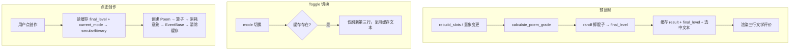

# 诗词评分创作 — 功能意图

**状态**: 🟢 已验证（V9.1: 预览锁定 + 文学化三行评价）

---

## 意图摘要（<200字）

砍掉 V8 的 C(N,3) 食谱枚举。诗词创作改为线性评分制：根据 Imaginary 数量与等级打分，超出 `max_imaginary_managable` 的额外 Imaginary 每个扣 5 分。评分定基础等级（平庸/佳作/绝唱），再按比例概率升级。mode 硬赋值 secular/literary 值（干谒→64/0，登高→0/48）。所有参与计算的 Imaginary 全量消耗。

**V9.1 新增**：预览时直接掷骰子锁定结果，用户点创作只是确认执行。展示从技术数值变为三行文学化评价——意象丰瘠、灵感手感、精力方向。

---

## 核心玩法

### 评分算法（V9）

```
score = Σ(每个 Imaginary 的贡献)

对每个 Imaginary（index 从 0 开始）:
  index < max_manageable  →  + (imaginary.level × 5)
  index >= max_manageable →  -5（溢出惩罚）
```

**如果 `imaginaries.size() < max_manageable`** → 计算函数返回错误，PoemCrafter 阻断创作。

### 等级阈值

| 等级 | score 范围 | 显示文本 | `Poem.level` |
|------|-----------|---------|-------------|
| 平庸 | < 25 | 平庸 | 1 |
| 佳作 | 25 ≤ score < 50 | 佳作 | 2 |
| 绝唱 | ≥ 50 | 绝唱 | 3 |

### 概率升级

纯函数仅输出 `upgrade_probability`，`randf()` 由 PoemCrafter 在**预览阶段**执行（路线 B：预览即锁定）：

```
base_level < 3 时:
  upgrade_probability = (score - current_threshold) / (next_threshold - current_threshold)
  其中 current_threshold = (base_level - 1) × 25, next_threshold = base_level × 25
```

例：score=40 → base_level=2 (佳作), upgrade_probability=(40-25)/(50-25)=0.60 → 60% 概率升绝唱。

### mode → 值硬赋值

| Mode | secular_value | literary_value |
|------|:------------:|:-------------:|
| `gan_ye` (干谒权贵) | 64 | 0 |
| `deng_gao` (登高抒怀) | 0 | 48 |

### 纯函数契约

[`PoemCraftingCalculator.calculate_poem_grade`](core/poem_crafting_calculator.gd:1) 是**无状态、幂等纯函数**：

- 禁止 `randf()` / `Database` / `PlayerState` / `Time` 调用
- `max_manageable` 由调用方显式传入
- 仅输出计算值，不执行副作用

### 三级事件库

诗词展示事件从对应等级的 EventBase 抽取：

| EventBase | 等级 | fallback 事件 |
|-----------|------|--------------|
| `poem_level_1` | 平庸 | `poem_level_1_fallback` |
| `poem_level_2` | 佳作 | `poem_level_2_fallback` |
| `poem_level_3` | 绝唱 | `poem_level_3_fallback` |

### 意象消耗

创作成功后**消耗所有参与计算的 Imaginary**（全量清空 `Database.imaginaries_detail`）。

---

## V9.1: 预览锁定 + 文学化三行评价

### 预览即锁定（路线 B）

预览（`_preview_current`）时立即调用 `randf()` 掷骰子确定 `final_level`，结果缓存。用户切换 mode 不重新计算，仅刷新第三行精力方向文案。点击「创作」按钮只是确认执行，直接从缓存读取。

### 三行文学评价

| 行号 | 基于 | 颜色 | 内容 |
|:----:|------|------|------|
| 1 | `base_level` (1/2/3) | `#daa520` 暗金 | 意象丰瘠评价（3选1随机） |
| 2 | `upgrade_probability` 三档 | `#87ceeb` 天蓝 | 灵感手感评价（3选1随机） |
| 3 | `current_mode` | `#ddd` 灰白 | 精力方向固定文案 |

#### 行1: 意象丰瘠常量

| base_level | 随机池 |
|:----------:|--------|
| 1 (平庸) | 「意象贫瘠，恐成陈词滥调」「意象单薄，难成气候」「寥寥数象，勉强成篇」 |
| 2 (佳作) | 「意象尚可，颇有章法」「意象初具，犹待点睛」「意象得体，渐入佳境」 |
| 3 (绝唱) | 「意象丰沛，气韵生动」「意象纵横，吞吐大荒」「万象在旁，呼之欲出」 |

#### 行2: 灵感手感常量

| upgrade_probability 档 | 随机池 | 升级成功追加 |
|:----------------------:|--------|------------|
| < 0.33 (低) | 「文思枯涩，全凭基本功」「手感生涩，勉力为之」「思绪凝滞，步步为营」 | `——竟有神来之笔！` |
| 0.33~0.66 (中) | 「文思渐涌，偶得佳句」「似有灵光，若即若离」「心手渐畅，暗藏机锋」 | 同上 |
| ≥ 0.66 (高) | 「灵感涌动，如有神助」「才思泉涌，下笔如飞」「灵光乍现，妙手偶得」 | 同上 |
| base_level=3 (绝唱) | 固定：**已达化境，随心所欲** | 无追加 |

#### 行3: 精力方向

| mode | 固定文案 |
|------|---------|
| `gan_ye` | 「此诗的精力将倾注于世俗功名之上」 |
| `deng_gao` | 「此诗的精力将倾注于千古文章之上」 |

### 数据流



### 关键行为差异（vs V9 无预览锁定时）

| 场景 | V9.1 行为 |
|------|----------|
| slot 重建 | 自动 `_preview_current` → 计算+掷骰子+缓存 |
| 切换 mode | 仅刷新第三行，不重算/不重掷骰子 |
| 意象数量不足 | 显示 insufficient 文本 + 清除缓存 |
| 点击创作时缓存缺失 | `Logging.err` + 阻断创作 |
| 切换 mode 后点创作 | 以 `current_mode`（点击时）的 secular/literary 为准 |

---

## 更改文件

| 文件 | 改动 |
|------|------|
| [`core/poem_crafting_calculator.gd`](core/poem_crafting_calculator.gd:1) | **重写** (V9) — 纯函数评分 + 等级分 + 升级概率计算 |
| [`ui/poem_crafter.gd`](ui/poem_crafter.gd:1) | **修改** (V9.1) — `_preview_current` 预览锁定 + 文学化三行评价；`_on_button_pressed` 精简为确认执行；Toggle 回调仅刷新第三行 |
| [`core/event_manager.gd`](core/event_manager.gd:1) | **新增方法** — `draw_from_event_base` 从指定 EventBase 抽事件 |
| [`data/1_core_rules/events/poem_levels/eb_poem_level_1.json`](data/1_core_rules/events/poem_levels/eb_poem_level_1.json) | **新建** — 平庸事件库 |
| [`data/1_core_rules/events/poem_levels/eb_poem_level_2.json`](data/1_core_rules/events/poem_levels/eb_poem_level_2.json) | **新建** — 佳作事件库 |
| [`data/1_core_rules/events/poem_levels/eb_poem_level_3.json`](data/1_core_rules/events/poem_levels/eb_poem_level_3.json) | **新建** — 绝唱事件库 |
| [`data/1_core_rules/events/fallback/poem_level_1_fallback.tres`](data/1_core_rules/events/fallback/poem_level_1_fallback.tres) | **新建** — 平庸匿名诗 |
| [`data/1_core_rules/events/fallback/poem_level_2_fallback.tres`](data/1_core_rules/events/fallback/poem_level_2_fallback.tres) | **新建** — 佳作匿名诗 |
| [`data/1_core_rules/events/fallback/poem_level_3_fallback.tres`](data/1_core_rules/events/fallback/poem_level_3_fallback.tres) | **新建** — 绝唱匿名诗 |
