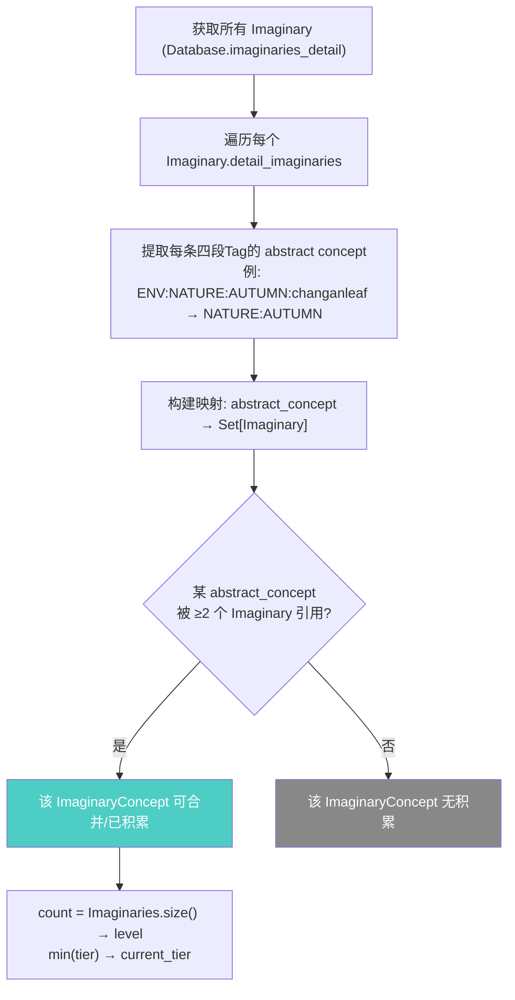

# 诗词意象匹配 — 功能意图

**状态**: ❌ 未实现（架构决策已定，待开发）

---

## 意图摘要（<200字）

诗词创作增加第二层校验：除了 Tier 等级匹配，还需检验玩家提交的具体意象是否贴合诗词主题。每首诗声明所需的四段式 Tag，玩家提交的 3 个意象展开为扁平 Set 后做交集匹配——精确 20 权重，同类 10 权重，每条 Fragment 只取最精确层，累计 30 解锁。同时增加诗词上限（同一时间仅持有一首）和使用后归档图鉴（附带使用情境描述）。移除 `basic_imaginaries` 中间态，Fragment 直接存储在 Category 上。

---

## 核心玩法

- **双层校验**：Tier 等级（木桶效应）→ Fragment 详细匹配（权重累加），任一未过则创作失败
- **权重规则（累加制，每条 Fragment 只取最精确匹配）**：
  - 精确匹配（4 段完全一致）：`A:B:C:D` → `A:B:C:D` = 20
  - 同类匹配（前 3 段一致）：`A:B:C:E` → `A:B:C:D` = 10
  - 无匹配：0
  - **同一条 Fragment 不重复计分**：若 `A:B:C:D` 精确命中，不再重复计算其 `A:B:C` 的同类分
  - 不同 Fragment 分别计分后**累加**，门槛 30
  - 举例：提交 `A:B:C:D` + `E:F:G:H` + `X:Y:Z:W`，诗词要求 `A:B:C:D` + `E:F:G:K`
    - `A:B:C:D` → 精确 20，不计同类
    - `E:F:G:H` → 同类 10（前 3 段匹配 `E:F:G`）
    - 合计 30 → ✅ 解锁
- **惩罚机制**：权重不足 → "意象散乱，强行拼凑。你在这堆废纸中枯坐了一夜，一无所获。" 浪费写诗机会但不消耗意象
- **诗词上限**：同一时间只能持有一首未使用的诗词（未来可扩展上限）。PoemCrafter 检测玩家已有诗词时拒绝创作并报错
- **图鉴归档**：诗词使用后移入图鉴页面，附带一句使用情境描述（如"呈于皇帝御览""题于长安酒肆墙壁"）。无描述则不显示该句，无默认 fallback
- **加载时膨胀**：所有四段式 Tag 在初始化时一次性膨胀为 `["A", "A:B", "A:B:C", "A:B:C:D"]` 存入 flat Set（用 `:` 分隔以兼容五维宪法），运行时纯 Set 交集，O(1)

---

## 数据流

```
事件获取意象 → 写入 Fragment（四段式 Tag）
                    ↓
           TagAdapter 加载时膨胀 → flattened Set
                    ↓
    ┌───────────────┴───────────────┐
    │                               │
    ↓                               ↓
ImaginaryComprehender            PoemCrafter
合并/坍缩 → tier + level         选 3 个 Category
                                    ↓
                            FragmentMatcher.match()
                              ├─ 收集 3 个 Category 的 expanded_tags
                              ├─ 与诗词 required_fragments 膨胀 Set 求交集
                              └─ 权重累加 → ≥30? 解锁 : 惩罚
```

---

## 涉及文件

| 文件 | 改动类型 | 说明 |
|------|----------|------|
| [`core/model/imaginary.gd`](/core/model/imaginary.gd:1) | **重构** | 移除 `basic_imaginaries: Array[Dictionary]`，新增 `fragments: Array[String]` + `expanded_tags: Array[String]` |
| [`core/fragment_matcher.gd`](/core/fragment_matcher.gd:1) | **新建** | 加载时膨胀函数 + 运行时 Set 交集匹配 + 权重累加 |
| [`core/imaginary_manager.gd`](/core/imaginary_manager.gd:1) | **修改** | `add_imagenary()` 直接写入 Fragment，不再包装为字典 |
| [`core/imaginary_comprehender.gd`](/core/imaginary_comprehender.gd:1) | **修改** | `merge_category()` 从 `fragments` 读取，坍缩后清空保留到 `merged` |
| [`core/poem_crafting_calculator.gd`](/core/poem_crafting_calculator.gd:1) | **修改** | 注入 `FragmentMatcher` 调用，双层校验返回值 |
| [`core/model/legendary_poem.gd`](/core/model/legendary_poem.gd:1) | **修改** | 新增 `required_fragments: Array[String]` 字段 |
| [`ui/poem_crafter.gd`](/ui/poem_crafter.gd:1) | **修改** | 过滤无 tier 的 Category + 上限检查（已有诗词则拒绝）+ 匹配进度 + 惩罚 UI |
| [`ui/poem_gallery.gd`](/ui/poem_gallery.gd:1) | **新建** | 诗词图鉴页面，展示已使用的诗词 + 使用情境描述 |
| [`core/model/poem_record.gd`](/core/model/poem_record.gd:1) | **新建** | 诗词归档数据结构：标题、内容、创作日期、使用情境（可选）、tier |
| 数据迁移脚本 | **新建** | 将现有 `basic_imaginaries` 字典迁移为 `fragments` 格式 |

---

## 状态转换

```
[玩家打开诗词面板]
    │
    ├─ 已有未使用的诗词
    │   → ❌ 拒绝创作，提示"已有诗作，先将其送出或题壁后再来"
    │
    ├─ Category 无 tier（未感悟/未合并）
    │   → UI 灰显，不可选中。需先合并碎片获得 tier 后才能用于创作
    │
    ├─ 选了 3 个已合并 Category（有 tier）
    │   → Tier 校验通过 → FragmentMatcher 匹配
    │       ├─ 权重 ≥ 30 → ✅ 创作成功，消耗 Category，新诗词覆盖旧诗词槽位
    │       └─ 权重 < 30 → ❌ 惩罚文案，保留 Category，浪费机会
    │
    ├─ Tier 校验未过（已有逻辑，不改动）
    │   → ❌ 直接失败
    │
    └─ 诗词被使用（赠诗/题壁/应制等）
        → 移入图鉴页面，附带使用情境描述（空则不显示该句）
```

---

## 开放问题

| # | 问题 | 决策 |
|---|------|------|
| 1 | 多个匹配级别权重是取最高还是累加？ | ✅ **累加（sum）** — 既有精确又有同类 → 20+10 |
| 2 | 膨胀后的层级分隔符用 `_` 还是 `:`？ | ✅ **`:`** — 与五维宪法 Tag 内部标准分隔符一致 |
| 3 | 惩罚文案是否根据当前 IAM（狂客/钻营/逢迎）有不同 flavor？ | ❓ 待定 — A: 统一文案 / B: 分 IAM 定制 |
| 4 | `merged` 字段存储原始四段式还是膨胀后的 Set？ | ❓ 待定 — A: 原始四段式 / B: 膨胀后 Set |


-----

Poem trait 动态注册方式：B) 通过 Database 内存态注册，走统一管道（未来 PoemTypeChooseOperator 等可复用）
secular_value / literary_value 如何获取：我不明白你什么意思，这是赋予给诗词的，应该直接在诗词创建的时候算出来给到诗词的数据模型
关于poem 的获取：我改主意了，使用一个专门的事件 + 动态插值 + 打字机慢放

关于model 层
1. ImaginaryTag, 删除basic imaginaries, 同时不需要任何其他属性增加
2. _rebuild_subviewport 同样展示对应的abstract concept + detail imaginaries, 但是对于detail imaginary, 修改第一行展示 Imaginary 相对于这个抽象概念来说的"方面“，比如说AbstractConcept = ENV_NATURE_AUTUMN, 同时Imaginary (name = "长安落叶, uuid = 'changanleaf)的"detail_imaginaries"字段的列表中，包括一个字段叫做ENV_NATURE_AUTUMN_changanleaf, 那么就去imaginary 数据模型的"perceptions 字典获取 key = "ENV_NATURE_AUTUMN_changanleaf"对应的str val 作为展示，然后在第二行展示暗红色小字“长安落叶”
3. 新加入Imaginary 数据模型，修改当前的Imaginary 文件名字为ImaginaryConcept, 类名字同样修改为这个(实际上是ImaginaryTag)
4. ImaginaryComprehender 动态获取当前所有的Imaginary, 把他们的detail_imaginaries展开为一个集合（里面包括这些四段detail imaginary 的abstract concept，然后找出这些集合所包含的共同abstract concept，对他们求交集
如果找到有一个abstract concept 超过两个集合存在（也就是有超过两个detailed imaginary），就去具体检索detailed imaginary 的数量，然后作为数据展示
也就是说，没有具体对于detail imaginary 的存储，他们是动态推倒出来的，这些数据也是poem crafter 的数据源
merged 字段：存原始四段式
惩罚文案：先统一文案

# 对话记录

## 最终架构方案 — 诗词创作 V4

### 数据模型全景

```
┌─────────────────────────────────────────────────┐
│              Database 双层存储                      │
├─────────────────────────────────────────────────┤
│                                                  │
│  imaginaries: Dict[String, ImaginaryConcept]     │
│  ├─ "env:nature:autumn" → { name:"秋意", tier:2 }│
│  ├─ "vibe:theme:macabre" → { name:"鬼氛", tier:1 }│
│  └─ ...                                          │
│                                                  │
│  imaginaries_detail: Dict[String, Imaginary]     │
│  ├─ "changanleaf" → {                             │
│  │    name:"长安落叶",                              │
│  │    detail_imaginaries: [                       │
│  │      "ENV:NATURE:AUTUMN:changanleaf",          │
│  │      "VIBE:THEME:MACABRE:changanleaf"          │
│  │    ],                                          │
│  │    perceptions: {                              │
│  │      "ENV:NATURE:AUTUMN:changanleaf":          │
│  │        "秋风萧瑟，落叶满长安"                     │
│  │    }                                           │
│  │  }                                             │
│  └─ ...                                          │
└─────────────────────────────────────────────────┘
```

### ImaginaryComprehender 动态推导流程



**关键洞察：** 不再有显式的"碎片计数"。ImaginaryConcept 的 level/tier 由 ImaginaryComprehender **每次调用时动态计算**——遍历玩家拥有的所有 Imaginary，看它们引用了哪些 abstract concept，被多少 Imaginary 引用。

### PoemCrafter UI 数据展示

```
┌──────────────────────────────────────┐
│         SubViewport                   │
│                                       │
│   ● AbstractConcept: "秋意"           │
│     └─ OrbitDetail:                   │
│        第一行: "秋风萧瑟，落叶满长安"    │  ← Imaginary.perceptions[4-seg-tag]
│        第二行: 长安落叶 (暗红小字)       │  ← Imaginary.name
│                                       │
│   ● AbstractConcept: "鬼氛"           │
│     └─ OrbitDetail:                   │
│        第一行: "乱葬岗上磷火幽幽..."     │
│        第二行: 鬼火 (暗红小字)          │
└──────────────────────────────────────┘
```

每个 AbstractConcept 的 OrbitDetail 节点来自 ImaginaryComprehender 的动态推导——所有 `detail_imaginaries` 中包含该 concept 的 Imaginary。

### 诗词揭示事件（替代静默 add_trait）

```
[创作成功]
  │
  ├─→ PoemCraftingCalculator 返回 PoemCraftingResult
  │     ├─ secular_value: 45.0
  │     ├─ literary_value: 60.0
  │     ├─ poem_type: "GAN_YE"
  │     └─ tier: 2
  │
  ├─→ 构造上下文 context:
  │     { poem_secular: 45, poem_literary: 60, poem_type: "干谒", poem_tier: 2 }
  │
  └─→ push_event("poem_reveal", context)
        └─→ 事件描述: "你以「{@poem_type}」为题，沉吟良久...[打字机慢放]"
        └─→ on_enter: context_fetch 将 poem 数据注入 display
        └─→ 选项: "将此诗收入囊中" → add_trait(poem) + pop_event
```

---

### ⚠️ 一个需要确认的架构问题

动态推导模型有一个隐含约束：**如果 Imaginary 的 `detail_imaginaries` 只引用了一个 abstract concept，那它不会被计入任何 ImaginaryConcept 的"积累"中**（因为你的规则是"超过两个集合存在"即 ≥2 个 Imaginary 引用同一个 concept）。

这意味着：
- 玩家获得孤立的 Imaginary（如只有一个 `ENV:NATURE:AUTUMN:changanleaf`）时，在 ImaginaryComprehender 看来 concept "NATURE:AUTUMN" 的引用计数为 1，不满足 ≥2 的合并门槛
- 玩家需要再获得另一个也引用 "NATURE:AUTUMN" 的 Imaginary（如 `ENV:NATURE:AUTUMN:beijingleaf`）才能触发合并

**这个理解对吗？还是说单个 Imaginary 也应该在 PoemCrafter 中可见（即使未合并）？**

---

方案确认后我按 Phase 分批委派 Code 模式执行。

补充：在PoemCrafter 右键collapase 了一个abstract concept 之后，需要消耗所使用的 imaginary，同时刷新页面
poem 不使用 tier ，使用level
单个 Imaginary 也应该在 PoemCrafter 中可见, 但无法合并
揭示事件普通即可