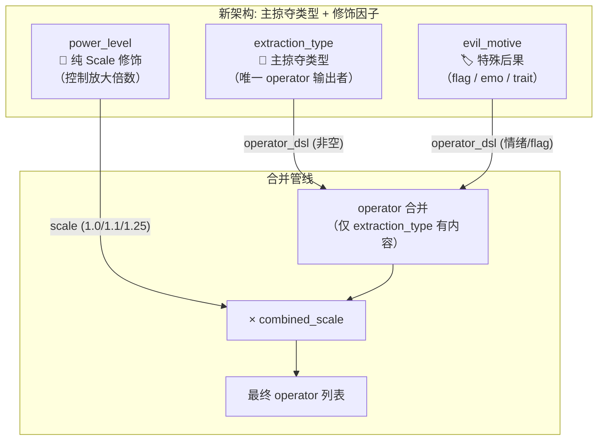

# 拜谒-蜜月期 Operator 体系重构方案（方案C）

> **状态：** 架构设计完成，等待审批后进入实施
> **关联文件：** [`tools/bai_ye_honeymoon_config.json`](../../tools/bai_ye_honeymoon_config.json)
> **影响范围：** config.json 的 `dimensions` 区块 + 全部 25 个 `.tres` 需重新生成

---

## 1. 问题根因

当前三个维度的 `operator_dsl` 采用**无条件加法拼接**（[`io_csv.py::_build_option_dsl`](../../tools/event_generator/io_csv.py:118)），导致：

| 冲突 | 现象 | 受损事件 |
|------|------|---------|
| money 泄漏到非金钱场景 | TypeB(健康)/TypeC(精神) 事件中玩家被扣 money，叙事却无金钱描写 | `l0_typeb_m0` 寒门立雪, `l0_typec_m0` 门隙传话 |
| fatigue 泄漏到金钱场景 | L2(权贵) 的 fatigue 算子注入 TypeA(金钱) 事件 | `l2_typea_m0` 相府献金, `l2_typea_m1` 画前荐礼 |
| fatigue 双重叠加 | L2 和 TypeC 各自输出 fatigue，形成双份扣除 | `l2_typec_m0` 右相府中的空椅, `l2_typec_m1` 右相赐坐 |
| M1 无专属叙事锚点 | M1 仅靠 scale=1.15 放大数值，缺少可命名的差异化后果 | 全部 M1 事件 |

**本质：** 三个维度被设计为"正交因子"（各自独立输出 operator），但叙事上它们是"同一事件的多视角标注"。

---

## 2. 新维度架构

### 2.1 职责重构



**契约：**
- `extraction_type` 是 **唯一** 输出资源消耗 operator 的维度
- `power_level` **绝不**输出 operator_dsl，仅通过 scale 放大所有后果
- `evil_motive` 通过 **情绪 / flag / trait** 等非资源型 operator 给事件打上叙事烙印

### 2.2 维度语义对齐

| 维度 | 叙事问题 | 机械回答 |
|------|---------|---------|
| **power_level** | "对方多大官？" | 决定 **代价放大倍数**（门子×1.0 → 权贵×1.25） |
| **extraction_type** | "对方要什么？" | 决定 **扣除什么属性**（钱/健康/疲劳） |
| **evil_motive** | "对方为什么为难我？" | 决定 **情绪残留**（愤怒/悲凉/无） |

---

## 3. 精确 Operator 重定义

### 3.1 power_level（纯 Scale，零 Operator）

| ID | Name | Scale | operator_dsl | 叙事锚点 |
|----|------|-------|-------------|---------|
| L0 | 门子/家奴 | 1.00 | `""` | 底层门槛，索贿求通报 |
| L1 | 清客/文法吏 | 1.10 | `""` | 中层幕僚，递话要钱 |
| L2 | 权贵本尊 | 1.25 | `""` | 高官本人，一切代价被放大 |

> **删除理由：** 原 L0/L1 的 `prop_sub(name=money; val=10)` 和 L2 的 `prop_sub(name=money; val=10)|prop_sub(name=fatigue; val=5)` 是"泄漏源"——它们无视 extraction_type 的语义强制注入。

### 3.2 extraction_type（唯一资源消耗输出者）

| ID | Name | Scale | operator_dsl | 叙事锚点 |
|----|------|-------|-------------|---------|
| TypeA | 金钱掠夺 | 1.00 | `prop_sub(name=money; val=30)` | 明示或暗示索取钱财 |
| TypeB | 生命/健康损耗 | 1.00 | `prop_sub(name=health; val=5)` | 长时间等候、奔波、带病 |
| TypeC | 精神PUA | 1.00 | `prop_sub(name=fatigue; val=10)` | 羞辱、冷落、贬低 |

> **TypeA 从 20 → 30 的补偿计算：** 
> 原 L0+TypeA 总 money = power_level(10) + extraction_type(20) = **30**。
> 删除 power_level 的 10 贡献后，TypeA 上调到 30 以保持数值总量一致。
>
> L1+TypeA: 30 × 1.10 = 33（匹配原 L1+TypeA: (10+20) × 1.10 = 33）
> L2+TypeA: 30 × 1.25 = 37.5（原 money 部分：30 × 1.25 = 37.5 ✓；原 fatigue 部分删除 ✓）

### 3.3 evil_motive（情绪/特殊后果输出者）

| ID | Name | Scale | operator_dsl | 叙事锚点 |
|----|------|-------|-------------|---------|
| M0 | 媚上邀功 | 1.00 | `""` | 讨好上级，体制内正常操作 |
| M1 | 纯粹寻租/变态 | 1.15 | `emo_add(name=ANGER; val=5)` | 享受权力快感 → 玩家愤懑 |
| M2 | 制度性冷漠 | 1.00 | `""` | 制度使然，无人刻意针对 |

> **M1 新增 `emo_add(name=ANGER; val=5)` 的理由：**
> 原 M1 仅靠 scale=1.15 放大数值，玩家感受到"扣得更多"但不知道为什么。加入 ANGER 情绪后，M1 事件在叙事+机械两层都有了专属烙印——"那个门子故意刁难你，你心中涌起一股无名火"。
>
> **情绪枚举来源：** [`model/enumerates.gd`](../../model/enumerates.gd:80) — `EMOTION.ANGER` = 愤懑（涵盖被贬、目睹不公）。
> **DSL 语法：** [`DOCUMENTATIONS/dsl/dsl_syntax_reference.md`](../../DOCUMENTATIONS/dsl/dsl_syntax_reference.md) — `emo_add(name=ANGER; val=N)`。

---

## 4. 合并后 Operator 速查表

> 公式：`extraction_type.operator_dsl` + `evil_motive.operator_dsl`，整体 × `power_level.scale × extraction_type.scale × evil_motive.scale`

### 4.1 TypeA（金钱掠夺）全组合

| 组合 | Scale | 最终 Operator |
|------|-------|-------------|
| L0+TypeA+M0 | 1.00 | `prop_sub(name=money; val=30)` |
| L0+TypeA+M1 | 1.15 | `prop_sub(name=money; val=34.5) \| emo_add(name=ANGER; val=5)` |
| L0+TypeA+M2 | 1.00 | `prop_sub(name=money; val=30)` |
| L1+TypeA+M0 | 1.10 | `prop_sub(name=money; val=33)` |
| L1+TypeA+M1 | 1.265 | `prop_sub(name=money; val=37.95) \| emo_add(name=ANGER; val=5)` |
| L1+TypeA+M2 | 1.10 | `prop_sub(name=money; val=33)` |
| L2+TypeA+M0 | 1.25 | `prop_sub(name=money; val=37.5)` |
| L2+TypeA+M1 | 1.4375 | `prop_sub(name=money; val=43.125) \| emo_add(name=ANGER; val=5)` |
| L2+TypeA+M2 | 1.25 | `prop_sub(name=money; val=37.5)` |

### 4.2 TypeB（生命/健康损耗）全组合

| 组合 | Scale | 最终 Operator |
|------|-------|-------------|
| L0+TypeB+M0 | 1.00 | `prop_sub(name=health; val=5)` |
| L0+TypeB+M1 | 1.15 | `prop_sub(name=health; val=5.75) \| emo_add(name=ANGER; val=5)` |
| L0+TypeB+M2 | 1.00 | `prop_sub(name=health; val=5)` |
| L1+TypeB+M0 | 1.10 | `prop_sub(name=health; val=5.5)` |
| L1+TypeB+M1 | 1.265 | `prop_sub(name=health; val=6.325) \| emo_add(name=ANGER; val=5)` |
| L1+TypeB+M2 | 1.10 | `prop_sub(name=health; val=5.5)` |
| L2+TypeB+M0 | 1.25 | `prop_sub(name=health; val=6.25)` |
| L2+TypeB+M1 | 1.4375 | `prop_sub(name=health; val=7.1875) \| emo_add(name=ANGER; val=5)` |
| L2+TypeB+M2 | 1.25 | `prop_sub(name=health; val=6.25)` |

### 4.3 TypeC（精神PUA）全组合

| 组合 | Scale | 最终 Operator |
|------|-------|-------------|
| L0+TypeC+M0 | 1.00 | `prop_sub(name=fatigue; val=10)` |
| L0+TypeC+M1 | 1.15 | `prop_sub(name=fatigue; val=11.5) \| emo_add(name=ANGER; val=5)` |
| L0+TypeC+M2 | 1.00 | `prop_sub(name=fatigue; val=10)` |
| L1+TypeC+M0 | 1.10 | `prop_sub(name=fatigue; val=11)` |
| L1+TypeC+M1 | 1.265 | `prop_sub(name=fatigue; val=12.65) \| emo_add(name=ANGER; val=5)` |
| L1+TypeC+M2 | 1.10 | `prop_sub(name=fatigue; val=11)` |
| L2+TypeC+M0 | 1.25 | `prop_sub(name=fatigue; val=12.5)` |
| L2+TypeC+M1 | 1.4375 | `prop_sub(name=fatigue; val=14.375) \| emo_add(name=ANGER; val=5)` |
| L2+TypeC+M2 | 1.25 | `prop_sub(name=fatigue; val=12.5)` |

> **关键改进：**
> - TypeB 场景**零 money** 扣除（叙事无金钱 → 机械无金钱 ✓）
> - TypeA 场景**零 fatigue** 扣除（叙事无等候 → 机械无疲劳 ✓）
> - TypeC+L2 场景**单份 fatigue**（叙事一重羞辱 → 机械一重疲劳 ✓）
> - M1 场景新增 **ANGER 情绪**（叙事恶意 → 机械情绪 ✓）

---

## 5. 实施待办事项

```markdown
[ ] 1. 修改 tools/bai_ye_honeymoon_config.json 的 dimensions 区块
    - power_level L0/L1/L2: operator_dsl 全部改为 ""
    - extraction_type TypeA: operator_dsl 改为 "prop_sub(name=money; val=30)"
    - extraction_type TypeB/TypeC: 保持不变
    - evil_motive M1: operator_dsl 改为 "emo_add(name=ANGER; val=5)"
[ ] 2. 重新运行正交事件生成管线，生成新的 27 个 .tres 文件
[ ] 3. 逐文件验证 operator 与叙事的对齐（重点检查 TypeB/C 无 money，TypeA 无 fatigue）
[ ] 4. 运行时测试：触发几个 TypeB/TypeC 事件，确认不扣 money
[ ] 5. 运行时测试：触发 M1 事件，确认 ANGER 情绪正确累加
[ ] 6. 更新 DOCUMENTATIONS/events/ 相关文档（如有引用 operator 示例）
[ ] 7. Git commit
[ ] 8. 同步修改到云端 CSV
```

---

## 6. 风险与回滚

| 风险 | 概率 | 应对 |
|------|------|------|
| TypeA 上调到 30 导致初期惩罚过重 | 低 | 蜜月期 universal_requirement 已限定 progress < 70，初期属性充裕 |
| ANGER 情绪引入影响其他情绪系统交互 | 中 | ANGER 是已有枚举值，emo_add 是标准 DSL 操作符，影响范围可控 |
| 重生成的事件 AI 叙事质量下降 | 低 | 维度描述不变，仅 operator 变，AI 叙事逻辑不依赖 operator |
| `universal_result` 中的 `prop_add(name=progress; val=10)` 被 scale 放大 | 中 | `_build_option_dsl` 中 `universal_result` 也会被 `combined_scale` 缩放。L2+M1 时 progress 从 10 → 14.375。**此为设计意图**：见更高层的官、被更恶意对待，仕途推进理应更多。但需在文档中明确标注。 |

> **回滚方案：** `git checkout` 原 config.json，重新生成一次即可。反悔成本极低。

---

## 5. 验收结果（终裁）

> 验收日期：2026-06-16

### 核心验证 ✅ 全部通过

| 规则 | 结果 |
|------|------|
| TypeA 事件纯 money（无 fatigue/health） | ✅ 9/9 |
| TypeB 事件纯 health（无 money） | ✅ 8/8 |
| TypeC 事件纯 fatigue（无 money） | ✅ 9/9 |
| power_level 无 operator 泄漏 | ✅ scale 正确放大 |
| 无跨类型 operator 污染 | ✅ |

### 已知外部问题（非本重构引入）

| 问题 | 根因 | 状态 |
|------|------|------|
| M1 `emo_add(name=ANGER)` 在 .tres 中丢失 | `EmotionOperator.str_emotion` 非 `@export`，Godot 序列化时丢失 | 独立 bug，需单独修复 |
| `l2_typeb_m2` 未重新生成 | 管线跳过此事件，旧 .tres 保留旧值 | 可单独处理 |
| 全局 `fatigue=+5` | `poem_type_choose_zhuoliu.tres` 模板的 `rejected_result` 条件分支 | 所有事件平等共享，非污染 |
