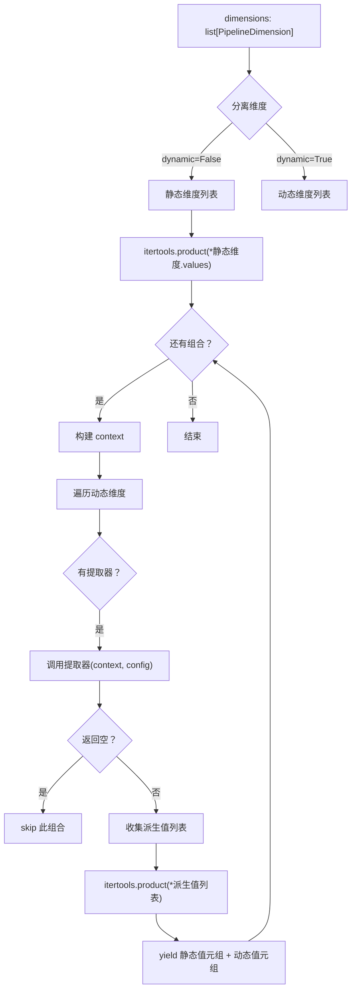

# Dynamic Dimension 架构设计

> **⚠️ 已废弃**
>
> 此文档描述的旧版 `EXTRACTOR_REGISTRY` + `_extract_scene_tags()` 架构已被重构。
> 新版使用 `linked_value_ids` 值级引用机制 + 内联计算。
> 详见：[`dynamic_dimension_refactor.md`](dynamic_dimension_refactor.md)

> **版本：** v1.0（已废弃）
> **用途：** 场景×标签正交事件库的底层架构支撑（旧版）
> **前置文档：** [`orthogonal_event_pipeline.md`](orthogonal_event_pipeline.md)

---

## 1. 动机：为什么需要 Dynamic Dimension？

### 1.1 问题

旧版正交管线（`generate_orthogonal_events.py`）要求所有维度的值在配置文件中**静态预定义**。对于拜谒事件（3 维静态矩阵：阻击位 × 掠夺机制 × 平庸之恶动机×3），这是合理的——每个维度的值集是固定的。

但在**场景×标签**事件库中，一个维度的值（标签）**依赖于**另一个维度的值（场景）。不同场景拥有不同的标签集：

```
场景: 长安夜宴  → 标签: env_society_festival, env_luxury_decadence
场景: 古刹避雨  → 标签: env_temple_solitude, env_natural_rain
```

如果静态预定义所有标签，会：

1. **爆炸不合理的组合**：长安夜宴 × 古刹标签（"雨中古寺的宁静"出现在华丽宴会上）
2. **后期维护成本高**：新增场景时必须同步修改标签列表
3. **违反正交原则**：场景和标签本就有依赖关系，强行解耦只会让语义崩溃

### 1.2 方案：Dynamic Dimension

引入**Dynamic Dimension（动态维度）** 机制：

> 一个维度的值不是预定义的，而是在笛卡尔积展开时，通过一个**提取器函数**从**已展开的静态维度的上下文**中动态派生。

```
静态维度（场景）: 长安夜宴 → 派生上下文 →
动态维度（标签）: 提取器从场景的 tags 字段读取 →
组合: (长安夜宴, env_society_festival), (长安夜宴, env_luxury_decadence)
```

---

## 2. 核心概念

### 2.1 数据模型

```
┌─────────────────────────────────────────────┐
│  EventPipelineConfig                         │
│  ├─ prompt_features: list[PromptFeature]     │
│  ├─ option_features: list[OptionFeature]     │
│  └─ dimensions: list[PipelineDimension]      │
│       ├─ [静态维度] id="scene"  dynamic=False │
│       │    └─ values: list[PipelineDimensionValue]
│       │         ├─ SceneValue(id="s1", tags=["a","b"])
│       │         └─ SceneValue(id="s2", tags=["b","c"])
│       │
│       └─ [动态维度] id="tag"  dynamic=True    │
│            ├─ value_extractor_key="scene_tags"│
│            └─ value_extractor_config={        │
│                 "exclude": ["main_tag"]        │
│               }                                │
└─────────────────────────────────────────────┘
```

### 2.2 关键类型

| 类型 | 所在文件 | 说明 |
|------|----------|------|
| [`PipelineDimensionValue`](tools/config.py:36) | `tools/config.py` | 维度值的基类。新增 `tags: list[str]` 字段，供 Dynamic Dimension 提取器读取 |
| [`SceneValue`](tools/config.py:50) | `tools/config.py` | 继承 `PipelineDimensionValue`，纯语义标记类型（`pass`），标识这个值是"场景" |
| [`DimensionCombo`](tools/config.py:79) | `tools/config.py` | 维度+值的数据组合，替代旧版硬编码的 `d1/dv1/d2/dv2` |
| [`PipelineDimension`](tools/config.py:61) | `tools/config.py` | 新增 `dynamic`/`value_extractor_key`/`value_extractor_config` 字段 |

### 2.3 提取器注册表

[`EXTRACTOR_REGISTRY`](tools/generate_orthogonal_events.py:313) 是一个全局 `dict[str, Callable]`，将字符串键映射到提取函数。

**内置提取器：**

| 键 | 函数 | 说明 |
|----|------|------|
| `"scene_tags"` | [`_extract_scene_tags()`](tools/generate_orthogonal_events.py:326) | 从上下文中的第一个带 `tags` 的维度值提取标签，支持 `exclude` 过滤 |

**提取器签名：**

```python
def extractor(context: dict, config: dict) -> list[PipelineDimensionValue]:
    """从上下文中派生出动态维度的值列表。
    
    Args:
        context: {"dimensions": {dim_id: PipelineDimensionValue, ...}}
        config: 来自 PipelineDimension.value_extractor_config 的配置
        
    Returns:
        派生出的 PipelineDimensionValue 列表（空列表 = 跳过该组合）
    """
```

**注册新提取器：**

```python
from tools.generate_orthogonal_events import register_extractor

def my_extractor(context, config):
    # ...
    pass

register_extractor("my_key", my_extractor)
```

---

## 3. 展开算法

### 3.1 流程

[`expand_combinations()`](tools/generate_orthogonal_events.py:360) 是核心展开函数：

```
输入: dimensions (list[PipelineDimension])
输出: generator of tuple[PipelineDimensionValue, ...]

1. 分离静态维度和动态维度
2. 对静态维度做笛卡尔积 (itertools.product)
3. 对于每个静态组合：
   a. 构建 context = {"dimensions": {dim.id: value, ...}}
   b. 对于每个动态维度：
      - 查询 EXTRACTOR_REGISTRY[value_extractor_key]
      - 调用 extractor(context, value_extractor_config)
      - 如果返回空列表 → skip 该组合
   c. 对动态维度的派生值列表做笛卡尔积
   d. yield 静态值 + 动态值
```

### 3.2 Mermaid 流程图



### 3.3 组合数计算

**公式：**

```
组合数 = Σ(对每个静态组合) Π(对每个动态维度, len(提取器返回值))
```

具体到场景×标签：
```
场景 s1 (tags=[env_society_festival, env_luxury_decadence]) → 2 标签
场景 s2 (tags=[env_temple_solitude, env_natural_rain])     → 2 标签
场景 s3 (tags=[env_military_border])                        → 1 标签  (exclude 过滤后)
场景 s4 (tags=[env_tavern_intimate])                       → 1 标签

总组合数 = 2 + 2 + 1 + 1 = 6 (无 exclude)
         = ... 动态计算
```

---

## 4. Prompt 组装重构

旧版 [`build_user_prompt()`](tools/generate_orthogonal_events.py:471) 接受固定的 `d1/dv1/d2/dv2/d3/dv3` 参数，硬编码了三维度。

新版重构为接受 [`list[DimensionCombo]`](tools/config.py:79)：

```python
# 旧版（已废弃）
def build_user_prompt(cfg, d1, dv1, d2, dv2, d3, dv3, ...)

# 新版（通用）
def build_user_prompt(
    cfg: EventPipelineConfig,
    combos: list[DimensionCombo],
    ...
) -> str:
```

`_make_combos()` 辅助函数将维度列表和值元组转换为 `DimensionCombo` 列表：

```python
combos = _make_combos(dimensions, value_tuple)
# → [DimensionCombo(dimension=dim, value=val), ...]
# 如果 lengths 不匹配 → raise ValueError
```

---

## 5. 向后兼容性

| 方面 | 状态 | 说明 |
|------|------|------|
| 旧版 3 维 JSON 配置 | ✅ 兼容 | `dynamic=False`（默认）时行为与旧版一致 |
| 旧版 `build_user_prompt` 调用 | ✅ 兼容 | 主循环改用 `DimensionCombo`，内部逻辑一致 |
| 旧版 CSV 输出格式 | ✅ 兼容 | CSV 字段结构无变化 |
| 旧版单元测试 | ✅ 全通过 | 50/50 tests passing |
| 旧版 dry-run | ✅ 27组合 | `bai_ye_honeymoon_config.json` 输出不变 |

---

## 6. 配置文件示例

### 场景×标签 JSON 配置

参见 [`scene_tag_library_config.json`](tools/scene_tag_library_config.json)：

```json
{
  "name": "场景-标签演示库",
  "dimensions": [
    {
      "id": "scene",
      "name": "场景",
      "dynamic": false,
      "values": [
        {
          "id": "changan_night_banquet",
          "name": "长安夜宴",
          "description": "长安城中权贵的奢华宴会，丝竹管弦，觥筹交错",
          "tags": [
            "env_society_festival",
            "env_luxury_decadence"
          ]
        }
      ]
    },
    {
      "id": "scene_tag",
      "name": "场景标签意象",
      "dynamic": true,
      "value_extractor_key": "scene_tags",
      "value_extractor_config": {
        "exclude": ["action_main_baiye"]
      },
      "values": []
    }
  ]
}
```

**关键点：**

- 静态维度 `scene` 的 `values` 使用 `SceneValue` 的语义类型（`"type": "scene"`）
- `tags` 字段在基类 `PipelineDimensionValue` 上，会被 Pydantic 正确反序列化
- 动态维度 `scene_tag` 的 `values` 可以为空——由提取器运行时生成
- 使用 `"value_extractor_key": "scene_tags"` 引用注册的提取器
- `value_extractor_config.exclude` 用于排除通用标签（如 `action_main_baiye`）

---

## 7. 扩展：添加新的 Dynamic Dimension

如需添加新的 Dynamic Dimension 类型：

### 步骤

1. **注册提取器：** 在 [`tools/generate_orthogonal_events.py`](tools/generate_orthogonal_events.py) 中实现提取函数并调用 `register_extractor()`

2. **配置 JSON：** 在维度定义中设置 `"dynamic": true`，指定 `"value_extractor_key"` 和 `"value_extractor_config"`

3. **（可选）添加值类型：** 如需新的语义标记类型，在 [`tools/config.py`](tools/config.py) 中继承 `PipelineDimensionValue`

4. **单元测试：** 在 [`tools/test_generate_orthogonal_events.py`](tools/test_generate_orthogonal_events.py) 中添加对应测试类

### 示例：从场景的 location 字段派生

```python
# 注册新提取器
def _extract_scene_locations(context, config):
    """从场景值的 location 字段提取地点列表。"""
    for dim_id, dv in context["dimensions"].items():
        if hasattr(dv, "location") and dv.location:
            return [
                PipelineDimensionValue(
                    id=loc, name=loc,
                    description=f"场景地点: {loc}"
                )
                for loc in dv.location
            ]
    return []

register_extractor("scene_locations", _extract_scene_locations)
```

---

## 8. 文件清单

| 文件 | 修改类型 | 说明 |
|------|----------|------|
| [`tools/config.py`](tools/config.py) | ✅ 修改 | 加 `SceneValue`, `DimensionCombo`, `PipelineDimension` 扩展字段 |
| [`tools/generate_orthogonal_events.py`](tools/generate_orthogonal_events.py) | ✅ 修改 | 加 `EXTRACTOR_REGISTRY`, `expand_combinations()`, 重构 `build_user_prompt()`, 解除3维硬编码 |
| [`tools/scene_tag_library_config.json`](tools/scene_tag_library_config.json) | ✅ 新增 | 场景×标签 2D 配置示例 |
| [`tools/test_generate_orthogonal_events.py`](tools/test_generate_orthogonal_events.py) | ✅ 修改 | 加 `TestExtractSceneTags`, `TestExpandCombinations`, `TestMakeCombos` |
| [`plans/dynamic_dimension_architecture.md`](dynamic_dimension_architecture.md) | ✅ 新增 | 本架构文档 |
