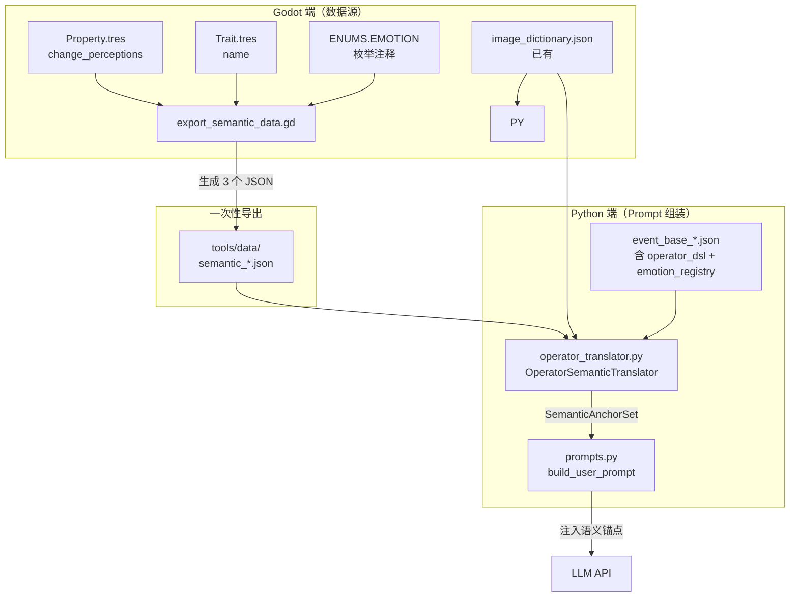

# Operator → Prompt 语义翻译层架构

> **动机：** 将 DSL Operator（`prop_add`、`emo_add`、`imagery_add`、`trait_add` 等）自动翻译为 LLM 可理解的语义锚点文本，注入 System/User Prompt，使 LLM 生成的叙事文本与底层游戏结算逻辑严格对齐，消除「语义撕裂」。
>
> **核心原则：** DSL 是唯一真相来源 (Single Source of Truth)。Operator 不再仅仅是 Godot 运行时的执行指令——它同时是喂给 LLM 的「写作预算表」。

---

## 1. 语境：为什么需要这个层

### 1.1 当前问题

- JSON config（如 [`event_base_747kuangda_denggao.json`](../../tools/event_base_747kuangda_denggao.json)）中 `operator_dsl` 字段散落在各选项里，但 **从未被注入 Prompt**
- LLM 不知道 `prop_add(name=money; val=-50)` 意味着「玩家破产了」，可能写出「你阔绰地甩出一锭银子」
- 意象（`imagery_add`）和特质（`trait_add`）的语义完全靠 JSON config 中硬编码的 `tags` 数组重复声明，DRY 原则被严重违反

### 1.2 目标

| 前 | 后 |
|----|----|
| LLM 盲写，operator 只是后端执行器 | Operator 驱动 LLM 叙事方向 |
| 意象在 JSON tags 和 image_dictionary 中重复定义 | `imagery_add(name=X)` 查表自动翻译，JSON 不再需要单独声明意象列表 |
| 属性变化量是裸数字 | 使用 `Property.change_perceptions` 将 delta 翻译为模糊文本 |
| 情绪描述散落在各 JSON config 中 | 集中 registry + 本地覆盖机制 |

---

## 2. 核心模块：OperatorSemanticTranslator

### 2.1 文件位置

```
tools/event_generator/operator_translator.py   ← 新增
tools/data/semantic_properties.json             ← 新增（Godot 导出）
tools/data/semantic_traits.json                 ← 新增（Godot 导出）
tools/data/semantic_emotions.json               ← 新增（Godot 导出，全局 fallback）
tools/data/image_dictionary.json                ← 已有，复用
tools/export_semantic_data.gd                   ← 新增（Godot 一次性导出工具）
```

### 2.2 模块结构

```python
class OperatorSemanticTranslator:
    """
    DSL Operator → 人类可读语义锚点 翻译器。

    构造时加载 4 个 JSON 数据源（均从 Godot 端导出）。
    """

    def __init__(
        self,
        properties_path: str,      # semantic_properties.json
        traits_path: str,          # semantic_traits.json
        emotions_path: str,        # semantic_emotions.json (全局 fallback)
        imageries_path: str,       # image_dictionary.json
    ):
        ...

    def translate(self, dsl_string: str) -> SemanticAnchorSet:
        """
        输入: "prop_add(name=money; val=50) | imagery_add(name=ENV_NATURE_SNOW:lone_snow)"
        输出: SemanticAnchorSet(props=[...], emotions=[...], traits=[...], imageries=[...])
        """
        ...

    def translate_prop_add(self, prop_name: str, delta: int) -> PropAnchor:
        """查 semantic_properties.json → 找 delta 区间 → 返回 gain_text/loss_text"""
        ...

    def translate_emo_add(self, emotion_name: str, delta: int, local_registry: dict | None = None) -> EmotionAnchor:
        """
        查 emotion 描述。
        优先级: local_registry[emotion_name] > semantic_emotions.json > 纯枚举名 fallback
        """
        ...

    def translate_trait_add(self, trait_name: str) -> TraitAnchor:
        """查 semantic_traits.json → 返回 trait 的 name 字段"""
        ...

    def translate_imagery_add(self, tag: str) -> ImageryAnchor:
        """查 image_dictionary.json → 返回 name + description"""
        ...

    def to_prompt_fragment(self, anchor_set: SemanticAnchorSet, local_emotions: dict | None = None) -> str:
        """将 SemanticAnchorSet 格式化为可注入 Prompt 的 Markdown 文本块"""
        ...
```

### 2.3 数据模型

```python
@dataclass
class PropAnchor:
    prop_name: str          # "money"
    delta: int              # +50
    human_text: str         # "一笔不小的进项"（来自 change_perceptions）
    direction: str          # "gain" | "loss"

@dataclass
class EmotionAnchor:
    emotion_name: str       # "SORROW"
    delta: int              # +15
    cn_name: str            # "悲悯"
    description: str        # "愁苦/悲凉，涵盖送别与怀古"

@dataclass
class TraitAnchor:
    trait_name: str         # "corrupt"
    human_name: str         # "贪腐"（来自 Trait.name）

@dataclass
class ImageryAnchor:
    tag: str                # "ENV_NATURE_SNOWSTORM:lone_snow"
    name: str               # "孤雪"
    description: str        # "独钓寒江雪的孤绝意象..."

@dataclass
class SemanticAnchorSet:
    props: list[PropAnchor]
    emotions: list[EmotionAnchor]
    traits: list[TraitAnchor]
    imageries: list[ImageryAnchor]
```

---

## 3. 四个数据源详解

### 3.1 属性翻译 → `semantic_properties.json`

**数据源：** 每个 `Property.tres` 的 `change_perceptions` 数组 + `name` 字段。

**示例（`money.tres`）：**

```json
{
  "money": {
    "name": "金钱",
    "change_perceptions": [
      {"min_delta": 1,  "max_delta": 5,    "gain": "荷包微沉，多了几文铜钱",     "loss": "用了几文铜钱"},
      {"min_delta": 6,  "max_delta": 20,   "gain": "一笔不小的进项",             "loss": "花销不小呢"},
      {"min_delta": 21, "max_delta": 100,  "gain": "你掂量着一大袋钱，沉重厚实", "loss": "这一下可花了不少"},
      {"min_delta": 101,"max_delta": 9999, "gain": "富可敌国！银钱堆积如山",     "loss": "倾家荡产..."}
    ]
  },
  "fatigue": {
    "name": "疲劳",
    "change_perceptions": [
      {"min_delta": 1,  "max_delta": 15,  "gain": "稍感疲惫",     "loss": "歇了一口气"},
      {"min_delta": 16, "max_delta": 40,  "gain": "疲态渐显",     "loss": "恢复了些气力"},
      {"min_delta": 41, "max_delta": 70,  "gain": "身心俱疲",     "loss": "神清气爽"},
      {"min_delta": 71, "max_delta": 100, "gain": "筋疲力尽",     "loss": "脱胎换骨"}
    ]
  }
}
```

**查找逻辑：**
```
delta > 0 → 匹配 min_delta <= abs(delta) <= max_delta → 取 gain
delta < 0 → 匹配 min_delta <= abs(delta) <= max_delta → 取 loss
delta == 0 → 跳过（无意义锚点）
```

**In Prompt:**
```
💰 金钱增加：一笔不小的进项（变化量 +50）
```

### 3.2 情绪翻译 → `semantic_emotions.json`（全局）+ JSON config 内 `emotion_registry`（本地）

**全局数据源：** [`model/enumerates.gd`](../../model/enumerates.gd:81-88) 中 `EMOTION` 枚举的注释。

```gd
enum EMOTION {
    SORROW,     # 愁苦/悲凉 (替代 DESPAIR，更具诗意，涵盖送别与怀古)
    ARROGANCE,  # 狂傲/得意 (涵盖饮酒作乐、金榜题名、无视权贵)
    ANGER,      # 愤懑 (涵盖被贬、目睹不公)
    TRANQUILITY, # 旷达/空灵 (涵盖山水田园、修道、释怀)
    AMBITION,    # 世俗的野心（想做官、想入世），用于区分李白和杜甫的路线
}
```

**全局 JSON 格式（从 Godot 导出）：**

```json
{
  "SORROW": {
    "cn_name": "悲悯",
    "description": "愁苦/悲凉，涵盖送别与怀古"
  },
  "ARROGANCE": {
    "cn_name": "狂傲",
    "description": "狂傲/得意，涵盖饮酒作乐、金榜题名、无视权贵"
  },
  "ANGER": {
    "cn_name": "愤懑",
    "description": "愤懑，涵盖被贬、目睹不公"
  },
  "TRANQUILITY": {
    "cn_name": "旷达",
    "description": "旷达/空灵，涵盖山水田园、修道、释怀"
  },
  "AMBITION": {
    "cn_name": "野心",
    "description": "世俗的野心（想做官、想入世）"
  }
}
```

**本地覆盖机制：** 每个 JSON config（如 [`event_base_747kuangda_denggao.json`](../../tools/event_base_747kuangda_denggao.json)）可以声明自己的 `emotion_registry` 字段，覆盖或补充全局描述（例如某时代下「旷达」有特定的时代含义）。

**查找优先级：**
```
1. JSON config 内的 emotion_registry[EMOTION_NAME]      ← 本地覆盖
2. semantic_emotions.json[EMOTION_NAME]                   ← 全局 fallback
3. 纯枚举名（如 "SORROW"）                                ← 最终兜底
```

**In Prompt:**
```
😢 悲悯情绪 +15：愁苦/悲凉，涵盖送别与怀古
```

### 3.3 特质翻译 → `semantic_traits.json`

**数据源：** 每个 `Trait.tres` 的 `name` 字段。

**示例（`relation_libai_core.tres`）：**

```json
{
  "relation_libai_core": {
    "name": "核心李白"
  },
  "corrupt": {
    "name": "贪腐"
  }
}
```

**查找逻辑：** 直接按 `trait_name` 查表，返回 `name` 字段。

**In Prompt:**
```
🏷️ 获得特质「贪腐」：收受贿赂，道德下滑
```

### 3.4 意象翻译 → `image_dictionary.json`（已有，复用）

**数据源：** [`tools/data/image_dictionary.json`](../../tools/data/image_dictionary.json)。

**示例：**

```json
{
  "ENV_NATURE_SNOWSTORM:lone_snow": {
    "name": "孤雪",
    "description": "独钓寒江雪的孤绝意象，在寂静中自持的高洁，也可暗示被世界遗忘的冷落"
  }
}
```

**查找逻辑：** 按 `tag`（4 段式完整 tag）精确匹配。

> **关键价值：** 一旦 `operator_dsl` 中写了 `imagery_add(name=TARGET_MYTH_GIANTROC:giant_roc)`，翻译器自动查到「大鹏」的名字和内涵描述并喂给 LLM。JSON config 不再需要 `tags` 数组里重复声明意象——DSL 成为唯一真相来源。

**In Prompt:**
```
🏔️ 需要融入以下意象（不要直接提及意象名称，通过视觉/听觉/触觉细节自然呈现）：
   · 孤雪 — 独钓寒江雪的孤绝意象，在寂静中自持的高洁，也可暗示被世界遗忘的冷落
```

---

## 4. 本地覆盖与全局 Fallback 机制

### 4.1 设计原则

| 优先级 | 数据源 | 适用类型 |
|--------|--------|---------|
| 最高 | JSON config 内的 `emotion_registry` 字段 | 情绪 |
| 中等 | `semantic_emotions.json`（全局导出） | 情绪 |
| 最低 | 纯枚举名 fallback | 情绪 |

> **为什么只有情绪需要本地覆盖？** 属性和意象的语义是跨时代稳定的（金钱就是金钱，孤雪就是孤雪），但「旷达」在天宝初年和天宝末年的具体含义可能不同。特质同理其实不需要本地覆盖，但保留扩展点。

### 4.2 JSON Config 内 `emotion_registry` 字段格式

```json
{
  "emotion_registry": {
    "TRANQUILITY": {
      "cn_name": "旷达",
      "description": "天宝末年的旷达：不再是盛唐的从容，而是一种'反正什么都改变不了'的放下"
    }
  }
}
```

如果 JSON config 内定义了 `TRANQUILITY`，翻译器就用这个定义；如果没定义，就用全局 `semantic_emotions.json` 里的默认描述。

---

## 5. 接入 `prompts.py`

### 5.1 调用点

在 [`build_user_prompt()`](../../tools/event_generator/prompts.py) 中，现有流程是：

```
维度组合 → 选项描述 → 写作契约 → 插件片段 → 黑名单 → 意象约束
```

新增语义锚点注入，插入位置在「选项描述」之后、「写作契约」之前：

```
维度组合 → 选项描述 → 🆕 语义锚点 → 写作契约 → 插件片段 → 黑名单 → 意象约束
```

### 5.2 伪代码

```python
# prompts.py 中新增

from tools.event_generator.operator_translator import OperatorSemanticTranslator

# 全局单例
_translator: OperatorSemanticTranslator | None = None

def get_translator() -> OperatorSemanticTranslator:
    global _translator
    if _translator is None:
        _translator = OperatorSemanticTranslator(
            properties_path="tools/data/semantic_properties.json",
            traits_path="tools/data/semantic_traits.json",
            emotions_path="tools/data/semantic_emotions.json",
            imageries_path="tools/data/image_dictionary.json",
        )
    return _translator


def build_user_prompt(...) -> str:
    ...
    # ── 🆕 语义锚点注入 ──
    translator = get_translator()
    local_emotions = cfg.emotion_registry  # 来自 JSON config
    anchor_fragment = translator.build_anchor_fragment(
        option_features=cfg.option_features,
        local_emotions=local_emotions,
    )
    if anchor_fragment:
        lines.append(anchor_fragment)
    ...
```

### 5.3 `build_anchor_fragment` 逻辑

遍历 `cfg.option_features`，对每个选项：
1. 提取其 `operator_dsl` 字段
2. 调用 `translator.translate(dsl_string)` 得到 `SemanticAnchorSet`
3. 调用 `translator.to_prompt_fragment(anchor_set, local_emotions)` 格式化

输出 Markdown 文本块：

```markdown
## 🔗 语义锚点（你的文本必须与以下结果严格一致）

选项 A「狂客的浪漫」完成后，玩家状态将发生以下变化：
- 💰 金钱 +50：一笔不小的进项
- 😢 悲悯情绪 -10：悲悯消退
- 🏔️ 获得意象「孤雪」：独钓寒江雪的孤绝意象...

选项 B「钻营的算计」完成后，玩家状态将发生以下变化：
- 💰 金钱 +200：你掂量着一大袋钱，沉重厚实
- 🏷️ 获得特质「贪腐」
- 😠 愤懑情绪 +5：愤懑，涵盖被贬、目睹不公

选项 C「中庸的兜底」完成后，玩家状态将发生以下变化：
- 😴 疲劳 +15：稍感疲惫
```

---

## 6. Godot 导出工具

### 6.1 文件：`tools/export_semantic_data.gd`

一个一次性的 `@tool` 脚本，遍历 `Database` 导出 JSON 快照。

```
运行方式：
  godot --headless --script tools/export_semantic_data.gd
```

输出 3 个文件到 `tools/data/`（`image_dictionary.json` 已存在，不重复导出）：
- `semantic_properties.json`
- `semantic_traits.json`
- `semantic_emotions.json`

### 6.2 导出逻辑

```
export_semantic_data.gd:

1. semantic_properties.json:
   for each Property in Database.properties:
       导出 uuid → {name, change_perceptions: [{min_delta, max_delta, gain, loss}]}

2. semantic_traits.json:
   for each Trait in Database.traits:
       导出 uuid → {name}

3. semantic_emotions.json:
   硬编码 ENUMS.EMOTION 枚举的注释映射
   （因为情绪不在 Database 中作为独立 Resource 存在）
```

### 6.3 ⚠️ 避免信息覆盖原则

`semantic_*.json` 是**导出产物**，不应手动编辑。数据源头在：
- `data/1_core_rules/properties/*.tres` → 属性的 `change_perceptions`
- `data/1_core_rules/traits/*.tres` → 特质的 `name`
- `model/enumerates.gd` → 情绪的注释

修改这些源文件后重新运行 `export_semantic_data.gd` 即可更新 JSON 快照。

---

## 7. 测试 Config 改造

### 7.1 目标文件

[`tools/test_config_emotion_imagery_v2.json`](../../tools/test_config_emotion_imagery_v2.json)

### 7.2 改造内容

**新增字段：**

| 字段 | 类型 | 说明 |
|------|------|------|
| `semantic_anchors` | object | 语义锚点开关配置 |
| `semantic_anchors.enabled` | bool | 是否启用语义锚点注入 |
| `emotion_registry` | dict | 本地情绪覆盖（可选，不覆盖则 fallback 全局） |

**修改现有字段：**

| 字段 | 当前值 | 改造后 |
|------|--------|--------|
| `dimensions[emotion].values[].id` | `"TRANQUILITY"` | 保持不变 |
| `dimensions[emotion].values[].operator_dsl` | **不存在** | 新增，如 `"emo_add(name=TRANQUILITY; val=10)"` |
| `option_features[].operator_dsl` | **不存在** | 新增，完整 DSL 字符串 |

**改造后结构示例：**

```json
{
  "id": "emotion_imagery_v2_semantic_test",
  "name": "语义锚点 V2 示范",
  "semantic_anchors": {
    "enabled": true
  },
  "emotion_registry": {
    "TRANQUILITY": {
      "cn_name": "旷达",
      "description": "超脱物外的淡然与通透，在盛唐语境下是一种主动的选择而非无奈的妥协"
    }
  },
  "dimensions": [
    {
      "id": "scene",
      "name": "场景模板",
      "values": [
        {
          "id": "scene_temple",
          "name": "古刹",
          "description": "深山中的千年古刹...",
          "operator_dsl": "imagery_add(name=VIBE_PHILOSOPHY_ZEN:temple_bell) | imagery_add(name=VIBE_PHILOSOPHY_ZEN:incense_ash)",
          "tags": ["VIBE_PHILOSOPHY_ZEN:temple_bell", "VIBE_PHILOSOPHY_ZEN:incense_ash"]
        }
      ]
    },
    {
      "id": "emotion",
      "name": "单情绪",
      "values": [
        {
          "id": "TRANQUILITY",
          "name": "旷达",
          "description": "超脱物外的淡然与通透",
          "operator_dsl": "emo_add(name=TRANQUILITY; val=10)"
        }
      ]
    }
  ],
  "option_features": [
    {
      "id": "option_A",
      "text": "狂客的浪漫",
      "operator_dsl": "prop_add(name=talent; val=5) | emo_add(name=TRANQUILITY; val=10) | imagery_add(name=VIBE_PHILOSOPHY_ZEN:temple_bell)"
    },
    {
      "id": "option_B",
      "text": "钻营的算计",
      "operator_dsl": "prop_add(name=money; val=50) | emo_add(name=SORROW; val=5) | trait_add(name=corrupt)"
    },
    {
      "id": "option_C",
      "text": "中庸的兜底",
      "operator_dsl": "prop_add(name=fatigue; val=8)"
    }
  ]
}
```

---

## 8. 数据流总览



---

## 9. 实施清单

| # | 任务 | 负责 | 产物 |
|---|------|------|------|
| 1 | 编写 `tools/export_semantic_data.gd` | Code | Godot 导出脚本 |
| 2 | 运行导出脚本，生成 3 个 `semantic_*.json` | 手动 | JSON 数据文件 |
| 3 | 编写 `tools/event_generator/operator_translator.py` | Code | Python 翻译模块 |
| 4 | 修改 `prompts.py`，接入翻译器 | Code | `build_user_prompt` 增加锚点注入 |
| 5 | 改造 `test_config_emotion_imagery_v2.json` | Code | 示范配置 |
| 6 | 在 `EventPipelineConfig` (Python dataclass) 中添加 `operator_dsl`、`emotion_registry` 字段 | Code | config.py |
| 7 | 端到端测试：用示范配置跑一次生成 | 手动 | 验证 LLM 输出与 DSL 一致 |
| 8 | 更新 `prompt_engineering_principles.md` | Code | 增加语义锚点章节 |
| 9 | 提交 commit | 手动 | git commit |
| 10 | 同步 `semantic_*.json` 到云端 | 手动 | 云端同步 |

---

## 10. 边界条件与约束

### 10.1 哪些 Operator 被翻译

只翻译**第一档语义锚点**（详见对应分析文档）：

| DSL 函数 | 翻译为 |
|----------|--------|
| `prop_add(name=X; val=N)` | 属性锚点（通过 change_perceptions） |
| `prop_sub(name=X; val=N)` | 同上（但 delta < 0，用 loss_text） |
| `prop_set(name=X; val=N)` | 同上（delta = N - 当前值，运行时才知道，Prompt 阶段标记为「强制设为」） |
| `emo_add(name=X; val=N)` | 情绪锚点（通过 emotion_registry） |
| `emo_sub(name=X; val=N)` | 同上（delta < 0） |
| `emo_set(name=X; val=N)` | 同上（标记为「强制设为」） |
| `trait_add(name=X)` | 特质锚点（通过 Trait.name） |
| `trait_remove(name=X)` | 同上（标记为「失去」） |
| `imagery_add(name=X)` | 意象锚点（通过 image_dictionary） |

### 10.2 不翻译的 Operator

以下 Operator 是纯系统逻辑，**绝对不注入 Prompt**（= 元游戏信息泄露 + 噪音）：

- 事件栈：`push_event`, `pop_event`, `queue_event`, `pop_to_event`, `clear_scheduled_events`
- 扫描与路由：`scan_and_push`, `npc_batch_check`
- 随机：`random`, `random_pick`
- 上下文管道：`context_fetch`, `context_first`
- UI：`image_present`, `image_slide`, `image_shatter`, `image_fade_out`, `image_remove`
- 行动控制：`block_action`, `lock_actions`, `reserve_action`, `deferred_lock_action`, `refresh_action_panel`
- 系统：`system`, `era`, `guarantee_next`, `menu_start`
- Flag 操作：大部分 `flag_*` 是内部计数器，不翻译；仅有明确叙事语义的 flag 才需要（TBD 后续迭代）

### 10.3 `prop_set` 的特殊处理

`prop_set` 的 delta 在生成阶段无法确定（因为不知道玩家当前值），Prompt 中应表述为：

```
💰 金钱被强制设为某个值（具体量取决于当前游戏状态）
```

这是一个已知的精度损失，但足以让 LLM 知道「金钱会发生剧烈变化」，而不是无变化。后续可在运行时补充具体数值。

### 10.4 CSV vs JSON 数据流

当前事件生成流水线：`event_base_*.json` → `main.py` → LLM → CSV → `dsl_parser.gd` → Godot `.tres`。

语义锚点翻译在 Python 侧（Prompt 组装阶段）完成。Godot 侧的 CSV 解析不受影响，因为 `operator_dsl` 字段本身就是标准 DSL 语法，DSL 解析器直接处理。翻译层只影响 Prompt 文本，不修改 DSL 语法。
