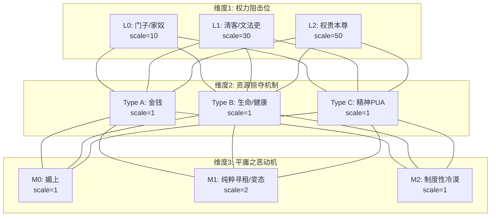
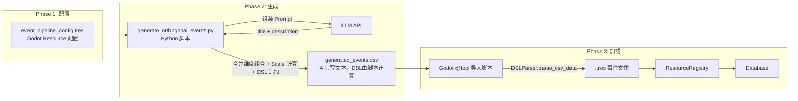
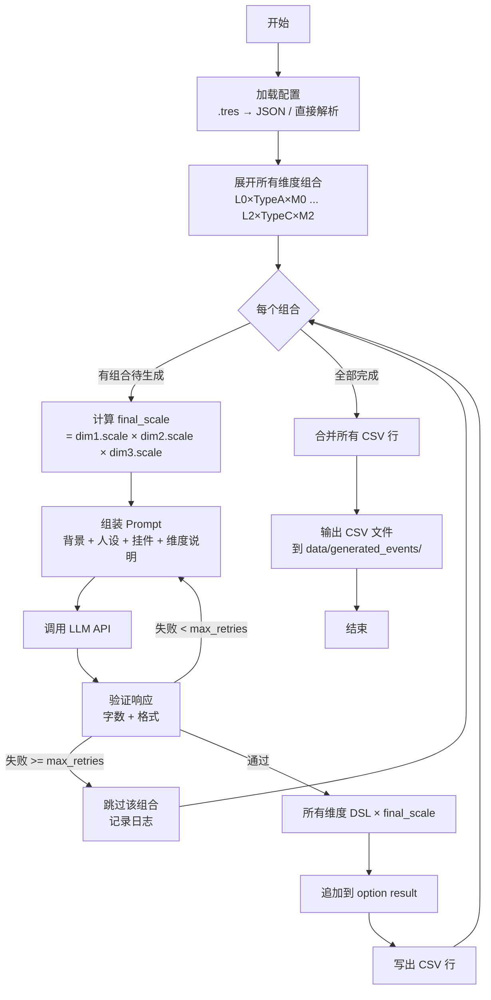

# 正交事件生成管线架构设计

> ⚠️ **此文档描述的是旧版 3 维度正交生成器（用于拜谒事件）。**
> 情绪-意象事件使用新的 V2 2 维度架构（场景模板 × 情绪滤镜）。
> 详见：[`plans/emotion_imagery_orthogonal_pipeline_v2.md`](emotion_imagery_orthogonal_pipeline_v2.md)
>
> **并存说明：** 旧版 3 维度生成器继续用于拜谒/官场类事件，V2 情绪生成器用于情绪-意象类事件。两者输出 CSV 格式一致，共享 Godot 导入管线。

## 1. 核心概念

### 1.1 正交矩阵



27 种组合 = 27 个事件（每阶段）。两阶段共 54 个事件。

### 1.2 AI 职责范围

**AI 只负责生成文本**：title（标题）和 description（事件描述）。
**不负责生成**：DSL operator、数值、CSV 结构。

### 1.3 Scale 计算规则

```
final_scale = dim1.scale × dim2.scale × dim3.scale
```

每个维度的 operator_dsl 中的数值都乘以 `final_scale`，各自独立，不合并。

**示例：L1(scale=30) × TypeA(scale=1) × M0(scale=1)**

```
final_scale = 30 × 1 × 1 = 30

L1 的 operator_dsl:    prop_sub(name="money"; val=10)   → val=10×30=300
TypeA 的 operator_dsl:  prop_sub(name="money"; val=20)   → val=20×30=600
M0 的 operator_dsl:    （空）

最终 result: prop_sub(name="money"; val=300), prop_sub(name="money"; val=600)
→ PlayerState 中 money 减少 900（两条各自执行，不合并）
```

**示例：L2(scale=50) × TypeC(scale=1) × M1(scale=2)**

```
final_scale = 50 × 1 × 2 = 100

L2 的 operator_dsl:    prop_sub(name="money"; val=10)   → val=10×100=1000
TypeC 的 operator_dsl:  emo_add(name="sorrow"; val=3)    → val=3×100=300
M1 的 operator_dsl:    prop_sub(name="health"; val=2)    → val=2×100=200

最终 result: prop_sub(name="money"; val=1000), emo_add(name="sorrow"; val=300), prop_sub(name="health"; val=200)
```

⚠️ **当前约束**：operator_dsl 只支持 PropertyOperator（prop_add/prop_sub/prop_set）。
如果发现非 PropertyOperator（如 emo_add/flag_int_set），Python 脚本报错终止。

### 1.4 数据流总览



---

## 2. Godot 侧配置架构

### 2.1 配置文件层级

```
model/pipeline/
├── event_pipeline_config.gd          # 事件库生成配置（主配置）
├── pipeline_dimension.gd             # 维度定义
├── pipeline_dimension_value.gd       # 维度值（含 DSL attachments + Scale）
└── prompt_feature.gd                 # "挂件"：纯文本风格提示
```

### 2.2 PromptFeature (`model/pipeline/prompt_feature.gd`)

```gdscript
@tool
class_name PromptFeature extends Resource

## "挂件"：一段纯文本，注入到 AI Prompt 中以微调文本风格。
## 例如：
##   - "使用无状态叙事，不要引用玩家过去的具体经历"
##   - "使用克制的语气，避免过度煽情"
##   - "强调官场潜规则和人情世故"

@export var id: String            # 唯一标识
@export var text: String          # 注入 AI Prompt 的纯文本内容
```

### 2.3 PipelineDimensionValue (`model/pipeline/pipeline_dimension_value.gd`)

```gdscript
@tool
class_name PipelineDimensionValue extends Resource

@export var id: String                      # 如 "L0", "TypeA", "M0"
@export var name: String                    # 如 "门子/家奴"
@export var description: String             # AI 说明：这个值是什么意思
@export var scale: int = 1                  # Scale 乘数
@export var operator_dsl: String = ""       # 附加 DSL（只支持 PropertyOperator）
# 示例: prop_sub(name="money"; val=10)
```

### 2.4 PipelineDimension (`model/pipeline/pipeline_dimension.gd`)

```gdscript
@tool
class_name PipelineDimension extends Resource

@export var id: String                      # 如 "power_level"
@export var name: String                    # 如 "权力阻击位"
@export var description: String             # AI 说明：这个维度是干嘛的
@export var values: Array[PipelineDimensionValue]
```

### 2.5 EventPipelineConfig (`model/pipeline/event_pipeline_config.gd`)

```gdscript
@tool
class_name EventPipelineConfig extends Resource

@export var id: String                      # 唯一标识，如 "bai_ye_honeymoon"
@export var name: String                    # 显示名，如 "拜谒 - 蜜月期 (0-70)"
@export var background_context: String      # 世界观背景知识 → AI prompt
@export var ai_persona: String              # AI 人设 → AI prompt
@export var prompt_features: Array[PromptFeature]  # "挂件"列表 → AI prompt
@export var dimensions: Array[PipelineDimension]  # 维度列表
@export var word_count_min: int = 80        # 字数下限
@export var word_count_max: int = 200       # 字数上限
@export var max_retries: int = 3            # 最大重试次数
@export var api_model: String = "gpt-4o"    # API 模型
@export var output_csv_path: String = "res://data/generated_events/"  # 输出路径
```

### 2.6 示例配置（拜谒蜜月期）

`data/pipeline/bai_ye_honeymoon_config.tres` 内容示例：

```
[gd_resource type="Resource" script_class="EventPipelineConfig" format=3]
[ext_resource type="Script" path="res://model/pipeline/event_pipeline_config.gd" id="1"]
[ext_resource type="Script" path="res://model/pipeline/pipeline_dimension.gd" id="2"]
[ext_resource type="Script" path="res://model/pipeline/pipeline_dimension_value.gd" id="3"]
[ext_resource type="Script" path="res://model/pipeline/prompt_feature.gd" id="4"]

[sub_resource type="Resource" id="PromptFeature_1"]
script = ExtResource("4")
id = "stateless_narrative"
text = "使用无状态叙事，不要引用玩家过去的具体经历，每次事件都当作第一次发生。"

[sub_resource type="Resource" id="PromptFeature_2"]
script = ExtResource("4")
id = "tone_cautious"
text = "不要过于戏剧化，保持冷静克制的叙事语气，突出官场的虚伪和客套。"

[sub_resource type="Resource" id="DimVal_L0"]
script = ExtResource("3")
id = "L0"
name = "门子/家奴"
description = "最底层的门卫、仆役，守门索贿"
scale = 10
operator_dsl = "prop_sub(name=\"money\"; val=10)"

[sub_resource type="Resource" id="DimVal_L1"]
script = ExtResource("3")
id = "L1"
name = "清客/文法吏"
description = "幕僚、文书小吏，递话要钱"
scale = 30
operator_dsl = "prop_sub(name=\"money\"; val=10)"

[sub_resource type="Resource" id="DimVal_L2"]
script = ExtResource("3")
id = "L2"
name = "权贵本尊"
description = "直接面对高官，需要重大代价"
scale = 50
operator_dsl = "prop_sub(name=\"money\"; val=10), prop_sub(name=\"fatigue\"; val=5)"

[sub_resource type="Resource" id="Dim_Power"]
script = ExtResource("2")
id = "power_level"
name = "权力阻击位"
description = "玩家拜谒时面对的门槛等级，越高代价越大"
values = [SubResource("DimVal_L0"), SubResource("DimVal_L1"), SubResource("DimVal_L2")]

# ... 类似定义 Dim_Extraction (TypeA/B/C) 和 Dim_Motive (M0/M1/M2) ...

[resource]
script = ExtResource("1")
id = "bai_ye_honeymoon"
name = "拜谒 - 蜜月期 (0-70)"
background_context = "大唐天宝年间，长安城...（世界观描述）"
ai_persona = "你是一位精通唐朝官场文化的叙事设计师..."
prompt_features = [SubResource("PromptFeature_1"), SubResource("PromptFeature_2")]
dimensions = [SubResource("Dim_Power"), SubResource("Dim_Extraction"), SubResource("Dim_Motive")]
word_count_min = 80
word_count_max = 200
max_retries = 3
api_model = "gpt-4o"
output_csv_path = "res://data/generated_events/"
```

---

## 3. Python 生成脚本架构

### 3.1 脚本位置

`tools/generate_orthogonal_events.py`

### 3.2 核心流程



### 3.3 Prompt 组装

```
[System]
你是唐朝官场叙事设计师。你只负责生成事件文本。

[世界观背景]
{config.background_context}

[你的角色]
{config.ai_persona}

[风格要求]
{config.prompt_features 每个的 text}

[当前事件的维度组合]
- {dim1.name}: {dim1_value.name}（{dim1_value.description}）
- {dim2.name}: {dim2_value.name}（{dim2_value.description}）
- {dim3.name}: {dim3_value.name}（{dim3_value.description}）

[输出格式要求]
只返回以下两个字段，不要任何额外内容：
- title: 15字以内的标题
- description: {word_count_min}-{word_count_max}字的事件描述

使用全角中文标点。
```

### 3.4 Scale 计算逻辑 (Python)

```python
def process_dimension_operators(dim_values: list, final_scale: int) -> str:
    """
    所有维度的 operator_dsl 都乘以 final_scale。
    只支持 PropertyOperator，遇到其他 operator 报错。
    
    示例:
    dim_values = [
        "prop_sub(name=\"money\"; val=10)",
        "prop_sub(name=\"money\"; val=20)",
        ""
    ]
    final_scale = 30
    
    返回: "prop_sub(name=\"money\"; val=300), prop_sub(name=\"money\"; val=600)"
    """
    scaled_dsls = []
    for dsl in dim_values:
        if not dsl.strip():
            continue
        # 解析 operator name
        # 提取 val 参数
        # val *= final_scale
        # 重建 DSL 字符串
        scaled_dsls.append(scaled)
    return ", ".join(scaled_dsls)
```

### 3.5 CSV 输出格式

```csv
row_type,uuid,title,description,context,requirements,on_enter,interruptions,template,provider
random_event,gan_ye_honeymoon_l0_a_m0,"门房索贿","你来到李府门前，一个尖嘴猴腮的门子拦住了去路...","trigger_tags=bai_ye|weight=10","","","","",""
option,,接受（花费...）,"","","","prop_sub(name="money";val=300), prop_sub(name="money";val=600)","","",""
```

---

## 4. 待办事项

### ~~Phase A: Godot 配置资源~~（已删除，改用 Python Pydantic）

> 用户要求删除 Godot 侧的 pipeline Resource 文件。
> 配置定义从 Python Pydantic 模型 (`tools/config.py:EventPipelineConfig`) 维护，
> 不再需要 Godot .tres 配置资源。

### Phase B: Python 生成脚本 ✅

1. ✅ 创建 `tools/config.py` — Pydantic 配置模型（`EventPipelineConfig`, `PipelineDimension`, `PipelineDimensionValue`, `PromptFeature`）
2. ✅ 创建 `tools/generate_orthogonal_events.py` — 主生成脚本
   - Python-native 配置加载（Pydantic）
   - Prompt 组装（含 PromptFeature 挂件）
   - DeepSeek LLM API 调用（OpenAI SDK 兼容）
   - 字数/格式验证 + 重试
   - Scale 计算（`final_scale = dim1.scale × dim2.scale × dim3.scale`）
   - DSL 数值缩放 + 合法性校验
   - CSV 输出（DSLParser 兼容列格式）

### Phase C: 插件 Hook 系统 ✅

> 提供 Plugin Hook 机制，允许在不修改 `generate_orthogonal_events.py` 主流程的前提下，
> 定制 Prompt、扩展 AI 输出字段、富化 CSV context 列。

#### 架构概览

```
config.json: plugins = ["failed_hint"]
       │
       ▼
tools/plugin_base.py          ← EventPromptPlugin 基类 + PLUGIN_REGISTRY
tools/plugins/__init__.py     ← 自动发现 & 注册所有插件模块
tools/plugins/failed_hint_plugin.py  ← 示例实现
       │
       ├── Hook 1: get_prompt_fragment()     → 向 User Prompt 注入额外指令
       ├── Hook 2: get_extra_output_fields() → 声明 AI 需返回的额外 YAML 字段
       └── Hook 3: enrich_context()          → 根据 parsed 结果富化 CSV context 列
```

#### 三个 Hook 点

| Hook | 方法 | 触发时机 | 用途 |
|------|------|----------|------|
| **Hook 1** | `get_prompt_fragment(combos, cfg) → str` | Prompt 组装末尾 | 注入额外指令（如"写出失败条件"） |
| **Hook 2** | `get_extra_output_fields() → list[str]` | 配置加载 | 声明 AI 需输出的额外字段名 |
| **Hook 3** | `enrich_context(ctx: PluginContext) → dict` | 解析后、写 CSV 前 | 根据 parsed 内容追加 `\|key=value` 对 |

#### PluginContext 数据类

```python
@dataclass
class PluginContext:
    combos: list[DimensionCombo]       # 当前组合的维度信息
    cfg: EventPipelineConfig           # 完整管线配置
    raw_response: str                  # LLM 原始响应文本
    parsed: dict                       # parse_llm_response() 结果（含 _extra）
    combined_scale: float              # 组合 scale 值
    uuid: str                          # 该事件的 UUID
```

#### 扩展字段解析规则

`parse_llm_response()` 自动捕获 AI 响应中所有非标准顶层字段到 `parsed["_extra"]`：
- `title` / `description` / `options` 之外的 `key: value` 行 → 存入 `_extra`
- `options` 块内仅缩进行为选项；非缩进行自动退出 options 模式
- `enrich_context()` 优先读取 `parsed["failed_hint"]`，回退到 `parsed["_extra"]["failed_hint"]`

#### 使用方法

1. 在 `tools/plugins/` 下创建插件模块（如 `my_plugin.py`）
2. 继承 `EventPromptPlugin`，实现需要的 Hook 方法
3. 调用 `register_plugin(MyPlugin())` 注册
4. 在 `config.json` 的 `plugins` 列表中添加插件 ID：

```json
{
  "plugins": ["failed_hint"],
  "dimensions": [...]
}
```

#### 与 Extractor Context 的区别

| | Extractor Context | Plugin Context |
|---|---|---|
| **生命周期** | `expand_combinations()` 维度展开阶段 | AI 生成 & 后处理阶段 |
| **数据内容** | `{"dimensions": {...}}`，用于派生维度值 | `parsed` 响应 + `combos` + `cfg` |
| **传递方式** | `register_extractor()` 的 `context` 参数 | `enrich_context(ctx: PluginContext)` 参数 |
| **用途** | 维度值生成（如从场景标签推导） | Prompt 注入 & 输出富化 |

### Phase D: Godot 加载端 ✅

5. ✅ 修正 Python CSV 列名以匹配 DSLParser 期望：
   - `context` 列使用 `trigger_tags=xxx|weight=N` 格式
   - `results` 列仅在 option 行使用（event 行留空避免 DSLParser 报错）
   - `>option` row_type 前缀满足 PDA 深度检测
6. ✅ 在 `core/csv_cloud_loader.gd` 添加 `import_generated_events` 按钮
   - 扫描 `res://data/generated_events/*_events.csv`
   - 复用 `_process_csv_data()` 完整管线：DSLParser → .tres → Registry
   - 零代码改动，点一下按钮即可

### Phase D: 测试

- [ ] 5. 端到端测试：Python 生成 → CSV → Godot 导入 → 事件池可用
- [ ] 6. 更新文档（本节）
- [ ] 7. 提交 commit
- [ ] 8. 如果有对 csv 的修改，同步到云端
