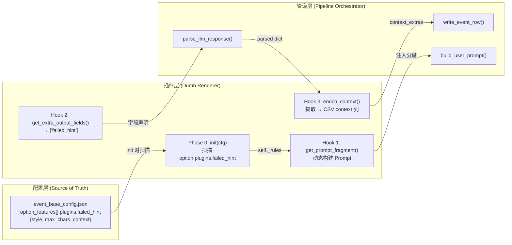
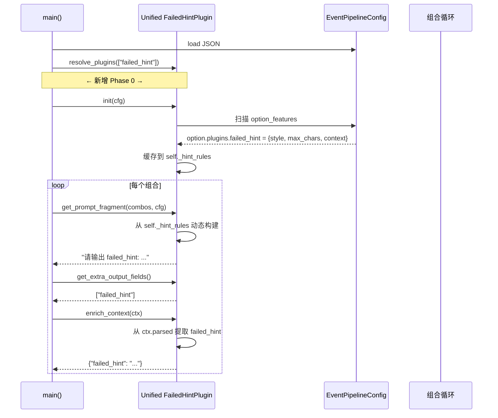

# 配置驱动插件系统 — 架构演进方案

> 从「硬编码行为插件」到「配置驱动 + 插件即渲染器」

---

## 1. 现状分析

### 当前架构

```
┌──────────────────────────────────────────────────┐
│  tools/plugin_base.py                            │
│  ┌──────────────────────────────────────────┐    │
│  │  EventPromptPlugin (基类)                │    │
│  │  ├── get_prompt_fragment(combos, cfg)    │    │
│  │  ├── get_extra_output_fields()           │    │
│  │  └── enrich_context(ctx)                 │    │
│  └──────────────────────────────────────────┘    │
│  PLUGIN_REGISTRY: dict[str, EventPromptPlugin]    │
└──────────────┬───────────────────────────────────┘
               │ 注册
     ┌─────────┴─────────┐
     ▼                   ▼
┌──────────────┐  ┌──────────────┐
│ ganye_failed │  │    failed    │
│ _hint_plugin │  │ _hint_plugin │
│              │  │              │
│  get_prompt  │  │  get_prompt  │
│  → 硬编码     │  │  → 硬编码     │
└──────────────┘  └──────────────┘
```

### 痛点

| 痛点 | 描述 | 位置 |
|------|------|------|
| **P1** | `get_prompt_fragment()` 返回硬编码字符串，无法从配置读取 | [`ganye_failed_hint_plugin.py:43`](tools/plugins/ganye_failed_hint_plugin.py:43) |
| **P2** | 两个插件 90% 代码重复（`enrich_context` 逻辑几乎一致） | [`failed_hint_plugin.py:61`](tools/plugins/failed_hint_plugin.py:61) ↔ [`ganye_failed_hint_plugin.py:67`](tools/plugins/ganye_failed_hint_plugin.py:67) |
| **P3** | 配置中的 `narrative_constraint.resolution_style` 已定义约束语义，但插件完全不读它 | [`event_base_config.json:24`](tools/event_base_config_bai_ye_real_appearance.json:24) |
| **P4** | 无生命周期「初始化」阶段，插件无法在循环前扫描配置做预处理 | `plugin_base.py` 无 `init()` |
| **P5** | 改一个语义需要改插件代码 + 改配置两处，不一致风险高 | 架构耦合 |

---

## 2. 目标架构

### 核心理念

> **插件是哑巴渲染器，配置是唯一的上帝。** 😡

```
  BEFORE:  插件硬编码 "使用直接引语，20字以内" → AI
  AFTER:   配置定义 {style: "mock_direct_speech", max_chars: 20} → 
           插件 init() 时读取 → get_prompt_fragment() 动态构建 → AI
```

### 数据流



### 插件生命周期（新增 Phase 0）



---

## 3. 数据模型变更

### 3.1 [`OptionFeature`](tools/config.py:85) 新增 `plugins` 字段

```python
class OptionFeature(TextFeature):
    """选项模板 (ChoiceTemplate)：每个选项的完整定义。"""
    result: str = ""
    requirement: str = ""
    fixed: bool = False
    prompt: str = ""
    narrative_constraint: Optional[NarrativeConstraint] = None
    
    # ── 🆕 插件配置挂载点 ──
    plugins: dict[str, dict] = Field(
        default_factory=dict,
        description=(
            "插件级配置字典，key=插件ID，value=插件自定义结构。"
            "例如: {\"failed_hint\": {\"style\": \"mock_direct_speech\", \"max_chars\": 20}}"
        ),
    )
```

**设计理由：**
- 使用 `dict[str, dict]` 而不是固定模型 → 插件可以自由定义自己的结构，不约束未来
- 默认空 dict → 向后完全兼容
- Pydantic Field 会自动反序列化 JSON 中的对象 → 零额外解析代码

### 3.2 JSON 配置示例

```json
{
  "plugins": ["failed_hint"],
  "option_features": [
    {
      "id": "option_accept",
      "prompt": "用20字以内描述玩家回应的动作",
      "requirement": "poem_has(type=GAN_YE; min_level=1; failed_hint=\"{failed_hint}\")",
      
      "// 🆕 插件的合法自留地": "",
      "plugins": {
        "failed_hint": {
          "style": "mock_direct_speech",
          "max_chars": 20,
          "context": "NPC 验货后发现没有诗词时的嘲讽反应。使用直接引语。"
        }
      },
      
      "narrative_constraint": {
        "type": "blind_box_transaction",
        "resolution_style": "failed_hint 必须是 NPC 验货后发现没有诗词时的嘲讽反应。使用直接引语，控制在20字以内"
      }
    }
  ]
}
```

**为什么保留 `narrative_constraint`？** 它是第一阶管道概念，由 `build_user_prompt()` 直接渲染到 "📜 写作契约" 区块，和插件系统是**两条平行线**。插件不替代它。

---

## 4. [`plugin_base.py`](tools/plugin_base.py) 变更

### 4.1 新增 `init()` 基类方法

```python
class EventPromptPlugin:
    # ... 现有代码 ...
    
    def init(self, cfg: EventPipelineConfig) -> None:
        """Phase 0: 管线初始化时调用（整个管线生命周期只调一次）。
        
        插件在此扫描 cfg 中自己关心的字段，构建内部状态，
        供后续 get_prompt_fragment() / enrich_context() 使用。
        
        默认实现是空操作，向后兼容。
        """
        pass
```

### 4.2 管道集成点

在 [`generate_orthogonal_events.py`](tools/generate_orthogonal_events.py) 的 `main()` 中：

```python
# 现有代码：加载配置、解析插件
cfg = load_config_from_json(args.config)
plugins = resolve_plugins(cfg.plugins)

# ── 🆕 Phase 0: 插件初始化 ──
for plugin in plugins:
    plugin.init(cfg)

# 现有代码：遍历组合循环（无变化）
for values_tuple in combinations:
    # ... 现有逻辑 ...
```

---

## 5. 合并后的统一插件设计

### 5.1 架构定位

```
                tools/plugins/failed_hint_plugin.py
┌──────────────────────────────────────────────────────────┐
│  Unified FailedHintPlugin                                │
│  ┌────────────────────────────────────────────────────┐  │
│  │  init(cfg):                                        │  │
│  │    遍历 cfg.option_features                        │  │
│  │    对每个有 plugins.failed_hint 的 option          │  │
│  │    提取 style / max_chars / context                │  │
│  │    缓存到 self._hint_rules[option_id]              │  │
│  ├────────────────────────────────────────────────────┤  │
│  │  get_prompt_fragment():                            │  │
│  │    从 self._hint_rules 动态构建                    │  │
│  │    "请输出一个 failed_hint 字段\n"                 │  │
│  │    + style 规则 → "使用直接引语\n"                 │  │
│  │    + max_chars → "控制在20字以内\n"                │  │
│  │    + context → "上下文: ...\n"                     │  │
│  ├────────────────────────────────────────────────────┤  │
│  │  get_extra_output_fields():                        │  │
│  │    → ["failed_hint"]                               │  │
│  ├────────────────────────────────────────────────────┤  │
│  │  enrich_context(ctx):                              │  │
│  │    → {"failed_hint": ctx.parsed.get("failed_hint")}│  │
│  └────────────────────────────────────────────────────┘  │
└──────────────────────────────────────────────────────────┘
```

### 5.2 伪代码

```python
class FailedHintPlugin(EventPromptPlugin):
    """配置驱动的失败提示插件（合并 ganye + 通用版本）。
    
    行为完全由配置中的 option_features[].plugins.failed_hint 驱动。
    无任何硬编码内容。
    """
    
    @property
    def plugin_id(self) -> str:
        return "failed_hint"
    
    def init(self, cfg: EventPipelineConfig):
        """Phase 0: 从所有 option 的 plugins.failed_hint 读取配置。"""
        self._hint_rules: dict[str, dict] = {}
        for opt in cfg.option_features:
            opt_cfg = opt.plugins.get("failed_hint", {})
            if not opt_cfg:
                continue
            self._hint_rules[opt.id] = {
                "style": opt_cfg.get("style", "direct_speech"),
                "max_chars": opt_cfg.get("max_chars", 30),
                "context": opt_cfg.get("context", ""),
            }
    
    def get_prompt_fragment(self, combos, cfg) -> str:
        """动态构建 prompt，无硬编码。"""
        if not self._hint_rules:
            return ""
        
        lines = ["另外，请输出一个 failed_hint 字段。"]
        
        for opt_id, rule in self._hint_rules.items():
            parts = [f"failed_hint 针对选项 '{opt_id}'："]
            if rule["context"]:
                parts.append(rule["context"])
            if rule["style"] == "mock_direct_speech":
                parts.append("必须使用直接引语（NPC 原话）")
            if rule["max_chars"]:
                parts.append(f"控制在{rule['max_chars']}字以内")
            lines.append("；".join(parts))
        
        lines.append("输出格式：\nfailed_hint: <内容>")
        return "\n".join(lines)
    
    def get_extra_output_fields(self) -> list[str]:
        return ["failed_hint"]
    
    def enrich_context(self, ctx: PluginContext) -> dict[str, str]:
        """从 parsed 提取 failed_hint（与现有逻辑一致）。"""
        hint = ctx.parsed.get("failed_hint", "")
        if not hint:
            extra = ctx.parsed.get("_extra", {})
            hint = extra.get("failed_hint", "")
        return {"failed_hint": hint} if hint else {}
```

---

## 6. 向后兼容性

| 变更点 | 影响 | 兼容措施 |
|--------|------|----------|
| `OptionFeature` 新增 `plugins` 字段 | Pydantic 自动忽略未知字段 | ✅ 旧 JSON 无此字段 = 空 dict |
| `EventPromptPlugin` 新增 `init()` 基类方法 | 子类无需覆盖 | ✅ 默认空方法 |
| 合并两个插件删除 `ganye_failed_hint_plugin.py` | `PLUGIN_REGISTRY` 中 ID 变更 | ⚠️ 需更新配置中的 `plugins` 列表 |
| `main()` 新增 init 调用 | 无 | ✅ 纯新增 |

**唯一破坏性变更：** 配置文件中 `"plugins": ["ganye_failed_hint"]` 需要改为 `"plugins": ["failed_hint"]`。同时需要在每个需要 failed_hint 的 option 下添加 `plugins.failed_hint` 配置。

---

## 7. 分步实施计划

### Step 1: 数据模型 — OptionFeature 加 plugins 字段
- **文件**: [`tools/config.py:99`](tools/config.py:99)
- **操作**: 在 `OptionFeature` 中添加 `plugins: dict[str, dict] = Field(default_factory=dict)`
- **验证**: `pytest tools/test_plugin_base.py` 通过
- **工作量**: 极小，3 行代码

### Step 2: 基类 — plugin_base.py 加 init() 方法
- **文件**: [`tools/plugin_base.py:120`](tools/plugin_base.py:120)
- **操作**: 在 `EventPromptPlugin` 中添加 `init(self, cfg) -> None` 空方法
- **验证**: 现有测试通过

### Step 3: 管道集成 — generate_orthogonal_events.py 加 init 调用
- **文件**: [`tools/generate_orthogonal_events.py:926-934`](tools/generate_orthogonal_events.py:926)
- **操作**: 在 resolve_plugins 之后、遍历组合之前，插入 `plugin.init(cfg)`
- **验证**: `python3 tools/generate_orthogonal_events.py --dry-run` 正常输出

### Step 4: 合并两个插件为统一版本
- **文件**: 
  - 🗑️ 删除 `tools/plugins/ganye_failed_hint_plugin.py`
  - 🔄 重写 `tools/plugins/failed_hint_plugin.py`
- **操作**: 
  - 新 `failed_hint_plugin.py` 实现 `init()` + 动态 `get_prompt_fragment()`
  - `plugin_id` 统一为 `"failed_hint"`
- **验证**: `python3 -c "from tools.plugin_base import PLUGIN_REGISTRY; print(PLUGIN_REGISTRY)"` 确认只有 `failed_hint`

### Step 5: 更新配置示例
- **文件**: 
  - [`tools/event_base_config_bai_ye_real_appearance.json`](tools/event_base_config_bai_ye_real_appearance.json)
  - [`tools/bai_ye_honeymoon_config.json`](tools/bai_ye_honeymoon_config.json)
- **操作**:
  - 将 `"plugins": ["ganye_failed_hint"]` → `"plugins": ["failed_hint"]`
  - 在 `option_accept` 下添加 `plugins.failed_hint` 配置块
  - 可选的：调整 `narrative_constraint.resolution_style` 去掉与 plugin 的重复

### Step 6: 测试并修改
- 跑 `--dry-run` 验证 prompt 输出
- 跑 `--trial` 验证 AI 响应 + CSV 输出
- 确认 `failed_hint` 字段正确注入到 CSV context 列

### Step 7: 更新文档 & 提交

---

## 8. 未来扩展

这个架构可以轻松支持更多插件，比如：

```json
{
  "option_features": [
    {
      "id": "option_accept",
      "plugins": {
        "failed_hint": { ... },
        "emotion_guard": {
          "required_emotion": "ANGER",
          "threshold": 30
        },
        "blind_box_transaction": {
          "is_active": true,
          "success_result_direction": "门房翻开诗卷，态度立刻变得谄媚。"
        }
      }
    }
  ]
}
```

每个插件只需要在 `init()` 中扫描 `option.plugins[自己的ID]`，互不干扰。🤓☝️ 这就是「契约即自由」——每个插件在自己的命名空间里爱怎么玩怎么玩，但出了这个门别碰别人的东西。
