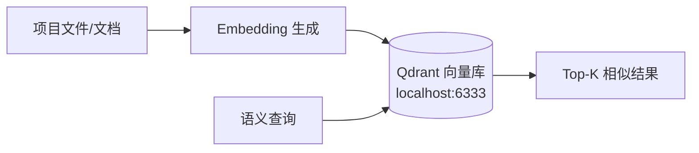

# Qdrant 本地向量库查询指南

> 本文档说明如何查询项目本地的 Qdrant 向量数据库，用于代码/文档的语义搜索。

---

## 1. 概述

项目通过 Docker 运行了一个本地的 **Qdrant** 向量数据库实例，用于存储项目代码和文档的分块嵌入向量（embeddings），支持**语义搜索**。

当前存储了 **1059 条**向量嵌入，涵盖：
- `DOCUMENTATIONS/` 下的技术文档
- 项目源代码（`.gd` 文件等）
- 部分配置文件

### 架构位置



---

## 2. 连接信息

| 项目 | 值 |
|------|-----|
| **服务地址** | `http://localhost:6333`（宿主机） |
| **容器内地址** | `http://host.docker.internal:6333` |
| **Collection** | `ws-48af07278f848afa` |
| **向量维度** | 768 |
| **距离算法** | Cosine |
| **向量数** | 1059 |

### 启动/停止

Qdrant 通过 `docker-compose.yml` 管理：
注：需要用户手动外部terminal cd 跳转，因为沙盒内没有docker
```bash
# 启动
docker compose up -d qdrant

# 停止
docker compose stop qdrant

# 查看日志
docker compose logs qdrant
```

---

## 3. Payload 数据结构

每条向量记录附加以下元数据：

| 字段 | 类型 | 示例 | 说明 |
|------|------|------|------|
| `filePath` | `string` | `DOCUMENTATIONS/events/current_event_dataflow.md` | 源文件路径 |
| `codeChunk` | `string` | `### 核心事件流向...` | 分块的代码/文本内容 |
| `startLine` | `int` | `7` | 在源文件中的起始行 |
| `endLine` | `int` | `25` | 在源文件中的结束行 |
| `segmentHash` | `string` | `2f47dca5...` | 分块的 SHA256 哈希 |
| `pathSegments` | `object` | `{"0": "DOCUMENTATIONS", "1": "events", ...}` | 路径分段（支持按目录过滤） |

### pathSegments 层级说明

`pathSegments` 将文件路径按目录切分为最多 5 层：

```
pathSegments.0 = "DOCUMENTATIONS"     # 顶层目录
pathSegments.1 = "events"             # 二级目录
pathSegments.2 = "current_event_dataflow.md"  # 文件名
```

每层都是 `keyword` 类型，支持精确过滤。

---

## 4. 查询方法

### 4.1 基础信息查询

```bash
# 查看所有 collections
curl -s http://localhost:6333/collections | python3 -m json.tool

# 查看 collection 详情（点数、索引状态、配置）
curl -s http://localhost:6333/collections/ws-48af07278f848afa | python3 -m json.tool
```

### 4.2 Scroll（翻页浏览）

不带过滤条件，浏览所有数据：

```bash
curl -s -X POST http://localhost:6333/collections/ws-48af07278f848afa/points/scroll \
  -H 'Content-Type: application/json' \
  -d '{"limit": 5, "with_payload": true}' | python3 -m json.tool
```

返回的 `next_page_offset` 可用于翻页：

```bash
curl -s -X POST http://localhost:6333/collections/ws-48af07278f848afa/points/scroll \
  -H 'Content-Type: application/json' \
  -d '{
    "limit": 5,
    "with_payload": true,
    "offset": "01b9a194-0fa5-56ab-a28a-ff043b142ecb"
  }' | python3 -m json.tool
```

### 4.3 Filter 过滤查询

按路径层级精确过滤：

```bash
# 只看 DOCUMENTATIONS/ 目录下的文档
curl -s -X POST http://localhost:6333/collections/ws-48af07278f848afa/points/scroll \
  -H 'Content-Type: application/json' \
  -d '{
    "filter": {
      "must": [
        {"key": "pathSegments.0", "match": {"value": "DOCUMENTATIONS"}}
      ]
    },
    "limit": 10,
    "with_payload": true
  }' | python3 -m json.tool
```

```bash
# 只看 events/ 子目录
curl -s -X POST http://localhost:6333/collections/ws-48af07278f848afa/points/scroll \
  -H 'Content-Type: application/json' \
  -d '{
    "filter": {
      "must": [
        {"key": "pathSegments.0", "match": {"value": "DOCUMENTATIONS"}},
        {"key": "pathSegments.1", "match": {"value": "events"}}
      ]
    },
    "limit": 10,
    "with_payload": true
  }' | python3 -m json.tool
```

```bash
# 只看某个具体文件
curl -s -X POST http://localhost:6333/collections/ws-48af07278f848afa/points/scroll \
  -H 'Content-Type: application/json' \
  -d '{
    "filter": {
      "must": [
        {"key": "filePath", "match": {"value": "DOCUMENTATIONS/old_bugs.md"}}
      ]
    },
    "limit": 20,
    "with_payload": true
  }' | python3 -m json.tool
```

### 4.4 语义搜索（向量相似度）

使用向量进行语义相似度搜索。需要生成一个 **768 维** 的 embedding 向量作为查询。

#### 方式 A：使用 Python + qdrant_client（推荐）

```python
from qdrant_client import QdrantClient
from qdrant_client.models import Filter, FieldCondition, MatchValue

client = QdrantClient(host="localhost", port=6333)

# 生成 embedding（需要 embedding 模型）
# 这里以 sentence-transformers 为例：
from sentence_transformers import SentenceTransformer
model = SentenceTransformer('all-MiniLM-L6-v2')  # 输出 384 维
# 注意：当前 collection 是 768 维，可能需要 other 模型

query_text = "事件系统的三层铁幕契约是什么？"
query_vector = model.encode(query_text).tolist()

# 搜索 Top-5 相似结果
results = client.search(
    collection_name="ws-48af07278f848afa",
    query_vector=query_vector,
    limit=5,
    with_payload=True
)

for point in results:
    print(f"[score={point.score:.4f}] {point.payload['filePath']}:L{point.payload['startLine']}")
    print(f"    {point.payload['codeChunk'][:100]}...")
    print()
```

#### 方式 B：直接 curl + 随机向量（测试连通性）

```bash
python3 -c "
import json, urllib.request

# 构建一个测试用的随机 768 维向量
import random
vec = [random.uniform(-1, 1) for _ in range(768)]

req_body = json.dumps({
    'vector': vec,
    'limit': 3,
    'with_payload': True,
    'with_vector': False
}).encode()

req = urllib.request.Request(
    'http://localhost:6333/collections/ws-48af07278f848afa/points/search',
    data=req_body,
    headers={'Content-Type': 'application/json'}
)
resp = urllib.request.urlopen(req)
data = json.loads(resp.read())

for p in data['result']:
    pl = p['payload']
    print(f'[score={p[\"score\"]:.4f}] {pl[\"filePath\"]}:L{pl[\"startLine\"]}')
    print(f'    {pl[\"codeChunk\"][:80]}...')
    print()
"
```

> ⚠️ 随机向量的评分通常很低（~0.03），这是正常的，因为没有语义匹配。真正的 embedding 搜索评分应该在 0.6-0.9+。

---

## 5. Python 综合查询脚本

如果你需要快速查询，可以把以下脚本保存为 `query_qdrant.py`：

```python
#!/usr/bin/env python3
"""Qdrant 向量库查询工具"""

import json, urllib.request, sys

BASE_URL = "http://localhost:6333"
COLLECTION = "ws-48af07278f848afa"

def scroll(limit=5, filter_dict=None, offset=None):
    """翻页浏览"""
    body = {"limit": limit, "with_payload": True}
    if filter_dict:
        body["filter"] = filter_dict
    if offset:
        body["offset"] = offset
    
    req = urllib.request.Request(
        f"{BASE_URL}/collections/{COLLECTION}/points/scroll",
        data=json.dumps(body).encode(),
        headers={"Content-Type": "application/json"}
    )
    resp = urllib.request.urlopen(req)
    return json.loads(resp.read())

def search(vector, limit=5):
    """语义搜索"""
    body = {
        "vector": vector,
        "limit": limit,
        "with_payload": True,
        "with_vector": False
    }
    req = urllib.request.Request(
        f"{BASE_URL}/collections/{COLLECTION}/points/search",
        data=json.dumps(body).encode(),
        headers={"Content-Type": "application/json"}
    )
    resp = urllib.request.urlopen(req)
    return json.loads(resp.read())

def pretty_print(results):
    """格式化输出结果"""
    for p in results.get("result", []):
        if isinstance(p, dict) and "payload" in p:
            pl = p["payload"]
            score = p.get("score", "N/A")
            print(f"[{score}] {pl['filePath']}:L{pl['startLine']}-L{pl['endLine']}")
            chunk = pl["codeChunk"][:120].replace("\n", " ")
            print(f"    {chunk}...\n")

if __name__ == "__main__":
    # 默认：浏览 5 条 DOCUMENTATIONS 下的数据
    result = scroll(limit=5, filter_dict={
        "must": [{"key": "pathSegments.0", "match": {"value": "DOCUMENTATIONS"}}]
    })
    pretty_print(result)
```

---

## 6. 常见问题

### Q: Qdrant 连不上怎么办？

```bash
# 检查 Docker 容器是否运行
docker ps | grep qdrant

# 如果没有运行
docker compose up -d qdrant

# 检查端口是否正常
curl -s http://localhost:6333/health
```

### Q: 从 devcontainer 内部怎么连？

使用 `host.docker.internal` 替代 `localhost`：

```bash
curl -s http://host.docker.internal:6333/collections
```

### Q: 有哪些 directories 可以过滤？

```bash
# 查看所有 pathSegments.0 的唯一值
# 通过 scroll 获取足够多的数据后提取
```

常见值：
- `DOCUMENTATIONS` — 技术文档
- `core` — 核心系统代码
- `model` — 数据模型
- `data` — 数据文件
- `qdrant_storage` — Qdrant 自身配置（可忽略）

### Q: 如何安装 qdrant_client？

```bash
pip install qdrant-client
```

### Q: indexed_vectors_count 为 0 是什么意思？

HNSW 图索引尚未构建。首次搜索会做全表扫描（1059 条数据量很小，不影响性能）。当数据量变大后（>10000），建议触发索引构建。

---

## 7. 相关文件

| 文件 | 说明 |
|------|------|
| [`docker-compose.yml`](../docker-compose.yml) | Qdrant Docker 配置 |
| [`qdrant_storage/`](../qdrant_storage/) | Qdrant 数据持久化目录 |
| [`core/csv_cloud_loader.gd`](../core/csv_cloud_loader.gd) | 数据加载（可能涉及向量化流程） |
