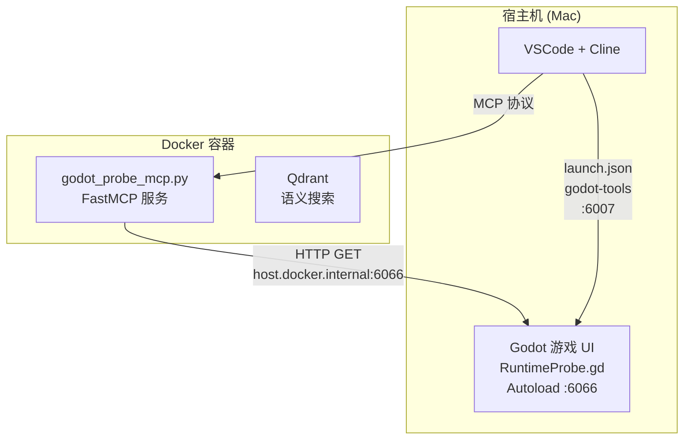

# 🩺 活体探针 (Runtime Probe) 架构文档

## 概述

活体探针是一套**单向只读 (Read-Only)** 的运行时内存透视架构。它允许 AI (Cline) 在 Godot 游戏运行时，通过 MCP 协议直接获取游戏内存中的实时状态，无需中断游戏进程或依赖日志文件。

## 架构图



## 组件

### 1. Godot Autoload - `core/runtime_probe.gd`

| 属性 | 值 |
|------|-----|
| 路径 | [`core/runtime_probe.gd`](core/runtime_probe.gd) |
| 注册方式 | `project.godot` → `[autoload]` → `RuntimeProbe="*res://core/runtime_probe.gd"` |
| 端口 | **6066** |
| 协议 | 纯 HTTP/1.1 (TCPServer + 手写 HTTP 解析) |

**只读契约:**
- ✅ 仅响应 `GET` 请求
- ✅ 序列化并返回游戏内存状态
- ❌ 绝对禁止 `call()` / `callv()` / `eval()` 等反射调用
- ❌ 绝对禁止任何写操作
- ❌ 拒绝所有非 `GET` 请求 (返回 `405 Method Not Allowed`)

### 2. MCP 桥接 - `godot_probe_mcp.py`

| 属性 | 值 |
|------|-----|
| 路径 | [`godot_probe_mcp.py`](godot_probe_mcp.py) |
| 框架 | FastMCP (与 `godot_rag_bridge.py` 一致) |
| 运行环境 | Docker 容器 (通过 `host.docker.internal` 访问宿主机) |

### 3. 统一日志系统 - `core/logger.gd`

| 属性 | 值 |
|------|-----|
| 路径 | [`core/logger.gd`](core/logger.gd) |
| 注册方式 | `project.godot` → `[autoload]` → `Logging="*res://core/logger.gd"` |
| 设计 | 纯静态函数内核 + 环形缓冲区 (500 条) |

**设计要点:**
- 所有公开函数均为 `static func`，即使 Autoload 未初始化也能调用
- 静态环形缓冲区 (`_ring_buffer`) 缓存最近 500 条日志
- `@tool` 模式和 `--headless` 模式下各脚本需通过 `const Logging = preload("res://core/logger.gd")` 调用
- 运行时场景可直接使用 Autoload 提供的 `Logging.xxx()` 调用

**API:**

| 函数 | 级别 | 颜色 | 用途 |
|------|------|------|------|
| `Logging.debug(msg)` | DEBUG | gray | 调试信息 |
| `Logging.info(msg)` | INFO | white | 常规信息 |
| `Logging.warn(msg)` | WARN | yellow | 警告 |
| `Logging.err(msg)` | ERROR | red | 错误 |

**项目约定:**
- **禁止**使用裸 `print()` / `printerr()` / `push_warning()` / `push_error()`
- 所有日志输出必须通过 `Logging.xxx()` 统一路由（截至 2026-06 已完成全量替换，397 处 → Logging）

## API 契约

### `GET /api/scene_tree` → `get_live_scene_tree()`

**用途:** 透视当前场景树的层级结构。

**返回示例:**
```json
{
  "ok": true,
  "timestamp": 1718000000,
  "data": {
    "name": "root",
    "class_name": "",
    "child_count": 3,
    "visible": true,
    "children": [
      {
        "name": "MainScene",
        "class_name": "",
        "child_count": 5,
        "visible": true,
        "children": [...]
      }
    ]
  }
}
```

**限制:** 最大递归深度 20 层，防止序列化死循环。

### `GET /api/game_state` → `get_game_state()`

**用途:** 获取玩家状态和全局游戏状态。

**返回示例:**
```json
{
  "ok": true,
  "timestamp": 1718000000,
  "data": {
    "player": {
      "name": "杜甫",
      "current_location": "yong_zhou",
      "ambition": { "key": "...", "name": "..." },
      "current_action_tags": ["..."]
    },
    "stats": {
      "literary_fame": 100,
      "money": 50,
      "talent": 75,
      "health": 80,
      "fatigue": 20,
      "burnout": 5,
      "drunk": 0,
      "sick": 0,
      "inspiration": 30,
      "career_progress": 10,
      "official_prestige": 40
    },
    "traits": [
      { "key": "trait_001", "name": "诗圣" }
    ],
    "flags": { "flag_era_tang": true },
    "emotions": { "sorrow": 0.3 },
    "game": {
      "year": 745.0,
      "ratio_time": 0.0,
      "mood": 0.5
    }
  }
}
```

### `GET /api/event_system` → `get_event_system()`

**用途:** 查看 EventManager 当前签筒和保证事件状态。

**返回示例:**
```json
{
  "ok": true,
  "timestamp": 1718000000,
  "data": {
    "current_event_pool": [
      {
        "event_uuid": "evt_001",
        "weight": 10,
        "original_weight": 10
      }
    ],
    "guaranteed_event_key": "evt_forced_002",
    "guaranteed_main_tag": "da_you_shi",
    "pool_size": 5
  }
}
```

### `GET /api/logs` → `get_live_logs()`

**用途:** 拉取 Logging 系统环形缓冲区中的实时运行日志。

**数据源:** `Logging.get_logs_since(since, limit)` — 从 Logging 静态环形缓冲区读取。

**Query String 参数:**
| 参数 | 类型 | 默认 | 说明 |
|------|------|------|------|
| `since` | int | 0 | 起始 seq（用于增量拉取） |
| `limit` | int | 50 | 最大返回条数 (max 500) |

**返回示例:**
```json
{
  "ok": true,
  "timestamp": 1781441987.67552,
  "data": {
    "total_buffered": 500,
    "current_seq": 906,
    "logs": [
      {
        "seq": 1,
        "timestamp": "12:00:00",
        "level": "INFO",
        "message": "[RuntimeProbe] 🟢 活体探针已上线，监听端口: 6066"
      }
    ]
  }
}
```

## 使用流程

### 启动游戏

1. 在 VSCode 中按 `F5` 或通过 Run → Start Debugging 启动 Godot 游戏
2. `launch.json` 中的 `Launch Godot Project` 配置会启动带 UI 的游戏实例
3. RuntimeProbe 自动在端口 6066 启动 HTTP 服务器
4. 确认日志中出现 `[RuntimeProbe] 🟢 活体探针已上线，监听端口: 6066`

### 启动 MCP 桥接

MCP 桥接服务 (`godot_probe_mcp.py`) 需要在 Docker 容器内运行，与现有的 `godot_rag_bridge.py` 和 `godot_mcp.py` 类似。

### 调用工具

AI 可以直接调用以下工具获取游戏实时状态：

| MCP Tool | HTTP 端点 | 适用场景 |
|----------|-----------|----------|
| `get_live_scene_tree()` | `GET /api/scene_tree` | UI 面板实例化排查、Node 挂载检查 |
| `get_game_state()` | `GET /api/game_state` | 玩家属性核查、Trait/Flag 状态 |
| `get_event_system()` | `GET /api/event_system` | 事件触发 Debug、权重检查 |
| `get_live_logs()` | `GET /api/logs` | 运行时日志流查看、Bug 排查 |

## 故障排除

| 现象 | 原因 | 解决 |
|------|------|------|
| `无法连接到 Godot RuntimeProbe (端口 6066)` | 游戏未启动或探针未上线 | 确认 Godot 正在运行，检查日志 |
| `探针返回 HTTP 404` | 端点路径错误 | 检查 URL 是否拼写正确 |
| `探针返回 HTTP 405` | 使用了非 GET 方法 | 本探针只接受 GET 请求 |
| 端口 6066 被占用 | 之前的进程未释放端口 | 等待几秒重试，或 kill 占用进程 |
| `get_live_logs()` 返回空 | Logging 缓冲区无日志 | 确认游戏已启动一段时间，有足够的 Logging.xxx() 调用产生 |

## 反悔成本

**极低。** 如果不再需要 RuntimeProbe，只需要：

1. 在 [`project.godot`](project.godot) 中删除 `RuntimeProbe="*res://core/runtime_probe.gd"` 这一行
2. 可选：删除 [`core/runtime_probe.gd`](core/runtime_probe.gd)

不修改任何现有业务逻辑，不留后遗症。
