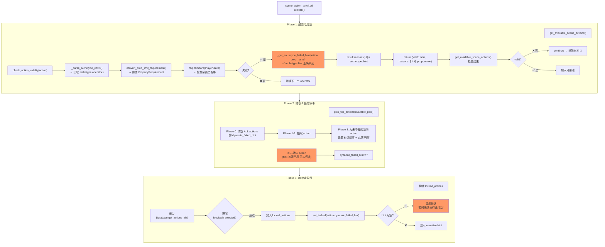

# Action Manager fail_hint 链路分析

## 现象

`ActionManager` 在 action 无法执行时（例如钱不够、健康不够），没有使用 `event_archetypes.json` 中定义的 `failed_hints` 叙事文本（如「囊中羞涩，连投刺的门包都凑不齐」），而是显示默认的「暂时无法执行此行动」。

---

## 全链路流程图



---

## 根因分析：2 个 Bug

### Bug 1（主要）：`pick_top_actions` 清除 hint 后未恢复非池 action

**位置**: [`core/action_manager.gd`](../core/action_manager.gd:642) `pick_top_actions()`

```
Phase 0 (line 642-645):  清空 ALL actions 的 dynamic_failed_hint
Phase 3 (line 695-705):  只为「池内 action」设置 B 类叙事
```

**后果**: 
- 被 `get_available_scene_actions()` 排除的 action（如钱不够的拜谒）在 Phase 0 中被清空 hint
- Phase 3 只处理池内 action，非池 action 的 hint **永远为空**
- `scene_action_scroll.gd` 第 52/65 行调用 `set_locked("")` → UI 显示默认文本

**修复思路**:
- `pick_top_actions()` Phase 3 结束后，遍历 `Database.get_actions_all()`，对被排除的非池 action 调用 `check_action_validity()` 并应用 A 类 hint

或

- `scene_action_scroll.gd` 构建 `locked_actions` 时，对每个 locked action 调用 `ActionManager.check_action_validity()` 设置 hint

### Bug 2（次要）：`reevaluate_all_locks` 只响应 time 变化

**位置**: [`core/action_manager.gd:300`](../core/action_manager.gd:300) `_on_player_stat_changed()`

```gdscript
if prop_name in ["time"]:
    reevaluate_all_locks()
```

**后果**: 
- 玩家执行了其他 action 消耗了 money/health，依赖这些属性的 action 的 locked UI **不会刷新**
- 即使 reevaluate_all_locks 会正确处理 A 类 hint，它根本没被触发

**修复思路**:
- 扩展 `_on_player_stat_changed` 的 prop_name 白名单，包含 money、health 等影响 action 可用性的属性
- 或者：直接监听所有属性变化（不需要白名单）

---

## 现有日志覆盖情况（绿色 = 已有，红色 = 缺失）

| 链路节点 | 日志状态 | 搜索关键词 |
|----------|---------|-----------|
| `get_available_scene_actions()` 开始 | ✅ `[ActionManager] ═══ 开始获取可用场景动作 ═══` | |
| `_init_archetype_cache()` 完成 | ✅ `已加载 N 个 action archetype` | |
| `check_action_validity()` 失败原因 | ✅ `拦截 [原因: xxx]` | `拦截` |
| `check_action_validity()` archetype hint 命中 | ❌ **缺失！** 🔴 | `archetype.*hint.*命中` |
| `pick_top_actions()` Phase 0 清空 | ❌ 没有针对每个 action 的日志 | `clear_failed_hint` |
| `pick_top_actions()` Phase 3 B 类叙事设置 | ❌ 没有日志 | `B类叙事.*设置` |
| 非池 action 的 hint 最终值 | ❌ **缺失！** 🔴 | `非池.*hint` |
| `scene_action_scroll.gd` 锁定态显示值 | ❌ **缺失！** 🔴 | `set_locked.*reason` |
| `reevaluate_all_locks()` 触发 | ✅ `属性变动重评估启动` | |
| `reevaluate_all_locks()` 每 action 的 A 类 hint 应用 | ❌ 没有每 action 日志 | `reevaluate.*hint` |

---

## 日志注入点（给 Coder 的指令）

### 1. `action_manager.gd` `check_action_validity()` — line ~202

在 `_get_archetype_failed_hint` 命中时加日志：

```gdscript
# 位置：action_manager.gd:202-204
if not archetype_hint.is_empty():
    Logging.info("[ActionManager] ✅ archetype hint 命中: action=%s, prop=%s, hint=%s" % [action.uuid, prop_name, archetype_hint])
    result.reasons[-1] = archetype_hint
```

搜索关键词: `archetype.*hint.*命中`

### 2. `action_manager.gd` `pick_top_actions()` — 在 Phase 3 后

在所有 hint 清空 + B 类设置后，遍历非池 action 打印 hint 值：

```gdscript
# 位置：pick_top_actions() 末尾，Phase 3 之后
for a_id in Database.get_actions_all():
    var a = Database.get_action(a_id)
    if a and a_id not in action_pool and not _blocked_actions.has(a_id):
        Logging.info("[ActionManager] ⚠️ 非池 action hint: id=%s, hint='%s'" % [a_id, a.dynamic_failed_hint])
```

搜索关键词: `非池.*hint`

### 3. `scene_action_scroll.gd` `refresh()` — line 51-52

在 `set_locked` 调用时输出传入的 reason：

```gdscript
# 替换 line 51-52
Logging.info("[SceneActionScroll] set_locked: action=%s, reason='%s'" % [all_visible_actions[i].uuid, all_visible_actions[i].dynamic_failed_hint])
children[i].set_locked(all_visible_actions[i].dynamic_failed_hint)
```

搜索关键词: `set_locked`

### 4. `action_manager.gd` `_on_player_stat_changed()` — line 298-302

日志记录触发重评估的属性名和非 time 属性的遗漏：

```gdscript
# 修改 line 300
if prop_name in ["time"]:
    Logging.info("[ActionManager] 关键属性 %s 变动，触发锁定重评估" % prop_name)
    reevaluate_all_locks()
elif prop_name in ["money", "health", "literary_fame", "talent"]:
    Logging.warn("[ActionManager] ⚠️ 属性 %s 变动但未触发重评估（白名单缺失）" % prop_name)
```

搜索关键词: `未触发重评估`

### 5. `action_manager.gd` `reevaluate_all_locks()` — line 273-288

每 action 应用 hint 时加日志：

```gdscript
# 在设置 hint 的位置
Logging.info("[ActionManager] reevaluate: action=%s, B_narrative='%s', A_reasons='%s'" % [a_id, a.lock_narrative, ", ".join(validity.reasons)])
```

搜索关键词: `reevaluate`

---

## 修复方案总结

### 修复 1：非池 action 的 fail_hint 恢复

**目标**: 修复 `pick_top_actions()` 清空 hint 后，非池 action 的 hint 丢失

**方案 A（推荐）**: 在 `pick_top_actions()` 末尾，对非池 action 调用 `check_action_validity()` 并设置 A 类 hint

**方案 B**: 在 `scene_action_scroll.gd` 的 `refresh()` 中，构建 locked_actions 时主动检查 validity

### 修复 2：扩展 reevaluate_all_locks 触发范围

**目标**: 让 money/health 等属性变化也能触发锁定重评估

**方案**: 将 `_on_player_stat_changed` 的白名单从 `["time"]` 扩展为所有影响 action 可用性的属性，或完全移除白名单

### 修复 3：添加全链路日志

按上述 5 个注入点添加日志，发布后可搜索以下关键词定位问题：

| 搜索关键词 | 预期用途 |
|-----------|---------|
| `archetype.*hint.*命中` | 确认 archetype hint 是否正确加载 |
| `非池.*hint` | 确认非池 action 的 hint 是否为空 |
| `set_locked` | 观察 UI 展示的锁定文本 |
| `未触发重评估` | 确认属性变动是否触发重评估 |
| `reevaluate` | 确认重评估是否正确设置 A 类 hint |
