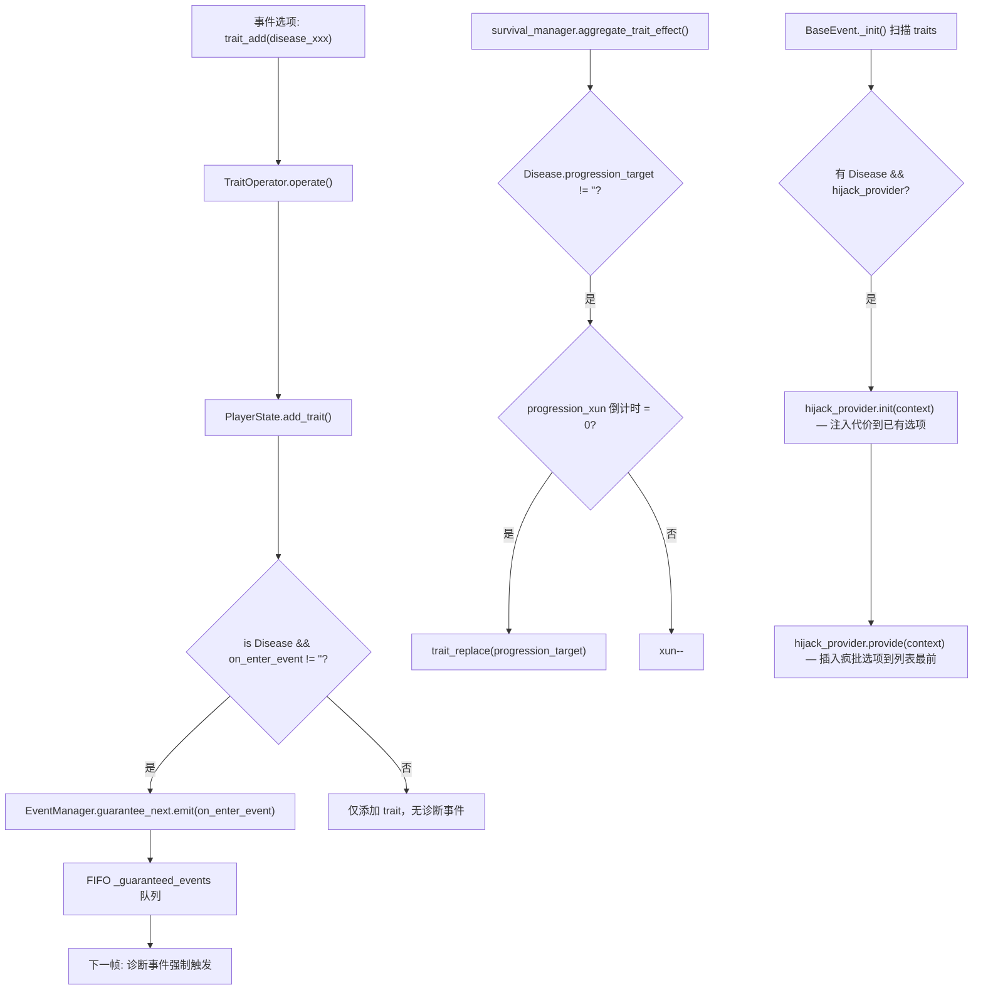

# Disease 系统完整设计文档 & Phase 2 执行计划

## 一、Phase 1 已完成基建总览

### 1.1 核心模型

```
Trait (trait.gd)
 └── Disease (disease.gd)
       ├── on_enter_event: String          # 诊断事件 key（获得时 guarantee_next 触发）
       ├── progression_target: String      # 进展目标 disease UUID
       ├── progression_xun: int            # 进展倒计时（旬）
       ├── hijack_provider: BaseProvider   # 选项劫持（如 ManiaProvider）
       ├── topic: "DISEASE" | "MENTAL_ILLNESS"
       ├── specific_topic: "ACUTE" | "CHRONIC" | "DEPRESSION" | "MANIA"
       ├── trait_effect_operations: Array[PropertyOperator]  # 属性每旬增减
       └── buffer_to_prop: DictMultiplyOperator  # 增益衰减乘数
```

### 1.2 四条疾病链

```
躯体链: 风寒急 (ACUTE) ──[6旬]──→ 肺痨 (CHRONIC, 终点)
精神链: 失意之郁 (DEPRESSION) ──[6旬]──→ 谵狂 (MANIA, 终点, hijack_provider)
```

| UUID | 名称 | Topic | Specific | Progression | 特殊 |
|------|------|-------|----------|-------------|------|
| `disease_fenghan_acute` | 风寒急 | DISEASE | ACUTE | → feilao_chronic (6xun) | — |
| `disease_feilao_chronic` | 肺痨 | DISEASE | CHRONIC | 终点 | buffer_to_prop (talent×0.5) |
| `disease_shiyi_depression` | 失意之郁 | MENTAL_ILLNESS | DEPRESSION | → zhanwang_mania (6xun) | buffer_to_prop (talent×0.5, money×0.8, literary_fame×0.7) |
| `disease_zhanwang_mania` | 谵狂 | MENTAL_ILLNESS | MANIA | 终点 | hijack_provider (ManiaProvider) |

### 1.3 生命周期流转



### 1.4 关键基础设施修改

| 文件 | 改动 |
|------|------|
| `core/model/disease.gd` | 新建 Disease class extends Trait |
| `core/model/mania_provider.gd` | 新建 ManiaProvider extends BaseProvider |
| `core/model/trait.gd` | topic 枚举 +DISEASE, +MENTAL_ILLNESS |
| `core/model/trait_operator.gd` | ADD 后检测 Disease → guarantee_next |
| `core/event_manager.gd` | 单 key → FIFO `_guaranteed_events: Array[Dictionary]` |
| `core/survival_manager.gd` | aggregate_trait_effect() 检测 progression → trait_replace |
| `model/event.gd` | BaseEvent._init() 扫描 hijack_provider |
| `core/database.gd` | 加载 disease 目录到 traits dict |
| `parser/micro_dsl_parser.gd` | sick/sickAcute/sickChronic/MENTAL tag 解析 |

### 1.5 已存在的诊断事件 (Phase 1 桩)

| Event UUID | 对应 Disease | 描述 |
|------------|-------------|------|
| `event_disease_fenghan_diagnosis` | 风寒急 | 风寒入体，头痛身热 |
| `event_disease_shiyi_diagnosis` | 失意之郁 | 落榜后的绝望 |
| `event_disease_zhanwang_crazy` | 谵狂 (ManiaProvider 触发) | 在市集中狂言 |

### 1.6 Tag 字典中 Disease 相关条目

```
ACTOR_HEALTH_SICK           # 病痛（通用）
ACTOR_HEALTH_SICKACUTE      # 急性病
ACTOR_HEALTH_SICKCHRONIC    # 慢性病
ACTOR_MENTAL_DEPRESSION     # 郁症
ACTOR_MENTAL_MANIA          # 狂症
```

---

## 二、Phase 2 目标

将 Phase 1 的 4 个 Disease 范例从「技术验证」升级为「可游玩内容」：

1. **扩充污染事件库**（每种疾病 3-4 个污染事件，替代当前 1 个桩）
2. **创建疾病获取传播事件**（sick prop 累积 → trait_add 的桥接事件）
3. **接入 747_kuangda 现有事件库**（在叙事合理的事件中加入疾病获取）
4. **接入 745_ambition 现有事件库**（季节性风寒触发）
5. **测试 & 文档**

---

## 三、污染事件库扩充设计

> 污染事件 = 玩家已获得该 disease 后，在签筒中随机触发的负面事件。
> Tag 规范：使用 `trigger_tags=[actor:health:sickAcute]` 等，确保仅在持有时触发。

### 3.1 风寒急污染事件（4 个）

| UUID | 标题 | trigger_tags | 核心叙事 |
|------|------|-------------|---------|
| `event_disease_fenghan_cough` | 寒咳 | `[actor:health:sickAcute]` | 剧咳打断写作 |
| `event_disease_fenghan_chills` | 寒战 | `[actor:health:sickAcute]` | 浑身发冷，裹紧被褥 |
| `event_disease_fenghan_headache` | 头风 | `[actor:health:sickAcute]` | 偏头痛，睁不开眼 |
| `event_disease_fenghan_bedridden` | 卧床 | `[actor:health:sickAcute]` | 病倒卧床，错过邀约 |

### 3.2 肺痨污染事件（4 个）

| UUID | 标题 | trigger_tags | 核心叙事 |
|------|------|-------------|---------|
| `event_disease_feilao_hemoptysis` | 咳血 | `[actor:health:sickChronic]` | 铜帕上赫然一摊血色 |
| `event_disease_feilao_night_sweats` | 盗汗 | `[actor:health:sickChronic]` | 夜半惊醒，衣衫尽湿 |
| `event_disease_feilao_wasting` | 消瘦 | `[actor:health:sickChronic]` | 镜中人形销骨立 |
| `event_disease_feilao_fever` | 潮热 | `[actor:health:sickChronic]` | 午后双颊泛红，手心滚烫 |

### 3.3 失意之郁污染事件（4 个）

| UUID | 标题 | trigger_tags | 核心叙事 |
|------|------|-------------|---------|
| `event_disease_shiyi_withdraw` | 闭门不出 | `[actor:mental:depression]` | 推掉所有邀约 |
| `event_disease_shiyi_insomnia` | 不寐 | `[actor:mental:depression]` | 翻来覆去，天快亮了 |
| `event_disease_shiyi_anorexia` | 厌食 | `[actor:mental:depression]` | 对着一桌饭菜毫无胃口 |
| `event_disease_shiyi_self_neglect` | 自弃 | `[actor:mental:depression]` | 笔墨蒙尘，诗集落灰 |

### 3.4 谵狂污染事件（4 个）

| UUID | 标题 | trigger_tags | 核心叙事 |
|------|------|-------------|---------|
| `event_disease_zhanwang_outburst` | 当街吟诗 | `[actor:mental:mania]` | 推开窗户，对着街巷放声 |
| `event_disease_zhanwang_rage` | 毁物 | `[actor:mental:mania]` | 怒摔砚台，墨汁四溅 |
| `event_disease_zhanwang_stripping` | 散发 | `[actor:mental:mania]` | 披发跣足，在市井中行走 |
| `event_disease_zhanwang_hallucination` | 谵语 | `[actor:mental:mania]` | 对着空无一人的角落说话 |

---

## 四、疾病获取桥接事件设计

> 核心机制：玩家在某些条件（高 sick prop + 特定场景）下，触发桥接事件 → 获得 disease trait。
> 这些事件放在 `data/1_core_rules/disease/` 下，作为独立事件库被 Database 加载。

### 4.1 桥接事件

| UUID | 触发条件 | 结果 | 叙事 |
|------|---------|------|------|
| `event_disease_bridge_fenghan` | `prop_gt(name=sick; val=50) & trigger_tags=[action:scene:outdoor]` | `trait_add(name=disease_fenghan_acute)` | 风寒入体，终于撑不住了 |
| `event_disease_bridge_shiyi` | `prop_gt(name=sick; val=30) & emo_gt(name=SORROW; val=40)` | `trait_add(name=disease_shiyi_depression)` | 身心俱疲，郁结成疾 |
| `event_disease_bridge_zhanwang` | `disease_shiyi_depression 自动 progression` | 已由 survival_manager 处理 | 无需额外事件 |

### 4.2 桥接事件 weight 策略

桥接事件的 weight 应设为 10-15（略高于普通污染事件的 10），确保高 sick 时优先触发。
同时应有冷却标记（flag 防止重复触发）。

---

## 五、接入现有事件库

### 5.1 接入原则

- **最小侵入**：只修改已有事件的 options 的 results 字段，不新增事件、不改事件结构
- **叙事合理**：仅在选择后果自然导向疾病时添加
- **一病一次**：同一事件库中每种疾病最多在 1-2 个事件中出现
- **Tag 合规**：所有新增 tag 必须来自 tag_dictioinary.md

### 5.2 747_kuangda 接入点

#### _duotai_humiliation_events.csv（夺胎羞辱，27 事件）

> 叙事：被羞辱到极点 → 郁结

| 事件 UUID | 接入方式 | 建议 option |
|-----------|---------|------------|
| `duotai_humiliation_peak_*` | 最高羞辱事件的一个 option 添加 `trait_add(name=disease_shiyi_depression)` | "沉默忍受" 选项 |

#### _qingliu_daoxin_posui_events.csv（道心破碎，10 事件）

> 叙事：道心破碎 = 精神崩溃 → 谵狂直接爆发

| 事件 UUID | 接入方式 | 建议 option |
|-----------|---------|------------|
| 最严重的道心破碎事件 | 添加 `trait_add(name=disease_zhanwang_mania)` | "彻底放弃" 选项 |

#### _qingliu_jiaolv_events.csv（清流焦虑，4 事件）

> 叙事：长期焦虑 → 急性病触发

| 事件 UUID | 接入方式 | 建议 option |
|-----------|---------|------------|
| 焦虑顶峰事件 | 添加 `trait_add(name=disease_fenghan_acute)` | "不顾身体继续奔波" 选项 |

#### _kuangke_zhuoliu_events.csv（旷客浊流，6 事件）

> 叙事：牢狱/羞辱 → 身心俱损

| 事件 UUID | 接入方式 | 建议 option |
|-----------|---------|------------|
| 牢狱相关事件 | 添加 `trait_add(name=disease_fenghan_acute)` | "放弃治疗" 选项 |

### 5.3 745_ambition 接入点

#### _scene_imagery_library_events.csv（场景意象库，25 事件）

> 叙事：季节交替 → 风寒

| 事件 UUID | 接入方式 | 建议 option |
|-----------|---------|------------|
| 秋冬场景事件 | 添加 `trait_add(name=disease_fenghan_acute)` | "在寒风中久立" 选项 |

---

## 六、待办事项 (Phase 2 执行清单)

### 第 1 步：扩充污染事件 CSV
- [ ] 在 `_disease_contamination_events.csv` 中为每种疾病新增 3 个污染事件（共 +12 事件，从当前的 4 → 16）
- [ ] 所有 trigger_tags 使用 tag_dictioinary.md 中已收录的 tag
- [ ] 每个事件至少 2 个 option
- [ ] results 中 operator 使用已存在的 prop/emo/imagery 操作

### 第 2 步：创建桥接事件 CSV
- [ ] 新建 `_disease_bridge_events.csv`（或在现有 diagnosis CSV 中追加）
- [ ] 2 个桥接事件：风寒桥接、郁症桥接
- [ ] requirements 使用 `prop_gt(name=sick; val=X)` + trigger_tags 组合
- [ ] results 使用 `trait_add(name=disease_xxx)`

### 第 3 步：创建对应 .tres 事件文件
- [ ] 为所有新增事件 key 创建最小 `.tres` 桩文件（如果 CSV 同步管线已处理则跳过）

### 第 4 步：接入 747_kuangda 事件库
- [ ] 在 `_duotai_humiliation_events.csv` 选定 1 个事件的选项添加 `trait_add(name=disease_shiyi_depression)`
- [ ] 在 `_qingliu_daoxin_posui_events.csv` 选定 1 个事件的选项添加 `trait_add(name=disease_zhanwang_mania)`
- [ ] 在 `_qingliu_jiaolv_events.csv` 选定 1 个事件的选项添加 `trait_add(name=disease_fenghan_acute)`
- [ ] 在 `_kuangke_zhuoliu_events.csv` 选定 1 个事件的选项添加 `trait_add(name=disease_fenghan_acute)`

### 第 5 步：接入 745_ambition 事件库
- [ ] 在 `_scene_imagery_library_events.csv` 选定 1 个事件的选项添加 `trait_add(name=disease_fenghan_acute)`

### 第 6 步：测试 & 验证
- [ ] CSV 解析测试（DSLParser 加载不报错）
- [ ] tag linter 检查（所有 tag 在字典中可查）
- [ ] 集成测试：验证 trait_add → guarantee_next → 诊断事件触发
- [ ] 集成测试：验证 progression 推进 → trait_replace
- [ ] 集成测试：验证 ManiaProvider 选项劫持

### 第 7 步：文档 & 提交
- [ ] 更新 `change_log.md`
- [ ] 更新 `DOCUMENTATIONS/events/trait_designs.md`（如有新增设计）
- [ ] 提交 commit
- [ ] 同步 CSV 到云端

---

## 七、设计约束 & 红线

1. **不修改 core/ 下任何 .gd 文件**（除非发现 bug）
2. **所有 tag 必须在 tag_dictioinary.md 中可查**，Linter 不通过的 tag 不许提交
3. **不修改已有 4 个 Disease .tres 的字段结构**（数值微调允许）
4. **CSV 字段使用 DSL 分隔符规范**：`|` > `;` > `/` > `:`
5. **CSV 文件是第一公民**，.tres 由同步管线生成；不要在 .tres 里手工改 CSV 数据
6. **事件 uuid 命名规范**：`event_disease_{disease_tail}_{序号}`，如 `event_disease_fenghan_chills`

---

## 八、文件清单

### 新建文件
- （可选）`data/1_core_rules/disease/_disease_bridge_events.csv`
- （由 CSV 同步生成）对应 `.tres` 桩文件

### 修改文件
- `data/1_core_rules/disease/_disease_contamination_events.csv` — 扩充 4→16 事件
- `data/4_eras/747_kuangda/_duotai_humiliation_events.csv` — +1 trait_add
- `data/4_eras/747_kuangda/_qingliu_daoxin_posui_events.csv` — +1 trait_add
- `data/4_eras/747_kuangda/_qingliu_jiaolv_events.csv` — +1 trait_add
- `data/4_eras/747_kuangda/_kuangke_zhuoliu_events.csv` — +1 trait_add
- `data/4_eras/745_ambition/_scene_imagery_library_events.csv` — +1 trait_add
- `change_log.md` — 更新
- （可选）`DOCUMENTATIONS/events/trait_designs.md` — 更新

### 不修改文件
- `core/model/disease.gd` ✋
- `core/model/mania_provider.gd` ✋
- `core/model/trait.gd` ✋
- `core/event_manager.gd` ✋
- `core/survival_manager.gd` ✋
- `model/event.gd` ✋
- `core/database.gd` ✋
- `data/1_core_rules/disease/disease_*.tres` ✋
