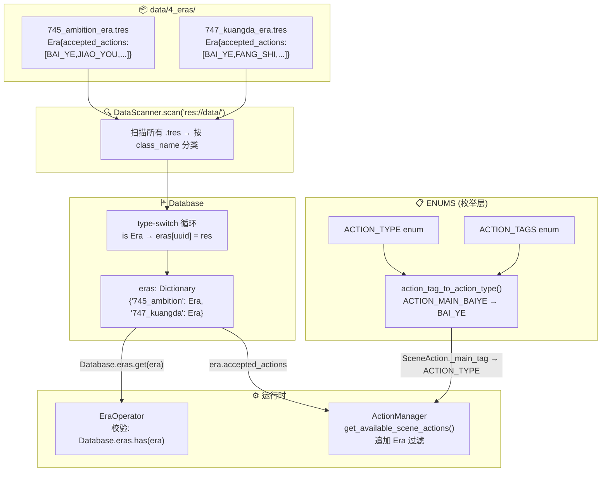

# Era 数据驱动重构方案

> 目标：将 Era 从硬编码的 `ENUMS.ERA_REGISTRY` 枚举注册表，改为由 `Era` Resource 数据文件驱动的动态系统，并让 `ActionManager` 接入 era 合法性过滤。

## Era.accepted_actions 三层语义

| `accepted_actions` 值 | 含义 |
|---|---|
| `null`（未设置，默认） | **全部允许** — 不拦截任何 action |
| `[]`（显式空数组） | **全部禁止** — 该时代无可用 action |
| `[BAI_YE, FANG_SHI, ...]` | **白名单** — 仅列表中指定的 action 可用 |

> 实现：修改 `era.gd` 声明去掉 `= []`，让 typed Array 默认为 `null`。当前 `745_ambition` 和 `747_kuangda` 均允许所有 action，因此 `.tres` 中不设置 `accepted_actions`（保持 null）。

---

## 数据流全景



---

## Todo 列表详解

### Todo 0: 修改 Era 数据模型 — accepted_actions 默认值

**文件**: `core/model/era.gd`

当前声明：
```gdscript
@export var accepted_actions: Array[ENUMS.ACTION_TYPE] = []
```

改为（去掉 `= []`，使默认值为 `null`）：
```gdscript
@export var accepted_actions: Array[ENUMS.ACTION_TYPE]
```

> **原因**: Godot 4.x 中 typed Array 不赋初始值时默认为 `null`，这与三层语义 `null = 全部允许` 一致。

---

### Todo 1: 创建 Era 数据文件

**位置**: `data/4_eras/` 根目录

创建两个 `.tres` 文件。由于当前两个 era 都允许所有 action，**不设 `accepted_actions`**（保持 null）。

| 文件 | era_id | accepted_actions |
|------|--------|-----------------|
| `data/4_eras/745_ambition_era.tres` | `745_ambition` | 不设置（null = 全部允许） |
| `data/4_eras/747_kuangda_era.tres` | `747_kuangda` | 不设置（null = 全部允许） |

`.tres` 文件示例结构：
```tres
[gd_resource type="Resource" script_class="Era" format=3]

[ext_resource type="Script" path="res://core/model/era.gd" id="1_xxx"]

[resource]
script = ExtResource("1_xxx")
uuid = "745_ambition"
name = "入世/功名时期"
description = "745年，杜甫初入长安，怀抱功名之志"
```

---

### Todo 2: ENUMS 改造

**文件**: `model/enumerates.gd`

#### 2a. 新增映射函数

在 `ACTION_TYPE` 枚举后新增：

```gdscript
## 将 ACTION_TAGS 枚举值映射到 ACTION_TYPE 枚举值
## 用于 SceneAction._main_tag → Era.accepted_actions 的合法性比对
## 返回 -1 表示该 tag 不映射到任何基础 action type
static func action_tag_to_action_type(tag: int) -> int:
    match tag:
        ACTION_TAGS.ACTION_MAIN_BAIYE:
            return ACTION_TYPE.BAI_YE
        ACTION_TAGS.ACTION_MAIN_JIAOYOU:
            return ACTION_TYPE.JIAO_YOU
        ACTION_TAGS.ACTION_MAIN_DENGGAO:
            return ACTION_TYPE.DENG_GAO
        ACTION_TAGS.ACTION_MAIN_FANGSHI:
            return ACTION_TYPE.FANG_SHI
        ACTION_TAGS.ACTION_MAIN_FENGZHAO:
            return ACTION_TYPE.FENG_ZHAO
        ACTION_TAGS.ACTION_MAIN_DUZHUO:
            return ACTION_TYPE.DU_ZHUO
        _:
            return -1
```

#### 2b. 删除硬编码注册表

删除以下全部内容：
- `enum ERAS { AMBITION_745, KUANGDA_747 }` (第 214-217 行)
- `const ERA_REGISTRY: Dictionary = { ... }` (第 221-224 行)
- `static func to_era_str(era_enum: int) -> String` (第 227-232 行)
- `static func is_valid_era(era_str: String) -> bool` (第 235-236 行)
- `static func get_all_eras() -> Array` (第 239-240 行)

---

### Todo 3: Database 添加 Era 桶

**文件**: `core/database.gd`

#### 3a. 声明新桶变量

在现有变量声明区域（约第 14 行附近）新增：

```gdscript
## Era 资源桶：{ "745_ambition": Era, "747_kuangda": Era }
var eras: Dictionary = {}
```

#### 3b. 在 type-switch 循环中添加 Era 分支

在当前 type-switch 循环（约第 145-183 行区域，`is LegendaryPoem` 分支后面）新增：

```gdscript
            elif res is Era:
                eras[uuid] = res
```

#### 3c. 添加 getter 方法

在现有的 Phase 3 getter 方法区域新增：

```gdscript
func get_era(uuid: String):
    return eras.get(uuid)
```

---

### Todo 4: 重构 EraOperator

**文件**: `core/operators/era_operator.gd`

将第 15-16 行的硬编码校验：

```gdscript
if not ENUMS.is_valid_era(era):
    Logging.err('[EraOperator] invalid era value: "%s" — must be one of: %s' % [era, ", ".join(ENUMS.get_all_eras())])
    return
```

改为 Database 驱动：

```gdscript
if not Database.eras.has(era):
    var valid_eras = Database.eras.keys()
    Logging.err('[EraOperator] invalid era value: "%s" — must be one of: %s' % [era, ", ".join(valid_eras)])
    return
```

---

### Todo 5: ActionManager 接入 Era 过滤

**文件**: `core/action_manager.gd`

在 `get_available_scene_actions()` 方法中，现有的过滤链是：

```
blocked → requirements → area_tags
```

在 `area_tags` 检查之后（约第 236 行 `continue` 之后、第 239 行 `# 3. 活到最后...` 之前），新增第 4 层过滤：

```gdscript
        # 4. Era 合法性检查
        if not GameState.current_era.is_empty():
            var era_res = Database.eras.get(GameState.current_era)
            if era_res:
                # 三层语义：
                #   null → 全部允许（不拦截）
                #   []   → 全部禁止（拦截一切）
                #   [...] → 白名单（仅列表中的放行）
                var accepted = era_res.accepted_actions
                if accepted != null:  # 非 null 才进入过滤
                    var action_type = ENUMS.action_tag_to_action_type(a._main_tag)
                    if action_type < 0 or not accepted.has(action_type):
                        Logging.info("[ActionManager] 动作 %s 不在当前时代 %s 的允许列表中，拦截" % [a_id, GameState.current_era])
                        continue
```

**逻辑说明**:
- `GameState.current_era` 为空 → 不限制（全时代可用），保持原有行为
- `era_res` 不存在 → 不限制（防御性编程）
- `era_res.accepted_actions == null` → 全部允许，不拦截
- `era_res.accepted_actions == []` → 全部禁止，全部拦截
- `era_res.accepted_actions = [BAI_YE, ...]` → 白名单过滤

---

### Todo 6: 验证与冒烟测试

1. 运行 Godot 编辑器，确认无 LSP 报错
2. 确认 `DataScanner` 日志中能看到 Era 资源的加载
3. 运行游戏，检查 EraOperator 校验是否正常工作
4. 切换 era（通过事件触发 EraOperator），验证 ActionManager 过滤是否生效

---

### Todo 7: 文档更新

- 更新 `DOCUMENTATIONS/` 中与 era 系统相关的文档
- 如有 `dsl_csv_structure_guide.md` 中涉及 era 枚举的部分，同步更新

---

### Todo 8: 提交流程

1. 提交 commit
2. **提示用户**: 如果 `data/4_eras/` 下有 CSV 文件（如 `_duotai_humiliation_events.csv`），记得同步到云端，避免下次 csv→tres 同步覆盖数据

---

## 反悔成本分析

| 变更 | 可逆性 | 风险 |
|------|--------|------|
| 删除 ERA_REGISTRY | 低风险。Git 可回滚，且无其他代码引用 | ⭐ |
| 新增 Era .tres 文件 | 零风险。纯新增文件 | ⭐ |
| EraOperator 改为 Database 校验 | 低风险。行为等价（校验逻辑从硬编码查表变为查 Database dict） | ⭐ |
| ActionManager 新增 era 过滤 | 中低风险。新增过滤层，默认 `current_era` 为空时不生效 | ⭐⭐ |

整体方案属于 **渐进式改造**（Strangler Fig Pattern），不破坏现有数据流和运行时行为。
