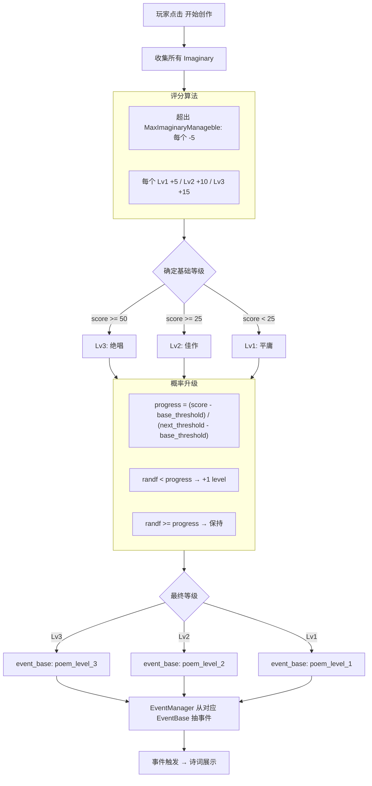
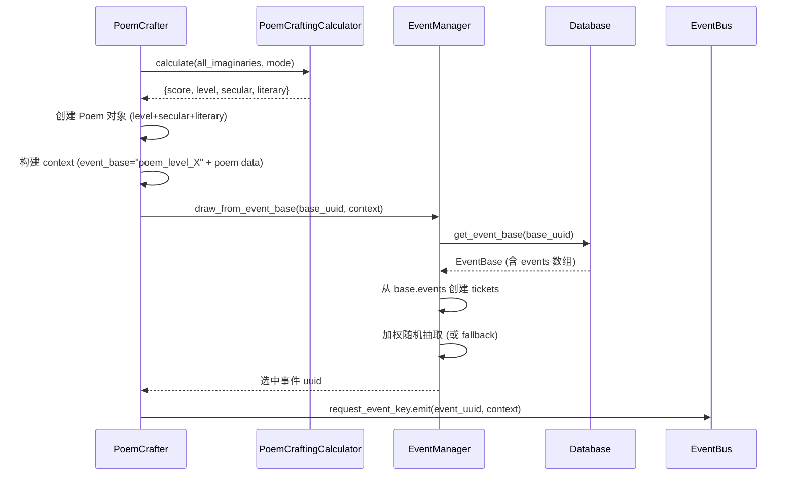

# 诗词创作 V9 重构方案 — 架构设计

> **状态**: ⏳ 方案确认中
> **关联**: [`poem_crafter.gd`](ui/poem_crafter.gd:1), [`poem_crafting_calculator.gd`](core/poem_crafting_calculator.gd:1), [`poem.gd`](core/model/poem.gd:1), [`imaginary.gd`](core/model/imaginary.gd:1), [`event_manager.gd`](core/event_manager.gd:1), [`event_base.gd`](core/model/event_base.gd:1)

---

## 架构总览

**核心变更：从「食谱配方匹配」转向「意象评分制 + 三级事件库抽奖」。**

V8 的 C(N,3) 食谱枚举逻辑全部砍掉，替换为基于 Imaginary 数量和等级的线性评分。诗词等级不再是「命中即通过/不命中即失败」的二元判断，而是「总有诗可成，但质量天差地别」的梯度系统。



---

## 1. 纯函数契约 (Stateless & Idempotent)

> ⚠️ **硬约束：`calculate_poem_grade` 必须是纯函数。**

| 禁止 | 原因 |
|------|------|
| `randf()` / `randi()` | 非确定性，破坏幂等 |
| `Database.*` 调用 | 隐式依赖全局状态 |
| `PlayerState.*` 调用 | 隐式依赖全局状态 |
| `Time.*` 调用 | 非确定性 |
| 修改任何入参 | 不可有副作用 |

**所有必要数据必须通过参数显式传入。** 随机性（概率升级抽奖）由调用方 [`poem_crafter.gd`](ui/poem_crafter.gd:1) 在拿到纯计算结果后自行执行。

---

## 2. 评分算法设计

### 2.1 前置校验：不足则返回错误

若 `imaginaries.size() < max_manageable`，函数返回 **特殊错误标记**（`passed = false, fail_reason = "insufficient"`）。调用方据此展示「意象不足」并阻断创作。

> 这个校验**取代** V8 的 "至少 3 个意象" 检查——阈值改为由参数 `max_manageable` 动态决定。

### 2.2 公式

```
score = Σ(每个 Imaginary 的贡献)
```

对每个 Imaginary（按任意顺序），设其在数组中的 index（0-based）：

| 条件 | 贡献 |
|------|------|
| index < `max_manageable` | `+ (imaginary.level × 5)` |
| index >= `max_manageable` | `−5` (固定惩罚) |

**参数基准：**
- `max_manageable`：由调用方从 `PlayerState.max_imaginary_managable` 读取后传入（默认 = 3）
- Imaginary level 值：1/2/3（来自 [`Imaginary.level`](core/model/imaginary.gd:6)）

### 2.3 示例

**场景 A：3 个 Lv1 意象，max=3**
- score = 5 + 5 + 5 = 15 → **平庸**

**场景 B：1 个 Lv3 + 2 个 Lv2，max=3**
- score = 15 + 10 + 10 = 35 → **佳作**（基础），升级概率 40%

**场景 C：3 个 Lv3 + 2 个溢出 Lv1，max=3**
- score = 15 + 15 + 15 + (-5) + (-5) = 35 → **佳作**（溢出拖后腿 💀）

**场景 D：3 个 Lv3，max=3**
- score = 15 + 15 + 15 = 45 → **佳作**，升级概率 80%

**场景 E：2 个 Lv3 意象，max=3**
- `imaginaries.size() (2) < max_manageable (3)` → **返回错误**（`passed=false, fail_reason="insufficient"`）

### 2.4 等级阈值

| 等级 | score 范围 | 显示文本 | `Poem.level` |
|------|-----------|---------|-------------|
| 1 — 平庸 | < 25 | 平庸 | 1 |
| 2 — 佳作 | 25 ≤ score < 50 | 佳作 | 2 |
| 3 — 绝唱 | ≥ 50 | 绝唱 | 3 |

### 2.5 升级概率计算（纯函数输出）

函数**仅计算** `upgrade_probability`（`float ∈ [0.0, 1.0)`），**不执行随机抽奖**。实际 `randf()` 由调用方执行。

仅在 `base_level < 3` 时计算：

```
current_threshold = (base_level - 1) × 25    # 0, 25
next_threshold    = base_level × 25          # 25, 50
upgrade_probability = (score - current_threshold) / (next_threshold - current_threshold)
```

**边界：**
- score = 25（刚好踩线）：upgrade_probability = 0.0
- score = 49（差一分绝唱）：upgrade_probability = 0.96
- score ≥ 50：已是绝唱，upgrade_probability = 0.0（无升级空间）
- score ≤ 0：钳制 base_level = 1, upgrade_probability = 0.0

---

## 2. Mode → Secular/Literary 赋值

| Mode | Toggle | secular_value | literary_value | 语义 |
|------|--------|:-------------:|:--------------:|------|
| `gan_ye` | 干谒权贵 | 64 | 0 | 功利世俗，讨好权贵 |
| `deng_gao` | 登高抒怀 | 0 | 48 | 广播诗名，文学传世 |

**不再使用** `CHANNEL_MATRIX` 乘数矩阵。直接硬赋值，简单粗暴。

---

## 3. 三级诗词事件库设计

### 3.1 EventBase 配置

三个事件库，放置于 `data/1_core_rules/events/poem_levels/`：

| 文件 | base_uuid | 等级 | 显示名 |
|------|-----------|------|--------|
| [`eb_poem_level_1.json`](data/1_core_rules/events/poem_levels/eb_poem_level_1.json) | `poem_level_1` | 平庸 | 平庸诗词事件库 |
| [`eb_poem_level_2.json`](data/1_core_rules/events/poem_levels/eb_poem_level_2.json) | `poem_level_2` | 佳作 | 佳作诗词事件库 |
| [`eb_poem_level_3.json`](data/1_core_rules/events/poem_levels/eb_poem_level_3.json) | `poem_level_3` | 绝唱 | 绝唱诗词事件库 |

**关键字段：**
```json
{
  "id": "poem_level_1",
  "name": "平庸诗词事件库",
  "era": "",
  "draw_strategies": "AVERAGE",
  "reset_on_empty": true,
  "events": ["poem_level_1_fallback"],
  "generation_configs": {}
}
```

- `era: ""` — 空字符串 = 全时代通用（诗词创作不绑定时代）
- `draw_strategies: "AVERAGE"` — 同 base 内均匀抽取
- `reset_on_empty: true` — 全部抽完一轮后重置黑名单
- `events` — 初期仅含 fallback 事件，后续补充具体诗词事件

### 3.2 Fallback 事件

三个匿名化 fallback `.tres`，放置于 `data/1_core_rules/events/fallback/`：

| 文件 | uuid | 语义 |
|------|------|------|
| [`poem_level_1_fallback.tres`](data/1_core_rules/events/fallback/poem_level_1_fallback.tres) | `poem_level_1_fallback` | 「一首平平无奇的诗，自我安慰尚可，赠人则略显寒酸」 |
| [`poem_level_2_fallback.tres`](data/1_core_rules/events/fallback/poem_level_2_fallback.tres) | `poem_level_2_fallback` | 「一首颇有章法的诗，令人点头称赞，唯欠几分神来之笔」 |
| [`poem_level_3_fallback.tres`](data/1_core_rules/events/fallback/poem_level_3_fallback.tres) | `poem_level_3_fallback` | 「一首泣鬼惊神的绝唱！字字珠玑，力透纸背，必将千古流传」 |

每个 fallback 结构参考现存的 [`poem_reveal.tres`](data/1_core_rules/events/fallback/poem_reveal.tres:1)，核心差异为 `description` 中的等级语义描述。

### 3.3 事件抽取流程



---

## 4. 代码修改清单

### 4.1 修改: [`core/poem_crafting_calculator.gd`](core/poem_crafting_calculator.gd:1)

**全部重写 `calculate_poem_grade` 静态方法。纯函数，无状态，幂等。**

```
## 纯函数 — 禁止 randf() / Database / PlayerState 调用
## 所有数据通过参数显式传入，不读全局状态
static func calculate_poem_grade(
    imaginaries: Array[Imaginary],
    mode: String,
    max_manageable: int = 3     # ⚠️ 调用方必须从 PlayerState 读取后显式传入
) -> PoemCraftingResult:
```

**出参 `PoemCraftingResult`：**
```
{
    passed: bool             // false = 错误(fail_reason 解释原因)
    fail_reason: String      // "insufficient" | ""
    score: int               // 原始分数
    base_level: int          // 基础等级 (1-3)
    upgrade_probability: float // [0.0, 1.0)，纯计算结果；randf() 由调用方执行
    secular_value: float     // mode 硬赋值
    literary_value: float    // mode 硬赋值
}
```

**⚠️ 明确删除的字段（相比 V8）：**
- `matched_recipe` / `matched_imaginary_uuids` / `tried_combinations` — 食谱系统砍光
- `final_level` / `upgrade_succeeded` — 随机性由调用方在拿到纯结果后自行处理
- `operators` — 算子生成由调用方根据 secular/literary 自己构建（`OperatorFactory.create_property_operator`）

**关键约束：**
- 函数内**绝对禁止** `randf()` 😡 — 任何随机行为都是对幂等性的亵渎
- `max_manageable` 是入参，不是硬编码常数，不读 `PlayerState`
- 不读 `Database`，不读任何全局单例
- `imaginaries.size() < max_manageable` → `passed=false, fail_reason="insufficient"`

### 4.2 新增: [`core/event_manager.gd`](core/event_manager.gd:1) 方法

新增 `draw_from_event_base(base_uuid: String, context: Dictionary) -> String`：

1. 查 `Database.get_event_base(base_uuid)` 获取 EventBase
2. 遍历 `base.events`，逐个 `Database.resolve()` 获取事件实例
3. 创建 EventTicket 数组（每个 ticket 权重 = event.weight）
4. 加权随机抽取 → 返回 `event_uuid`
5. 如果 `base.events` 为空 → 直接返回空字符串（调用方处理）
6. 更新 AVERAGE 黑名单 (`_mark_event_base_triggered`)

### 4.3 修改: [`ui/poem_crafter.gd`](ui/poem_crafter.gd:1)

**仅修改 `_on_button_pressed` 和 `_preview_current` 两个函数**（其余 UI 逻辑保持不变）。

**`_on_button_pressed` 新流程：**
1. 获取所有 valid imaginaries
2. 调用纯函数：`PoemCraftingCalculator.calculate_poem_grade(imaginaries, mode, PlayerState.max_imaginary_managable)`
3. 若 `result.passed == false` → 根据 `fail_reason` 展示错误，阻断
4. 检查 `_has_unused_poem()` — 保留现有逻辑
5. **概率升级抽奖（调用方执行 randf）：**
   - `var final_level = result.base_level`
   - `if randf() < result.upgrade_probability: final_level += 1`
6. 创建 Poem：`level=final_level`, `secular_value=result.secular_value`, `literary_value=result.literary_value`
7. 存 `PlayerState.created_poems`
8. **算子生成**：根据 secular/literary 调用 `OperatorFactory.create_property_operator`，然后 `_apply_operators`
9. 消耗所有参与计算的 Imaginary（全量清空 `Database.imaginaries_detail`）
10. context: `{"event_base": "poem_level_%d" % final_level, "poem_secular": ..., "poem_literary": ..., "poem_level": final_level}`
11. `EventManager.draw_from_event_base` + `EventBus.request_event_key.emit`

**`_preview_current` 新流程：**
- 调用 `calculate_poem_grade(imaginaries, mode, PlayerState.max_imaginary_managable)`
- 显示：「意象: N | 总分: X | 基础: 佳作 | 升级概率: 40%」

### 4.4 新建: 3 个 EventBase JSON

路径：`data/1_core_rules/events/poem_levels/eb_poem_level_{1,2,3}.json`

三个文件结构相同，仅 `id` / `name` / `events` 不同。

### 4.5 新建: 3 个 Fallback .tres

路径：`data/1_core_rules/events/fallback/poem_level_{1,2,3}_fallback.tres`

每个 `.tres` 是一个 `RandomEvent`，包含：
- `uuid`: `poem_level_X_fallback`
- `name`: 对应等级名称
- `description`: 对应等级语义的匿名化诗词描述
- `weight`: 1.0
- 一个 `option` 子资源（"欣赏诗作"），`choice_result` 为空（仅展示）

---

## 5. 与 V8 的关键差异决策

| 方面 | V8 (旧) | V9 (新) |
|------|---------|---------|
| 匹配机制 | C(N,3) 食谱枚举，命中/未命中 | 线性评分 |
| 失败条件 | 无匹配食谱 → 失败 | `imaginaries < max_manageable` |
| 意象消耗 | 仅消耗命中的 3 个 | 消耗全部 |
| 等级来源 | recipe 隐式决定 | score → base_level → randf 抽奖 |
| 管道乘数 | CHANNEL_MATRIX 乘法 | mode 直接硬赋值 |
| 事件来源 | 单个 `poem_reveal` push_event | 三级 EventBase 池抽 |
| preview | 显示食谱名 + operator | 总分 + 等级 + 升级概率 |
| 函数纯度 | 读 Database.recipe_index | **纯函数**：入参显式传入 |
| 随机性 | 无 | 分离：计算=纯函数，抽奖=调用方 |

### 5.1 反悔成本分析

重构 [`poem_crafting_calculator.gd`](core/poem_crafting_calculator.gd:1) 是**高内聚低耦合**的改动：
- `calculate_poem_grade` 是纯静态函数，无状态依赖
- 调用方仅 [`poem_crafter.gd`](ui/poem_crafter.gd:1) 两处
- 删除 recipe_index 参数但保留向后兼容（带默认参数 = {}）
- **反悔成本低**：如果评分算法不如预期，可轻松回退到 V8 分支

---

## 6. 边界情况与降级策略

| 场景 | 行为 |
|------|------|
| 0 个意象，max=3 | 纯函数返回 `passed=false, fail_reason="insufficient"` → PoemCrafter 阻断 |
| 2 个意象，max=3 | 同上，`insufficient` |
| 3 个 Lv1，max=3 | score=15 → 平庸，upgrade_probability=0.6 |
| score < 0（大量溢出） | base_level=1, upgrade_probability 钳制为 0.0 |
| score ≥ 50 | base_level=3 (绝唱), upgrade_probability=0.0 |
| EventBase 无事件 | `draw_from_event_base` 返回空 → PoemCrafter 降级 fallback uuid |
| fallback .tres 未加载 | `Database.resolve` 返回 null → Logging.err |

---

## 7. 文件变更清单

| 文件 | 操作 | 说明 |
|------|------|------|
| [`core/poem_crafting_calculator.gd`](core/poem_crafting_calculator.gd:1) | **重写** | 新评分算法 |
| [`ui/poem_crafter.gd`](ui/poem_crafter.gd:1) | **修改** | `_on_button_pressed` + `_preview_current` |
| [`core/event_manager.gd`](core/event_manager.gd:1) | **新增方法** | `draw_from_event_base` |
| [`data/1_core_rules/events/poem_levels/eb_poem_level_1.json`](data/1_core_rules/events/poem_levels/eb_poem_level_1.json) | **新建** | Lv1 EventBase |
| [`data/1_core_rules/events/poem_levels/eb_poem_level_2.json`](data/1_core_rules/events/poem_levels/eb_poem_level_2.json) | **新建** | Lv2 EventBase |
| [`data/1_core_rules/events/poem_levels/eb_poem_level_3.json`](data/1_core_rules/events/poem_levels/eb_poem_level_3.json) | **新建** | Lv3 EventBase |
| [`data/1_core_rules/events/fallback/poem_level_1_fallback.tres`](data/1_core_rules/events/fallback/poem_level_1_fallback.tres) | **新建** | Lv1 匿名诗 |
| [`data/1_core_rules/events/fallback/poem_level_2_fallback.tres`](data/1_core_rules/events/fallback/poem_level_2_fallback.tres) | **新建** | Lv2 匿名诗 |
| [`data/1_core_rules/events/fallback/poem_level_3_fallback.tres`](data/1_core_rules/events/fallback/poem_level_3_fallback.tres) | **新建** | Lv3 匿名诗 |
| [`DOCUMENTATIONS/feature_intents/poem_crafter.md`](DOCUMENTATIONS/feature_intents/poem_crafter.md) | **更新** | V9 需求文档 |
